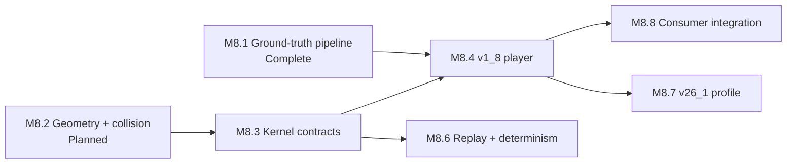

# Go Theft Craft master plan

Last reviewed: 2026-08-16

This file is the cross-repository source of truth for what remains. Detailed
designs and implementation plans remain in their owning repositories. Update
this file when a milestone starts, becomes blocked, or passes its release gate.

## Status legend

| Status | Meaning |
| --- | --- |
| Complete | Implemented and verified in the repository named by the milestone. |
| Client checks pending | Implemented, with every automated gate green, but a manual check its release gate requires has not been run. |
| Next | Approved and ready to implement. |
| Planned | Ordered, but its focused design or implementation plan is not yet approved. |
| Blocked | Cannot start until the named dependency is complete. |

## Current position

**M1: managed stream and compression** is implemented in `minecraft-protocol`
and passes its full release gate, including the new pinned Node
`minecraft-protocol` interoperability lane. The work is committed as
`8625ea7`.

**M2: encryption and login lifecycle** is complete in `minecraft-protocol` and
passes its full release gate, including two new encrypted Node
interoperability lanes.

**M2.5: schema-first code generation** is complete. Planning M4 against the real
protocol 775 schema found that the generator overrides schema types by bare
name, and that `position` and `entityMetadata` exist in both schemas with
different layouts — 47 packs x, y, z and 775 packs x, z, y; 47 terminates
metadata at 127 and 775 at 255. Generating 775 under the current rule would
have produced wrong bytes that every per-protocol round-trip test would have
accepted. The fix is to compile any type the schema defines and reserve
hand-written codecs for names the schema declares native, which also changes
protocol 47's generated API. It landed before M3 migrates `server`, so the
consumer migrates once.

**M3 is complete.** All twelve tasks are done and every step of its plan is
checked. `server` runs every connection on the managed stream, serves
handshake and status from generated packets, accepts logins through
`login.Acceptor`, negotiates compression, answers legacy pings, disconnects
gracefully, and owns no wire code at all: `pkg/protocol` and `pkg/gamedata` are
deleted apart from the play packet structs M6 replaces. `minecraft-protocol` is
released as `v0.1.0` and consumed as a released module with no `replace`
directive.

Every byte-parity fixture captured from the unmigrated server still matches,
and a pinned Node `minecraft-protocol` client reaches play against the migrated
server with compression off and on.

Both client checks passed on 2026-08-15 against a real 1.8.9 client, offline
and online, with **zero decode errors**: no generated codec rejected a packet
the vanilla client sent. The online login proved the server hash and
verify-token handling against the real Mojang session server, which no
automated test can do — every test stubs that call, and a hash wrong in the
same way on both sides of a loopback test still passes. Compression was
verified at `-1`, `256`, and `1`. The record is
[here](../server/docs/verification/2026-08-15-m3-client-checks.md).

Running the server found three defects the test suite never touched: two
disconnect-logging faults, both fixed, and a survival block duplication that is
**not** caused by the migrated drop data. Those and two missing features are
recorded in
[the session findings](../server/docs/verification/2026-08-15-m3-session-findings.md)
and carried into M6, which owns the rest of the consumer migration. One of
them — 2x2 crafting matching only some recipes — asked whether M3's registry
swap changed behavior. It did not: the matcher and the migrated registry are
both correct, and the defect was a pre-existing shift-click handler that
crafted once instead of draining the grid. Settled and fixed ahead of M6.

**M4 is complete, including both client checks.** All four stages landed, the
live check has been run against a real server, and a real Java 26.1 client has
been driven against this code with no packet failing to decode.
`minecraft-protocol` describes both pinned data trees with manifest v2,
generates `generated/java/v26_1` — 256 framed packets across five states, typed
game data for all 25 datasets, every dataset kept as the bytes upstream
published behind `v26_1.Raw()`, and a checked-in `coverage.json` — and aliases
it as `generated/java/current`. The login negotiator names no version: it
drives protocol 47, whose login ends at success, and protocol 775, whose login
passes through configuration, from the roles and the login exchange each
version declares. A 42-fixture differential suite compares the 775 codecs
against pinned Node ProtoDef in both directions.

The live check has now been run, against Paper 26.1.2 build 74, and it earned
its keep on the first run: the negotiator never answered `select_known_packs`,
and a 26.1 server sends no registry data and never finishes configuration
until it is answered. The connection stalled in configuration looking perfectly
healthy, and every scripted test passed throughout, because no script sent the
packet. Fixed, and the scripted server now withholds the finish handshake
until the answer arrives.

With that fixed the check reaches play, and the default limits — 2 MiB per
frame, 8 MiB decompressed — stand on traffic through login: the largest raw
frame a real server sent was 12,564 bytes and the largest decoded body 32,316
bytes, both `configuration/tags`.

The vanilla-client half was then closed too, on 2026-08-16, by a route the
plan had written off: a client cannot be pointed at a 775 server here, because
`login.Acceptor` is still protocol 47 only — but it can be served from a
recording of a real one. `mcproto serve` does that, and a real 26.1 client
spawned in the recorded world and played until it disconnected. **3,612
packets, none of which failed to decode.**

Getting there needed ten seconds of real play recorded first, and that is what
exposed the network NBT defect below. Play traffic is now measured as well:
6,145 frames across 49 distinct play packet types, every one decoding.

Protocol 47 is unchanged throughout, apart from one added file:
`generated/java/v1_8/login_exchange.go`. Its generated output is otherwise
byte-identical and its loopback interoperability suite still passes.

The eight things M4 found are recorded in its milestone section below. The two
worth carrying furthest: M4.2's report that the 775 codecs "parse as Go" was
true and not enough — they did not compile, for two reasons a test now covers —
and roles alone cannot drive a login, because two protocols agree about the
parts of one and about almost nothing else.

**M5 is complete.** Routing and middleware sit above framing without importing
the stream, the capture format is written straight from the observation path,
a bounded history ring is the one sink allowed to lose data, replay is
deterministic and reports its own divergences, and `mcproto` has the full
command set behind documented exit codes.

The amendment's headline defect was real and is fixed: a capture written with
the documented defaults would have held the login key exchange in the clear,
because the raw frame record is written before the frame is decoded and the
packet-level redaction check could not answer for it. The fix took a different
shape than the amendment specified, for a reason only the code showed — the
packet ID is not at the front of a frame payload once compression is on. That
and five other findings are in the M5 section below.

M5 also found things only a real connection could: replaying a genuine 26.1
login failed until the player learned that a capture holds both directions and
a session decodes one. Every synthetic fixture held a single direction, so
nothing before the live capture could have shown it.

**M6.1: server play-state migration is Client checks pending.** Every
automated gate is green and the manual play-state client check has not been run.
The server's play state is off its own protocol 47 packet structs and onto
`minecraft-protocol`'s generated types: the local packet package and its code
generation are deleted, and the server now owns no wire code at all. Every
packet is a generated `minecraft-protocol` type, consumed from the released and
vendored `v0.1.0` module with no `replace` directive.

All six byte-parity fixtures captured from the unmigrated server are
byte-identical to what they were before the migration, and all five parity
tests still compare produced bytes against them. `task lint`, `task test`, the
new `task test:race`, `task test:interop`, and `task build` all pass. The play
read path no longer decodes packets twice; 13 hand-written `java.Unmarshal`
calls and 8 hand-rolled parsers are gone.

The one gate left is the vanilla-client play session. The strict generated
decode has been proven against the pinned Node loopback interop lane, **not**
against a real client — that is exactly the half M3 left on local structs, and
the check that has not been run. Its prepared record is
[here](../server/docs/verification/2026-08-15-m6-1-client-check.md); M6.1 is not
Complete until that session runs with its decode-error count recorded.

**M6.3: the headless connection is complete.** All fourteen tasks landed and
every automated gate is green: `task lint`, `task test` under `-race`, the new
`task test:e2e`, and `task build`. The client dials, authenticates offline,
logs in through the shared negotiator, reaches play, publishes session events
through bounded subscriptions, and closes exactly once. Protocol 47 and
protocol 775 both have adapters, a readiness rule, and a profile;
`version/java` assembles both.

The M7 design's two prerequisites were folded in where they belong. `Event`
carries the revision, through an embedded `Stamp` that only the collector can
write, so no handler or subscriber can set or forge one. The second — the
client owning the configuration phase — is **not** done: it is a 775 concern
and it needs the client to stop the negotiator at configuration and drive it
itself. See the M6.3 section below.

Executing it changed three contracts the plan did not anticipate.
`version.Adapter` gained `Handshake`, because a version-neutral client cannot
build a handshake packet. `version.WireProfile` gained `Collector`, because the
adapter and the loop were holding different ones and every event a handler
produced was being dropped — a test caught it, not review. And appending to a
collector is the package function `event.Emit` rather than a method, because a
value inside an interface cannot be stamped after the fact.

**M8.1: physics ground-truth pipeline is complete.** It subdivided M8 and
depended only on the released `minecraft-reference` tool and the completed M0
game-data contracts, not on M1 through M7. The rest of M8 stays blocked on M4
and M7.

`mcreference dump` compiles and runs a reflective Java program against a
prepared 1.8.9 server jar and writes a canonical `physics.json`: 198 block
slipperiness values, the 65,536-entry trigonometry table, and the Mojang jar
digest. Twelve entity motion constants are literals inside method bodies that
no reflective dumper can reach, so they were transcribed and confirmed twice,
once from decompiled source and once from `javap` disassembly. The file is
committed, digest-pinned, and rendered into `generated/java/v1_8/physics.go`,
reachable as `v1_8.Data().Physics()`. `generate:check` passes with neither
`java` nor `javac` on `PATH`.

Three findings are worth carrying into M8.2 and later:

- Eleven of the twelve motion constants are `float` literals that Java widens
  to `double` where they are applied, so the real values are
  `0.9800000190734863` and its siblings rather than the round decimals.
  `physics.json` stores the widened forms.
- On the ground the horizontal drag is `slipperiness * 0.91F` for players and
  `slipperiness * 0.98F` for items, and Java computes that product in `float32`
  before widening. A kernel doing it in `float64` will not match bit for bit.
- Extracted data is optional in both the manifest schema and the render plan,
  so the 26.1 tree still generates. M8.7 adds a second dumper for 26.1.2;
  `Dump` already rejects every version but 1.8.9 with an explicit error.

**M11: server framework is newly planned.** The eight items in
`server/docs/todo.md` fit no existing plan, because every server plan is
protocol migration, and this file had no milestone for `server` becoming
something people build with. M11 is that track, subdivided into M11.1 through
M11.7, depending on M6.1 alone and running parallel to M7 through M10.

Designing it settled two questions the todo list only implied. `server` is a
framework rather than an application, so every item is a seam with a default
implementation rather than a feature, and `cmd/server` becomes
`examples/vanilla`. And per-item identity, which the duplication requirement
forces, turns out to be affordable at 64 bits per item while per-block identity
is not: universal block IDs cost roughly 512 MB for a 500×500 area before a
single provenance record, so identity is sparse and covers placed blocks, with
the key space left able to hold the universal case behind a flag.

```mermaid
flowchart LR
    M0["M0 Protocol 47 foundation<br/>Complete"]
    M1["M1 Managed stream + compression<br/>Complete"]
    M2["M2 Encryption + login lifecycle<br/>Complete"]
    M25["M2.5 Schema-first codegen<br/>Complete"]
    M3["M3 Server status/login migration<br/>Complete"]
    M4["M4 Java 26.1 / protocol 775<br/>Complete"]
    M5["M5 Routing, capture/replay, mcproto<br/>Complete"]
    M6["M6 Complete consumer migrations<br/>Next"]
    M7["M7 Observed client world state"]
    M8["M8 Deterministic simulation slice"]
    M9["M9 Movement, attack, inventory, craft"]
    M10["M10 Conformance and stable v1"]
    M11["M11 Server framework<br/>M11.1–M11.7"]

    M0 --> M1 --> M2 --> M25 --> M3 --> M4 --> M5 --> M6 --> M7 --> M8 --> M9 --> M10
    M6 --> M11
```

M11 is a parallel track, not a step in the protocol pipeline. It depends on
M6.1 alone and nothing depends on it, so it runs beside M7 through M10 whenever
there is capacity. Its only hard obligation to the rest of the plan is that
`server` keeps working as the test harness M9 and M10 both need.

## Milestone tracker

| ID | Deliverable | Owner | Status | Depends on | Detailed documents |
| --- | --- | --- | --- | --- | --- |
| M0 | Shared contracts, bounded Java wire primitives, immutable game data, generated Java 1.8 data, and reflection-free protocol 47 codecs | `minecraft-protocol` | Complete | — | [Shared extraction](docs/superpowers/plans/2026-08-13-shared-protocol-extraction.md), [wire extraction](docs/superpowers/plans/2026-08-13-java-1-8-wire-extraction.md), [immutable data](docs/superpowers/plans/2026-08-13-immutable-game-data-contracts.md), [Java 1.8 data](docs/superpowers/plans/2026-08-14-java-1-8-generated-data.md), [protocol 47 codecs](../minecraft-protocol/docs/plans/2026-08-14-java-1-8-protocol-codecs.md) |
| M1 | Asynchronous managed stream, runtime state and compression changes, bounded pipelines, legacy `FE 01` pre-frame hook, disconnect-aware graceful shutdown, and observation points | `minecraft-protocol` | Complete | M0 | [Design](../minecraft-protocol/docs/superpowers/specs/2026-08-14-managed-stream-compression-design.md), [implementation plan](../minecraft-protocol/docs/superpowers/plans/2026-08-14-managed-stream-compression.md) |
| M2 | AES-CFB8 transport encryption and complete, developer-controllable login lifecycle | `minecraft-protocol` | Complete | M1 | [Protocol toolkit umbrella plan](docs/superpowers/plans/2026-08-13-current-protocol-stream-toolkit.md), [headless authentication plan](docs/superpowers/plans/2026-08-13-headless-client-authentication.md), [M2 design](../minecraft-protocol/docs/superpowers/specs/2026-08-15-encryption-login-lifecycle-design.md), [M2 implementation plan](../minecraft-protocol/docs/superpowers/plans/2026-08-15-encryption-login-lifecycle.md) |
| M2.5 | Compile every schema-defined type from its own schema, share named types, bound decode recursion, and delete the superseded hand-written value types | `minecraft-protocol` | Complete | M2 | [Design](../minecraft-protocol/docs/superpowers/specs/2026-08-15-schema-first-codegen-design.md), [implementation plan](../minecraft-protocol/docs/superpowers/plans/2026-08-15-schema-first-codegen.md) |
| M3 | Migrate one real connection path: server handshake, status, ping, login, disconnect, compression, and online/offline mode | `server`, `minecraft-protocol` | Complete | M2.5 | [Design](../server/docs/superpowers/specs/2026-08-15-shared-protocol-migration-design.md), [implementation plan](../server/docs/superpowers/plans/2026-08-15-shared-protocol-migration.md) |
| M4 | Generate Java 26.1 data and protocol 775 codecs, retaining unknown source datasets | `minecraft-protocol` | Complete | M3 | [Design](../minecraft-protocol/docs/superpowers/specs/2026-08-15-java-26-1-protocol-775-design.md), [implementation plan](../minecraft-protocol/docs/superpowers/plans/2026-08-15-java-26-1-protocol-775.md) |
| M5 | Packet routing and middleware, capture history, replay, status/login helpers, and non-interactive `mcproto` | `minecraft-protocol` | Complete | M4 | [Design](../minecraft-protocol/docs/superpowers/specs/2026-08-15-routing-capture-replay-cli-design.md) (amended 2026-08-15), [implementation plan](../minecraft-protocol/docs/superpowers/plans/2026-08-15-routing-capture-replay-cli.md) (amended 2026-08-15) |
| M6 | Finish shared-protocol migration for the server and proxy, then connect headless-minecraft to the current Java profile | `server`, `proxy`, `headless-minecraft` | Planned | M5 | [Shared extraction](docs/superpowers/plans/2026-08-13-shared-protocol-extraction.md), [headless design](docs/superpowers/specs/2026-08-13-headless-minecraft-design.md), [headless lifecycle plan](docs/superpowers/plans/2026-08-13-headless-client-authentication.md) |
| M7 | Immutable observed player, entity, chunk, registry, container, and environment snapshots; reducers apply packets in wire order | `headless-minecraft` | Planned | M6 | [Headless design](docs/superpowers/specs/2026-08-13-headless-minecraft-design.md), [world-state plan, Tasks 1–6](docs/superpowers/plans/2026-08-13-world-state-actions.md) |
| M8 | First deterministic, protocol-independent Java 1.8.9 and 26.1.2 player movement slice with canonical replay and server/client adapters; items and arrows moved to M9 | `minecraft-simulation` | Planned | M4, M7 | [Sequencing design](../minecraft-simulation/docs/superpowers/specs/2026-08-15-m8-m9-sequencing-design.md), [simulation design](docs/superpowers/specs/2026-08-13-minecraft-simulation-design.md), [physics subproject design](../minecraft-simulation/docs/superpowers/specs/2026-08-14-simulation-physics-first-subproject-design.md), [reference research plan](docs/superpowers/plans/2026-08-13-minecraft-reference-extraction.md), [simulation implementation plan](docs/superpowers/plans/2026-08-13-minecraft-simulation-foundation.md) |
| M8.1 | Extract Java 1.8.9 physics constants from a verified Mojang server jar and publish them as a pinned, generated Go package | `minecraft-reference`, `minecraft-protocol` | Complete | — | [Physics subproject design](../minecraft-simulation/docs/superpowers/specs/2026-08-14-simulation-physics-first-subproject-design.md), [implementation plan](../minecraft-simulation/docs/superpowers/plans/2026-08-14-m8-1-ground-truth-pipeline.md) |
| M9 | Entity-trace capture, dropped items and arrows, then movement, digging, building, attack, container, inventory, and crafting scenarios, subdivided into M9.1–M9.8 by mechanic | `minecraft-simulation`, a new capture repository, `headless-minecraft`, `server` | Planned | M8.8 | [Sequencing design](../minecraft-simulation/docs/superpowers/specs/2026-08-15-m8-m9-sequencing-design.md), [world-state and actions plan](docs/superpowers/plans/2026-08-13-world-state-actions.md), [M9 plan](docs/superpowers/plans/2026-08-16-m9-gameplay-mechanics.md) (M9.1 written; M9.2–M9.8 await their prerequisite) |
| M10 | Cross-implementation conformance, compatibility contracts, migration notes, and stable `v1.0.0` releases | all runtime repositories | Planned | M9 | Existing repository roadmaps, [M10 plan](docs/superpowers/plans/2026-08-16-m10-conformance-releases.md) |
| M11 | Turn `server` into a framework: composable seams, a version-neutral world model, storage, world generation, provenance, observability, and commands, subdivided into M11.1–M11.7 | `server` | Planned | M6.1 | [Server framework design](../server/docs/superpowers/specs/2026-08-16-server-framework-design.md), [M11 plan](docs/superpowers/plans/2026-08-16-m11-server-framework.md) (M11.1 written; M11.2–M11.7 await their own design) |

## What is complete

- [x] `minecraft-protocol` repository foundation and finite wire limits.
- [x] Immutable game-data contracts and Java 1.8 generated data.
- [x] Protocol 47 descriptor and generated packet codecs (`162e95d`).
- [x] Initial `headless-minecraft` safety and version-profile foundation
  (`afab923`).
- [x] Managed stream, compression, protocol 47 transitions, graceful
  disconnect, observation points, and Node interoperability tests.
- [x] AES-CFB8 encryption, the Java key exchange, strict login identity types,
  observation redaction, and the opt-in login negotiator.
- [x] Schema-first code generation, shared named types, bounded decode
  recursion, and removal of the hand-written value types.
- [x] `minecraft-protocol` `v0.1.0`, its first tagged release, consumed by
  `server` as a released module.
- [x] Java 1.8.9 physics ground truth: `mcreference dump`, pinned
  `physics.json` with Mojang provenance, and generated `physics.go`
  (`b463b3e`, `961702d`).
- [x] Server connections on the managed stream, with generated handshake and
  status packets, the shared login acceptor, compression, legacy pings, and
  graceful disconnects.
- [x] Standalone `minecraft-reference` workflow and release (`v1.0.1`).
- [x] Initial `minecraft-simulation` repository boundary (`854e7d9`).

Repository foundation does not mean the headless client or simulation runtime
is implemented. Those bodies of work begin at M6 and M8.

## What is left

### M1 — Managed stream and compression

Complete. Every item below is implemented and verified.

- [x] Replace the combined framed codec with session, packet, frame, and
  compression-envelope boundaries.
- [x] Implement asynchronous inbound reads and completed outbound writes over
  `io.Reader` and `io.Writer`.
- [x] Serialize developer-requested protocol-state and compression changes.
- [x] Enforce frame, decompressed-payload, queue, and shared buffered-byte
  limits before allocation.
- [x] Preserve inbound and outbound pipeline ordering.
- [x] Add the opt-in pre-frame hook for legacy `FE 01` ping.
- [x] Send the state-appropriate disconnect packet during graceful shutdown,
  drain accepted writes, and retain immediate abort for transport failure.
- [x] Publish lossless observation points that later capture/history code can
  subscribe to without becoming part of framing.
- [x] Test malformed frames, cancellation races, partial I/O, resource limits,
  localhost TCP behavior, and pinned Node `minecraft-protocol`
  interoperability.

Two decisions made while implementing, recorded because they affect later
milestones:

- The design reserves one frame-plus-decompression headroom. A single shared
  headroom slot deadlocks, because the read pump holds it while handing its
  frame to the coordinator. Each direction therefore gets its own reservation,
  so the buffered-byte ceiling stays honest. Encryption in M2 adds no new
  buffer to this accounting; it wraps the framed byte stream in place.
- A running stream owns its session exclusively, so `Stream.Snapshot` is the
  only safe way to observe state and pipeline settings. Consumers in M3 and M6
  must not read a session directly.

### M2 — Encryption and login lifecycle

Complete. Every item below is implemented and verified.

- [x] Approve a focused design and implementation plan.
- [x] Add AES-CFB8 at the transport boundary in the correct pipeline order.
- [x] Support offline and Microsoft-backed identities without coupling auth to
  the stream.
- [x] Keep automatic transitions optional: developers can inspect, accept,
  reject, delay, or replace state and compression decisions.
- [x] Test successful login, authentication rejection, timeout, cancellation,
  disconnect, and shutdown at every state.

The modern-login item moved to M4. Protocol 775 codecs do not exist until M4,
so hand-written configuration and play login packets would be discarded the
moment M4 generates them.

Three decisions made while implementing, recorded because they affect later
milestones:

- Encryption is applied, not proposed. No packet carries the plaintext session
  key, so M3 and M6 consumers call `Stream.Control` with a
  `java.EncryptionControl` after the key exchange rather than expecting a
  session transition to enable it.
- The `login` package is protocol 47 only. M4 either parameterizes it or adds a
  second constructor, and M6 depends on whichever it chooses. M2 tagged the
  generated packets with `protocol.LoginRole` so that choice is a change of
  dispatch rather than a second negotiator.
- The standard library's `cipher.NewCFBEncrypter` is cipher feedback with a
  block-wide segment; Java Edition uses an eight-bit one. Two Go peers using
  the standard library agree with each other and with no real implementation,
  so every loopback test passed while the cipher was wrong. The pinned Node
  lane is what caught it, which is the argument for keeping that gate required
  in M10.

### M2.5 — Schema-first code generation

Complete. Protocol 47's bytes did not change, which was the exit criterion.

- [x] Pin protocol 47's wire bytes with a round-trip test over every packet and
  hand-computed assertions for the position bit layout, written before anything
  changed.
- [x] Bound decode recursion against the existing `Limits.recursionDepth`.
- [x] Resolve hand-written codecs against the schema's own native set, and pass
  native invocation arguments through — `endVal` is no longer a Go constant.
- [x] Generate named types once when they are recursive or used by two or more
  packets, instead of inlining them per packet.
- [x] Delete `java.Position`, `java.Slot`, and `java.EntityMetadata`.
- [x] Prove the result with the existing byte fixtures and the pinned Node
  interoperability lane.

The `slot` question this milestone raised is answered: protocol 47's schema
expresses everything the hand-written `slot` codec did, and the fixtures passed
unchanged. There is no gap to carry into M4.

Four things found while implementing, recorded because they affect later
milestones:

- A name is native only when its definition is the native marker itself.
  `string` is defined as an invocation of the native `pstring`, so its stored
  node is a native node carrying a different name. Counting that as a native
  declaration reintroduces the same bug one name further along, and M4 will
  meet the pattern again in 775's alias-heavy type table.
- Four packets cannot be reached by any canonical byte stream, because entity
  metadata terminates at a byte the generator's test alphabet never produces
  and NBT needs a structurally valid tag. They are pinned by hand. M4 needs the
  same treatment for 775's equivalents.
- Two latent defects surfaced only once `position` stopped being a scalar: an
  option holding a struct rendered as `*(p).Field`, which Go parses as
  `*((p).Field)`, and a `pstring` with a non-VarInt count type was read with
  the VarInt-prefixed codec instead of being rejected. Both were unreachable
  while every schema-defined type was overridden by name.
- A parameterized type cannot be shared, because its shape depends on the
  argument each invocation supplies. Protocol 47 has one, `entityMetadataItem`.
  If 775 has a parameterized type that is also recursive, it cannot be compiled
  at all under the current rules, and M4 should check for that before planning
  its generation stage.

### M3 — First real consumer

Design and implementation plan approved. Twelve tasks across four stages, two
repositories. The server's connection runs on the managed stream from the first
byte; play keeps its local packet structs and moves to the shared reflect codec,
which reads the same `mc` tags.

- [x] Approve the server status/login migration plan.
- [x] Add `login.Acceptor` to `minecraft-protocol` as the server-side
  counterpart to M2's client negotiator, tested against it over `net.Pipe`.
- [x] Pin the server's current bytes with a connection harness written against
  the unmigrated code.
- [x] Source game data from `minecraft-protocol/data` repo-wide.
- [x] Replace the blocking read loop and the swapped `io.ReadWriter` with a
  `protocol.Stream`, keeping `writePacket`'s signature so its eighty call sites
  do not move.
- [x] Migrate handshake, status, ping, and login to generated packets.
- [x] Enable compression, threshold configurable, defaulting to 256.
- [x] Answer legacy `FE 01` pings and send disconnect packets before closing.
- [x] Delete `pkg/protocol`, the server's cipher files, and the hand-written
  server hash.
- [x] Prove it with byte-parity fixtures and the pinned Node client.
- [x] Prove it with a real 1.8.9 client through a full play session, and one
  online-mode login.

Six things found while implementing M3, recorded because they affect later
milestones:

- A session proposes a transition only for a packet it can inspect. A
  connection that writes a raw payload gets no transition, so the migration
  drove state explicitly until handshake, status, and login moved to generated
  values. M6 finishes this for play, and until it does the connection still
  mirrors the session's state into a local enum.
- `minecraft-protocol` requires Go 1.26.6, so `server` moved to the same
  `openserbia/go-flake` pins. `devbox.json` must set `GOROOT` explicitly:
  without it, a shell entered from a sibling repository leaks its GOROOT and
  every build fails on a toolchain mismatch. M6 will hit this in `proxy` and
  `headless-minecraft` too.
- The shared data names Java 1.8 `"1.8.9"`; the server advertises `"1.8.8"`.
  Both are protocol 47. The status response keeps `"1.8.8"` because M3 changes
  no byte on the wire, and reconciling the two names is a decision of its own.
- `cmd/dmd` survives. It downloads the `protocol.json` that the retained packet
  codegen reads, so it cannot go until M6 deletes the packet structs.
- `task lint` and `task build` were both failing in `server` before this
  milestone — six pre-existing findings, and a build that pointed at a
  directory holding no Go files. M3 could not report a green gate without
  fixing them, so it did.
- The offline UUID derivation moved into `minecraft-protocol` as
  `login.OfflineUUID`. It is byte-identical to the server's own, which is what
  keeps saved player files reachable: the server looks them up by UUID.

Three constraints found while planning M3:

- The server has **no compression today** — it never sends `set_compression` and
  cannot read a compressed frame. That item is new behavior, not a migration.
- Every play packet will now be decoded twice, and the generated decode is
  strict where the old loop was not. A serverbound packet whose generated model
  is wrong becomes a disconnect. The real-client session is what finds those,
  and each one is a codec bug to fix in `minecraft-protocol`.
- M2 defines `login.Verifier` but implements only the client half. The
  server-side acceptor is new work, and it belongs in `minecraft-protocol` so
  both halves of the encryption handshake can be tested against each other in
  one repository.

### M4 — Java 26.1 and protocol 775

**Complete against a real server.** All four stages landed, and the live check
has been run against Paper 26.1.2 build 74 on 2026-08-16. It found a defect no
scripted test could: the negotiator never answered `select_known_packs`, and a
26.1 server sends no registry data and never finishes configuration until it
is answered, so a live login stalled in configuration while looking healthy.
Fixed, with a scripted server that now withholds the finish handshake until
the answer arrives. The remaining gap is the vanilla client, below.

The measurement the limits were waiting for, through handshake, login,
configuration, and the first play packet:

| Measurement | Value | Limit | Headroom |
| --- | --- | --- | --- |
| Largest raw frame | 12,564 bytes (a compressed `configuration/tags` frame) | 2 MiB | 167x |
| Largest decoded body | 32,316 bytes (`configuration/tags`) | 8 MiB | 259x |

Both defaults hold with room to spare, so no limit moves. This measures login
only. Play is where chunk data is the largest thing a server sends, and
nothing here has measured it — M7 is where that check belongs.

| Stage | Exit criterion |
| --- | --- |
| M4.1 | `task data:fetch` twice produces no diff; `data:validate` passes for both versions; protocol 47 output is byte-identical after the manifest migration |
| M4.2 | The 775 schema compiles with zero unsupported constructs, and `position` compiles from the 775 schema rather than inheriting 1.8's bit order |
| M4.3 | Every 26.1 dataset decodes strictly with no unknown field, and every dataset name appears in `Raw` |
| M4.4 | `v26_1.Protocol()` reports 775; the ProtoDef differential suite passes; the live check reaches play against Paper 26.1 and reports its largest frame; a vanilla 26.1 client's traffic decodes — **met** |

- [x] Pin the PrismarineJS source manifest and aliases.
- [x] Implement configuration and play transitions for modern Java login,
  moved here from M2 because the packets it needs do not exist until this
  milestone generates them.
- [x] Import all exposed datasets and preserve unknown formats as raw data.
- [x] Generate deterministic protocol 775 packets and codecs.
- [x] Add byte fixtures and protocol 47 regression coverage.
- [x] Verify status and login against a compatible Paper server. Done against
  Paper 26.1.2 build 74; `livecheck/README.md` records the numbers.
- [x] Verify against a vanilla Java 26.1 client. Done on 2026-08-16:
  **3,612 packets from a real client, none of which failed to decode.** The
  record is in
  [the client check](../minecraft-protocol/docs/verification/2026-08-16-vanilla-client-check.md).

  It was reachable after all, by a route the earlier note missed. There is no
  775 server here to point a client at, so the client was served from a
  recording of a real one: `mcproto serve` decodes each recorded clientbound
  frame, writes it to the live client through this repository's own encoder,
  and waits wherever the recording shows the client speaking. Eight packets
  were decoded that nothing here had ever decoded, `block_place` among them,
  which carries a `Slot`.

  What it still does not cover is the acceptor, which remains protocol 47 only.
  That is M6 work and the note below stands.

What M4 produced: `generated/java/v26_1` with 256 framed packets across five
states, the typed game data for all 25 datasets, every dataset kept as the
bytes upstream published behind `v26_1.Raw()`, a checked-in `coverage.json`,
`generated/java/current` as an alias, a login negotiator that names no version,
and a 42-fixture differential suite against pinned Node ProtoDef. Protocol 47's
generated output is unchanged apart from one added file, `login_exchange.go`,
and its loopback interoperability suite still passes.

Eight things M4 found that the plan did not predict, each recorded in full in the
[implementation plan](../minecraft-protocol/docs/superpowers/plans/2026-08-15-java-26-1-protocol-775.md):

- **"Parses as Go" was a weaker claim than it sounded.** M4.2 reported the 775
  codecs parsed; they did not compile. A recursive type has to be held through
  a pointer, and a shared mapper compiles to a named string type while its
  lookup tables hold plain strings. Both are now covered by tests, and both
  would have gone unnoticed until the first consumer.
- **Roles alone cannot drive a login.** A role says which part a packet plays;
  driving the sequence also means building and reading packets whose names,
  IDs, field types, and states differ between versions. Each version now
  generates a login exchange, which is what let the negotiator lose its
  version dependency.
- **Login success is not a transition in protocol 775.** The client
  acknowledges it, and every state change in the modern sequence is proposed by
  the serverbound half of a handshake, because moving on the clientbound half
  leaves a client answering from a state it has left.
- **Disconnect reasons after login are NBT components, not JSON**, in
  configuration and play but not in login.
- **Two dataset shapes read wrong at first glance**: a loot drop's stack size
  range has an open end written as a null bound, and one tint category keys by
  number where every other keys by biome name.
- **Network NBT required a compound root, and real servers do not send one.**
  The plain-text form of a text component is a bare `TAG_String`; Paper sends
  its MOTD in `server_data` that way. The reader rejected it, and would have
  rejected every chat message, kick reason, title, and playerlist header whose
  component was plain text — a client built on this would have dropped its
  connection the first time anybody spoke. Neither the test suite nor the live
  check could see it: the live check read one play packet and stopped. It
  surfaced the moment something tried to record ten seconds of play, which
  stalled at eleven packets. This is the strongest argument in the plan for
  measuring against real traffic rather than against a specification.
- **A driver cannot pass through what a server is waiting for.** The
  negotiator treated `select_known_packs` as configuration content and skipped
  it, which is correct for everything else a server sends in configuration and
  wrong for this one packet: the server sends no registry data and never
  finishes configuration without the answer. Only the live check could find it,
  because a scripted server sends what the script says and this script had
  nothing to say about a packet nobody had thought about.
- **The version-string reconciliation was mostly unnecessary.** Of the seven
  documents naming `26.1.2`, all but two were naming a game build — a Mojang
  artifact or a server under test — which is the correct use. Only the
  authentication and toolkit plans read as claims about the dataset, and those
  two were reworded.

Five constraints found while planning M4, recorded because they affect later
milestones:

- `position` and `entityMetadata` exist in both schemas with different wire
  layouts. M2.5 fixes the generator rule that would have given 775 the 1.8
  codec; M4's differential fixtures include a position-carrying packet so a
  regression surfaces as a byte mismatch rather than a server disconnect.

- The pinned Node `minecraft-protocol` 1.66.2 supports up to 1.21.11, so there
  is no session-level 775 interoperability lane. M4 verifies codecs
  differentially against the `protodef` library and verifies the session only
  against a real server, by hand. M10's conformance matrix inherits this gap
  until upstream ships 26.1 support.
- Three 26.1 schema types are mutually recursive (`Slot`, `SlotComponent`, and
  the item-predicate family), so the generator must share named types and count
  decode depth. That work moved to M2.5, where protocol 47's byte fixtures can
  prove it.
- Six of the 24 resolved 26.1 datasets are aliases of older versions:
  `windows` is 1.16.1, `commands` is 1.20.3, `mapIcons` is 1.20.2, and
  `blockLoot` and `entityLoot` are 1.20. Anything in M7 or M9 that reads window
  slot layouts is reading nine-year-old data, and must say so.
- 26.1 dataset shapes differ from 1.8's, so typed models become version-owned
  rather than shared. M6 is the first milestone holding two versions at once and
  owns whatever cross-version accessor its consumers actually need.
- The default limits — 2 MiB per frame, 8 MiB decompressed — have never been
  checked against a modern login. M4's live check measures the largest frame and
  decompressed payload a real 26.1 login produces and records both, and the
  defaults change only if that measurement demands it.
- The pinned dataset is `26.1`, protocol 775. There is no `26.1.2` dataset
  upstream, though seven planning documents name one. M4's documentation task
  reconciled them: `26.1` for data and generated code, a patch version only when
  naming a game build or a server under test. Most mentions were already the
  latter and stayed.
- The default limits — 2 MiB per frame, 8 MiB decompressed — have been measured
  through login against Paper 26.1.2 build 74 and hold with 167x and 259x
  headroom. `livecheck/README.md` records the numbers and how the server was
  prepared. Play is not covered: chunk data is the largest thing a server
  sends, and no check has measured it, so no milestone may claim these limits
  fit play until one does.

### M5 — Routing, capture/history, replay, and CLI

**Complete.** Every task landed, and the command set was verified end to end
against the same Paper 26.1.2 server M4 measured: capture a login, inspect it,
replay it, and compare the digest against the one the capture recorded.

- [x] Approve the capture record format and redaction policy.
- [x] Amend both documents for what M2 and M4 changed under them.
- [x] Redact sensitive raw frames and observe rejected writes.
- [x] Add packet routing and ordered middleware outside framing.
- [x] Record raw frame, decoded packet, secret, state, compression, timing,
  direction, and lifecycle observations without blocking the stream.
- [x] Provide bounded in-memory history plus durable capture sinks.
- [x] Replay deterministically from a capture with explicit timing modes.
- [x] Add non-interactive `mcproto status`, `login`, `capture`, `inspect`, and
  `replay` commands with predictable exit codes and machine-readable output.

What M5 found or decided differently from its approved plan:

- **The redaction defect was real, and the fix has a shape the amendment did
  not.** The amendment specified `SensitiveFrame(State, int32)`, answered from
  a packet ID peeked before decode. A frame payload is the compression
  envelope, not the packet body, so the ID is not at the front of it and the
  stream cannot find it without decompressing. The session can, and it is the
  only thing that knows how, so the interface is
  `SensitiveFrame(Direction, framePayload []byte)` and the generated sessions
  answer false immediately outside the login state — which is what keeps a
  per-frame check off the cost of play traffic.
- **`OriginalLen` cannot be reported for a redacted secret record**, and that
  is correct rather than an omission: the material is never read at all unless
  disclosure was asked for, so measuring it would mean materializing the key.
- **A capture holds both directions and a session decodes one.** Offline replay
  of a real login failed on the client's own outbound frame until it learned to
  skip the direction it cannot decode. It still has to follow those packets'
  transitions, because a client's login acknowledgement is what moves the
  connection to configuration — and the state to follow comes from the packet
  record, not the raw one, because a raw record is stamped before the
  transition commits. Only a real capture exposed this; every synthetic fixture
  held one direction.
- **`Dispatch` is exported after all.** M6.3's plan assumed it would not be,
  and wrote an interface seam to work without it. `Run` owns a loop over a
  `Receiver`, and a consumer that groups packets before applying them — which
  protocol 775's bundle delimiter requires — needs the single-packet form `Run`
  already used internally. Exporting it is one method over existing behaviour.
  M6.3 may use the router directly or keep its own table; the seam still works
  either way.
- **Record kinds are numbered in stage order**, 1 through 4, rather than the
  "kind 5" the amendment sketched for the secret record. The amendment's point
  was that the secret stage needs a record kind at all, which it now has;
  leaving a hole at 3 to reach 5 would be a number without a reason.
- **Code generation did not move into `mcproto generate`.** The plan's last
  task asked for it with `cmd/mcdata-gen` left as an alias. It is a refactor of
  the one path every other gate depends on, and it buys a command name rather
  than a capability, so it was left alone and recorded rather than done
  quietly. Maintenance is not duplicated in YAML either way.

The four constraints found while amending M5, each of which invalidated
something the approved documents asserted:

- **A capture written with M5's documented defaults would have leaked the login
  encryption exchange.** Redaction is applied to `ObservationPacket` records
  only, and the raw record for the same frame carries the same bytes unflagged
  — while raw frames are the default and only stage replay needs. The header
  would have read `"redaction": "enforced"` over a file holding the shared
  secret in the clear, and `ErrUndisclosedSecret` would never have fired,
  because the record it guards is not the one carrying the bytes. The fix is a
  frame-level `SensitiveFrame(State, int32)` on the session, answered from the
  packet ID peeked before decode, so the inbound raw record can stay emitted
  before decoding as M1 intended. It is a defect in released code and it is
  M5's first task.
- **Nothing resolves a protocol ID to a protocol.** The capture header names
  `"java/26.1"` and offline replay was to build a session "through the
  registry"; no registry exists and M4 adds none. Replay takes an injected
  resolver, and a thin `protocols` package imported only by `cmd/mcproto` knows
  the two versions. An `init`-registered global was rejected: it would link a
  megabyte of 26.1 generated code into consumers that only speak 1.8.9.
- **M2's `ObservationSecret` stage had no record kind**, so a capture could not
  show when encryption began — the property that stage exists to provide. Kind 5
  carries the label, and the payload only under disclosure. Worth noting for M7
  and M10: raw frames are captured above the conduit, after decryption, so a
  disclosed key is never needed to replay a capture. It decrypts a separate
  trace taken below the conduit, and nothing else.
- **`Observation` gains three fields, not one.** The approved design claimed
  `Elapsed` would be M5's only change to M1 or M2 code. `OriginalLen` is needed
  because `observe` drops the payload before the record is built, so a redacted
  record cannot report the size it withheld; `ObservationRejected` is needed
  because `observeOutbound` runs only after a successful write, so a write
  rejected by backpressure emits nothing at all and a consumer chasing a
  vanished packet has no record to find. The rejected stage is the one stage
  describing the consumer rather than the session: replay skips it and the
  digest excludes it by construction.

### M6–M7 — Consumers and observed state

- [x] Settle whether the 2x2 crafting matcher regressed on M3's registry swap,
  and cover `matchRecipe2x2` against the real registry, which no test does.
  Settled: **no regression.** The shared registry keeps wildcard ingredients as
  `Metadata: -1`, and the matcher is correct across every case tried. The real
  defect was pre-existing: shift-clicking the output crafted once instead of
  draining the grid. Fixed, along with a duplication bug in `tryAddToSection`
  found on the fix path. The matcher and the crafting click paths now have
  tests against the real registry, and the `conn` test harness supplies real
  game data rather than leaving it nil.
- [~] Complete server play-state migration to `minecraft-protocol` (M6.1):
  replace the local packet structs in `pkg/gamedata/versions/pc_1_8` with
  generated types and delete the server's remaining codegen. M3 left play on
  those structs deliberately, decoding them with the shared reflect codec.
  **Client checks pending:** the migration and every automated gate are done —
  the package and its codegen are deleted, the server owns no wire code, the
  parity fixtures are unchanged, and lint, test, race, interop, and build are
  green — but the vanilla-client play session has not been run. See the
  [prepared record](../server/docs/verification/2026-08-15-m6-1-client-check.md).
- [ ] Migrate proxy wire imports while keeping the legacy protocol private to `proxy`.
- [x] Finish headless lifecycle, authentication, event subscriptions, and
  bounded stream ownership (M6.3). Offline authentication only; Microsoft
  device-code is M6.4.
- [x] Connect the headless client to the current Java profile (M6.3). Both
  profiles are assembled and validated, and the 775 adapter translates the
  session domain in configuration and play. The end-to-end lane covers
  protocol 47 only: serving 775 needs a server-side login, and the shared
  `login.Acceptor` is written against the v1_8 generated types.
- [~] Build immutable observed-world snapshots and wire-ordered reducers.
  **M7 Tasks 1-5 are done:** the reducer spine with one revision per batch, the
  client wiring, and the player, entity, and chunk domains, each on both
  protocols. Tasks 6-11 — environment, containers, registry, raw preservation,
  chat, and the gate — remain.
  M7's design review put two prerequisites back on M6.3. `Event` has to carry
  the snapshot revision, which M6.3's design promised and its plan dropped, and
  the client has to own the configuration phase rather than letting
  `login.Negotiate` consume it. Without the second one, registry data, feature
  flags, and the inbound resource-pack offer never reach a handler on the first
  pass, which breaks M7's registry domain and two of M6.3's own session events.
- [ ] Preserve unknown metadata, namespaced values, and custom payloads.

#### M7 — What observed world state has found so far

- **The world holds state and events; the adapter holds decoding.** The design
  left this open and it governs every domain: `world.Player` and
  `world.Entities` expose mutators, and `internal/adapter/*/reduce.go`
  type-switches its own generated packets and calls them. Two protocols then
  share one snapshot shape and one event set, and each keeps its own quirks
  where they belong — 47's fixed-point positions and flag byte, 775's doubles
  and boolean struct, both becoming blocks and `world.Relative`.
- **`version` cannot name that seam.** `world` imports `version` for `Batch`,
  so a `Reducers` method on `version.Adapter` would make the two packages
  import each other. The client asserts the adapter to its own interface
  instead, and registers what it returns in `New`, after every option.
- **Every taxonomy constant gained a `Name` prefix.** `event.PlayerSpawned` is
  a struct and `event.NamePlayerSpawned` is its name. The session domain got
  away with unprefixed constants as the only domain; `PlayerSpawned` and
  `EntitySpawned` both want to be structs.
- **Protocol 775 chunk sections are stored but not decoded, deliberately.**
  775 sends each section as a paletted container whose encoding has changed
  across recent versions. The shared protocol module treats `chunkData` as an
  opaque byte array, nothing generates or validates the section format, and no
  captured 26.1 chunk exists here to test against. A decoder written from
  memory would return wrong blocks silently, and M8's collision and M9's
  digging would be built on them. The bytes are kept and reachable, chunk load,
  unload, block changes, block entities, and light all work, and block lookups
  in a 775 section report `ErrSectionNotDecodable`. **What unblocks it is one
  captured 26.1 chunk as a fixture**, which `mcproto capture` can record — the
  same route M4 used to close its vanilla-client check.
- **Each protocol attributes the half the other does not.** Protocol 775 sends a
  damage event naming the entity responsible and the entity that dealt it, and
  its death event carries only a player and a message — the killer field is
  gone. Protocol 47 has no damage packet at all, and its combat event carries
  the killer. Neither is the superset, which is what justifies a normalized
  attribution shape rather than exposing whichever protocol is richer. Where a
  protocol is silent the event says so, because entity 0 is a legal entity and
  there is no sentinel that means "not sent".
- **A death arrives twice on both protocols**, as an entity status and as a
  combat event, so `Died` is idempotent until the next respawn. The first
  announcement wins, and on protocol 47 the first one is the unattributed one —
  which is why `PlayerDied` reports whether it was attributed rather than
  reporting a killer of zero.
- **The chunk benchmarks say copy-on-read is still right.** A block lookup on
  a decoded section is 39.5 ns, and a snapshot over 400 columns of two sections
  each is 33.6 µs — a pointer copy per section, as design decision 4 intended.
  Decision 9's escape route stays unused.

#### M6.3 — What the headless connection found

- **The client owns the configuration phase.** This was M7's second
  prerequisite and it is now done. The adapter names the state the client
  takes over at — `LoginTerminalState`, configuration for 775 and nothing for
  47 — `Connect` passes it to `login.WithTerminalState`, and the loop drives
  configuration into play. Registry data, feature flags, resource-pack offers,
  cookies, and custom payloads now reach handlers instead of being consumed
  inside the login sequence. A scripted 775 configuration run in `client`
  covers it end to end short of a real server. **M7 Task 7 is unblocked**: its
  registry reducer receives `registry_data` in configuration, in wire order,
  in its own batch.
- **The client never answered keepalives, and now does.** Found while wiring
  the configuration phase, not by review. The taxonomy names the event
  `KeepAlivePonged` and the adapters published it without sending anything, so
  a real server would have dropped the session after about twenty seconds —
  and in configuration, before play was ever reached. No test caught it: the
  fixture server never sends a keepalive, and the client's own tests asserted
  the event, which existed. **Nothing in M6.3's design or plan assigned the
  answer to anyone.**
- **Answering needed a seam, and it is `version.Outbox`.** The readiness rule
  was the only outbound path and it stops observing the moment the player is
  placed, so it cannot own an answer that recurs for the whole session.
  Handlers now queue answers in a batch-scoped outbox that the loop drains and
  writes, before the readiness reply and in the order queued, reporting each
  as a `PacketSent`. It is the same shape as the collector, for the same
  reason: the read goroutine owns both ends of one batch. M9's actions are the
  next thing that will want it.
- **The bundle limit was never approached.** The default is 4096 packets per
  bundle. Nothing in this milestone exercises a real bundle: the fixture
  server speaks protocol 47, which has no delimiter, so every batch held one
  packet. The limit is covered by the batcher's and the loop's own tests at a
  limit of 2 and 3. M7, which will run against a real 775 server, is the first
  chance to measure a real bundle's size.
- **No frame measurements came from here.** This milestone never completed a
  775 login: `login.Acceptor` is written against the v1_8 generated types, so
  a 775 server cannot be stood up in this repository. M4.4's measurements —
  12,564 bytes largest raw frame, 32,316 bytes largest decoded body, both
  `configuration/tags` — remain the only real numbers, and both sit far under
  the 2 MiB and 8 MiB defaults.
- **Two contracts moved onto the adapter**, which is worth carrying into M7
  and M9 because it sets where version-specific wire knowledge lives: the
  handshake packet and the readiness rule are both adapter-owned. Anything
  else that differs per version and is not a packet handler belongs there too,
  rather than in the client behind a version switch.
- **A profile now carries its collector**, and `Validate` requires it. The
  first wiring gave the adapter one collector and the loop another, so every
  event a handler produced was silently dropped. Nothing failed: the
  connection worked, `Ready` arrived, and only the kick test noticed the
  missing event. M7 adds reducers on the same boundary and would have hit the
  identical fault.
- **775 disconnect reasons are structured components and are reported without
  text.** Both `kick_disconnect` and the configuration `disconnect` carry
  `java.NetworkNBT`. Rendering a chat component is a presentation decision the
  library does not make for a consumer, which matches what the shared login
  exchange already does. A consumer that wants the text renders it from the
  raw packet.
- [x] Carry damage attribution and death on the taxonomy. Found while designing
  [`examples/orbit`](docs/superpowers/specs/2026-08-16-orbit-example-design.md):
  the taxonomy had `PlayerHealthChanged` and `EntityDamaged` and neither named
  who dealt the damage, so no consumer could pick a target to retaliate
  against, and death was an inference a consumer drew from health reaching
  zero. Closed by design Decision 11 and plan Task 4.5. Three names added —
  `player.damaged`, `player.died`, `entity.died` — and `EntityDamaged` now
  carries the shared `event.Damage` instead of a bare source type. Orbit's
  required-surface items 4 and 5 are satisfied; item 6, respawn as a sendable
  action, stays open against M9.

### M8–M9 — Simulation and gameplay

M8 subdivides into stages ordered by risk retired rather than by layer, and M9
subdivides by mechanic. The
[sequencing design](../minecraft-simulation/docs/superpowers/specs/2026-08-15-m8-m9-sequencing-design.md)
holds each stage's real dependency, its exit criterion, and the interfaces it
may not change. The
[physics subproject design](../minecraft-simulation/docs/superpowers/specs/2026-08-14-simulation-physics-first-subproject-design.md)
holds the original rationale; where the two disagree, the sequencing design is
newer and wins.

M8.1 and M8.2 have no dependency on each other. M8.1 needs no simulation code,
and M8.2 needs no extracted constants.

Three changes to the original plan, all recorded in the sequencing design:

- **M8.5 is retired.** Dropped items, arrows, and entity-trace capture move to
  M9.1 and M9.2, so M8 delivers one deterministic player movement slice. The
  identifier is not reused: an `M8.x` number means the same thing in every
  document.
- **M8.4 is gated on fixtures.** The zero-corrections test against a live
  vanilla server needs M6 and M7, which the movement code itself does not. That
  gate moves to M8.8, where the client adapter exists anyway.
- **Capture needs a new repository.** The existing legacy proxy speaks a
  different protocol family and cannot be extended into a protocol 47 capture
  tool. M9.1 is a new repository, not the small subcommand originally budgeted.

| Stage | Depends on | Exit criterion |
| --- | --- | --- |
| M8.1 | — | `v1_8.Physics()` returns slipperiness, the trigonometry table, and motion constants; `generate:check` passes with no JDK |
| M8.2 | — | Property tests prove no tunneling, bounded step-up, and that zero motion is a fixed point |
| M8.3 | M8.2 | An empty tick produces a stable digest and a change set that a stale store rejects |
| M8.4 | M8.3 | Fixture conformance for walk, sprint, jump, sneak, fall, and collide |
| M8.6 | M8.3 for encoding; M8.4 for the matrix | Identical digest on Linux, macOS, and Windows, on amd64 and arm64 |
| M8.7 | M8.4, M4 | The M8.4 fixture suite passes on 26.1.2 |
| M8.8 | M8.4, M6, M7 | Both adapters run one kernel; scripted input draws zero corrections from vanilla 1.8.9 |

M9 follows M8.8 and subdivides by mechanic, because the packages and the
conformance fixtures are already organized that way and each mechanic is
independently verifiable against a vanilla server.

| Stage | Deliverable | Exit criterion |
| --- | --- | --- |
| M9.1 | Entity-trace capture in a new protocol 47 proxy repository | A captured trace replays deterministically from its recording |
| M9.2 | Dropped item and arrow rules, both profiles | Captured traces replay within one thirty-second of a block |
| M9.3 | Movement scenarios | Correction, teleport, and disconnect mid-action behave as vanilla |
| M9.4 | Digging and block breaking | Break times match vanilla for tool, block, and effect combinations |
| M9.5 | Building and placement | Placement legality and resulting block state match vanilla |
| M9.6 | Attack, damage, knockback | Reach validation, cooldown timing, damage, and death match vanilla |
| M9.7 | Containers and inventory | Window open and close, slot synchronization, and rejected moves match vanilla |
| M9.8 | Crafting | Recipe matching and result stacks match vanilla, including the 2x2 grid |

Three constraints discovered while running M8.1, recorded here because they
affect later stages:

- Entity gravity and drag are numeric literals inside method bodies, not
  fields. No reflective dumper reaches them. They are transcribed from research
  notes and range-checked by tests. Every other constant is extracted.
- Eleven of the twelve motion constants are `float` literals that Java widens
  to `double` where they are applied, and the ground drag is computed as
  `slipperiness * 0.91F` in `float32` before widening. A kernel that computes
  that product in `float64` will not match vanilla bit for bit.
- Captured traces verify trajectories to roughly one thirty-second of a block,
  not exactly, because Java Edition 1.8 transmits positions as fixed point.
  This catches wrong constants and wrong axis order, not last-place drift.

- [x] Complete M8.1: `mcreference dump`, pinned `physics.json` with Mojang
  provenance, and generated `physics.go`.
- [ ] Update `minecraft-simulation` to consume the released
  `minecraft-reference` tool instead of `main`.
- [ ] Complete reviewed vanilla behavior catalogs and independent fixtures for
  Java 1.8.9 and 26.1.2.
- [ ] Implement the deterministic kernel, strict unknown-state handling,
  collision, movement, canonical result digest, and replay.
- [ ] Prove the same simulation through server and headless adapters, gated on
  zero corrections from a live vanilla 1.8.9 server (M8.8).
- [ ] Build the protocol 47 capture repository, then verify dropped items and
  arrows against its traces (M9.1 and M9.2).
- [ ] Add movement scenarios: walk, sprint, sneak, jump, fall, collide,
  correction, teleport, and disconnect mid-action.
- [ ] Add attack scenarios: target selection, reach validation, cooldown or
  version-specific timing, damage, knockback, death, respawn, and rejected
  attacks.
- [ ] Add respawn to the interaction primitives. Task 6 of the world-state plan
  lists chat, command, movement, look, stance, use, place, attack, interact,
  dig, slot, click, drop, and close, and no way to answer a death. A client that
  dies and cannot respawn is stuck, so this blocks M9.6's own respawn scenario
  as well as [`examples/orbit`](docs/superpowers/specs/2026-08-16-orbit-example-design.md).
- [ ] Export `movement.Strategy` so an application can implement one. Task 7
  designs controller-owned strategy switching and ships bunnyhop; nothing yet
  proves a strategy defined outside the library works, which `examples/orbit`
  is the first caller to need.
- [ ] Add inventory and crafting scenarios: window open/close, slot sync,
  transaction rejection, recipe selection, missing ingredients, shift-click,
  crafted output, and reconnect recovery.
- [ ] Add digging and building scenarios with partial progress and server
  correction.

### M10 — Conformance and releases

- [ ] Convert suitable community-server cases into independently maintained
  black-box scenarios or fixtures after checking their licenses and behavior.
- [ ] Run compatibility matrices against pinned Node `minecraft-protocol`,
  Paper, the owned Go server, and supported vanilla clients.
- [ ] Run prebuilt headless vanilla-client scenarios for status, login,
  movement, attack, inventory, crafting, malformed disconnects, and graceful
  shutdown.
- [ ] Keep Java reference artifacts and decompiled sources local; publish only
  provenance, independent behavior descriptions, fixtures, and expectations.
- [ ] Add public API compatibility tests and migration notes.
- [ ] Publish stable releases only after all release gates pass.

### M11 — Server framework

`server` is a framework first and an application never. `cmd/server` becomes
`examples/vanilla`, and the eight items in `server/docs/todo.md` become seams
rather than features. The
[design](../server/docs/superpowers/specs/2026-08-16-server-framework-design.md)
subdivides the track and settles ten decisions; each sub-milestone gets its own
focused design and plan when it becomes next.

The three worth carrying furthest:

- **Immutable sections with a swap on write** answer overlapping writers,
  saving without freezing the tick, and chunk ownership as one decision rather
  than three. `headless-minecraft` M7 reached the same model independently, so
  both repositories describe chunks the same way.
- **A live ID-to-location index is the duplication detector**, not a forensic
  log. Any write placing an existing item ID in a second location without
  removing it from the first is caught where it happens. The same index answers
  "where is this item now" and, persisted, is the item sidecar. It is also the
  instrument that would settle the unexplained survival block duplication in
  the M3 session findings.
- **Non-vanilla data lives beside the vanilla file, never inside it.** Custom
  NBT tags would work and would be dropped silently by any external reader.
  Keeping them separate costs a consistency problem, answered by writing both
  stores from one snapshot with a shared generation stamp and reconciling at
  load, which turns an external edit into a recorded event instead of silent
  corruption.

- [ ] M11.1 Framework shape: `server.New` and options, `cmd/server` moves to
  `examples/`, seams declared, plain resource counters.
- [ ] M11.2 World model and chunk ownership: interned block states, per-version
  adapters, immutable sections.
- [ ] M11.3 Storage: `WorldStore` and `SideStore`, native format research,
  vanilla Anvil adapter, snapshot saving.
- [ ] M11.4 World generation: parameters, named world types, version-neutral
  output. No separate repository.
- [ ] M11.5 Provenance: item and block identity, the ID index, the audit log and
  its queries, reconciliation on load.
- [ ] M11.6 Observability: one `Observer` interface, per-player, per-feature,
  and per-chunk attribution.
- [ ] M11.7 Commands: `Command`, `Set`, `vanilla.Stubs()`, brigadier rendering
  on protocol 775 and tab-complete on 47.

## Document index

### Approved specifications

- [Headless client and shared protocol design](docs/superpowers/specs/2026-08-13-headless-minecraft-design.md)
- [Minecraft simulation design](docs/superpowers/specs/2026-08-13-minecraft-simulation-design.md)
- [Simulation physics first subproject design](../minecraft-simulation/docs/superpowers/specs/2026-08-14-simulation-physics-first-subproject-design.md) — subdivides M8 into M8.1–M8.8
- [M8 and M9 sequencing design](../minecraft-simulation/docs/superpowers/specs/2026-08-15-m8-m9-sequencing-design.md) — real per-stage dependencies, the retirement of M8.5, M9.1–M9.8, and the frozen interfaces
- [Managed stream and compression design](../minecraft-protocol/docs/superpowers/specs/2026-08-14-managed-stream-compression-design.md)
- [Encryption and login lifecycle design](../minecraft-protocol/docs/superpowers/specs/2026-08-15-encryption-login-lifecycle-design.md)
- [Schema-first code generation design](../minecraft-protocol/docs/superpowers/specs/2026-08-15-schema-first-codegen-design.md) — adds M2.5
- [Shared protocol migration design](../server/docs/superpowers/specs/2026-08-15-shared-protocol-migration-design.md) — M3
- [Java 26.1 and protocol 775 design](../minecraft-protocol/docs/superpowers/specs/2026-08-15-java-26-1-protocol-775-design.md) — subdivides M4 into M4.1–M4.4
- [Routing, capture, replay, and CLI design](../minecraft-protocol/docs/superpowers/specs/2026-08-15-routing-capture-replay-cli-design.md) — amended 2026-08-15
- [Headless connection design](docs/superpowers/specs/2026-08-15-headless-connection-design.md) — subdivides M6 into M6.1–M6.4 and fixes the 73-name event taxonomy
- [Observed world state design](docs/superpowers/specs/2026-08-16-observed-world-state-design.md) — M7; draft for review. Puts two prerequisites back on M6.3: the revision on `Event`, and a client loop that owns the configuration phase
- [Server framework design](../server/docs/superpowers/specs/2026-08-16-server-framework-design.md) — adds M11 and subdivides it into M11.1–M11.7

### Focused implementation plans

- [Java 1.8 wire extraction](docs/superpowers/plans/2026-08-13-java-1-8-wire-extraction.md) — complete
- [Immutable game-data contracts](docs/superpowers/plans/2026-08-13-immutable-game-data-contracts.md) — complete
- [Java 1.8 generated data](docs/superpowers/plans/2026-08-14-java-1-8-generated-data.md) — complete
- [Java 1.8 protocol codecs](../minecraft-protocol/docs/plans/2026-08-14-java-1-8-protocol-codecs.md) — complete
- [Managed stream and compression](../minecraft-protocol/docs/superpowers/plans/2026-08-14-managed-stream-compression.md) — complete
- [Encryption and login lifecycle](../minecraft-protocol/docs/superpowers/plans/2026-08-15-encryption-login-lifecycle.md) — next; amended 2026-08-15 with descriptor login roles
- [Schema-first code generation](../minecraft-protocol/docs/superpowers/plans/2026-08-15-schema-first-codegen.md) — approved; starts after M2
- [Shared protocol migration](../server/docs/superpowers/plans/2026-08-15-shared-protocol-migration.md) — approved; starts after M2.5
- [M8.1 physics ground-truth pipeline](../minecraft-simulation/docs/superpowers/plans/2026-08-14-m8-1-ground-truth-pipeline.md) — complete
- [M8.2 geometry and collision core](../minecraft-simulation/docs/superpowers/plans/2026-08-15-m8-2-geometry-collision-core.md) — planned, ready to execute
- [Java 26.1 and protocol 775](../minecraft-protocol/docs/superpowers/plans/2026-08-15-java-26-1-protocol-775.md) — approved; starts after M3
- [Routing, capture, replay, and CLI](../minecraft-protocol/docs/superpowers/plans/2026-08-15-routing-capture-replay-cli.md) — approved; amended 2026-08-15; Tasks 1–7 start now, 8–12 after M4
- [Headless connection](docs/superpowers/plans/2026-08-15-headless-connection.md) — M6.3; complete. Each task records what executing it changed
- [Microsoft authentication](docs/superpowers/plans/2026-08-15-microsoft-authentication.md) — M6.4; planned, ready to start: M6.3 is complete and the `auth.Provider` seam it plugs into is in place
- [Observed world state](docs/superpowers/plans/2026-08-15-observed-world-state.md) — M7; planned. Six amendments pending from its design review before Task 1
- [Headless client and authentication](docs/superpowers/plans/2026-08-13-headless-client-authentication.md) — foundation complete; lifecycle and authentication pending
- [Constructed components, world state, and operations](docs/superpowers/plans/2026-08-13-world-state-actions.md) — pending
- [Minecraft reference extraction](docs/superpowers/plans/2026-08-13-minecraft-reference-extraction.md) — reference tool extracted and released; simulation research catalog pending
- [Minecraft simulation foundation](docs/superpowers/plans/2026-08-13-minecraft-simulation-foundation.md) — repository foundation complete; implementation pending

### Umbrella plans

- [Shared protocol extraction](docs/superpowers/plans/2026-08-13-shared-protocol-extraction.md) — Tasks 1–5 complete. Task 6 is superseded by the M3 migration plan, which splits it: game data moves in M3, packet structs in M6. Tasks 7 and 8 remain for M6.
- [Current protocol and stream toolkit](docs/superpowers/plans/2026-08-13-current-protocol-stream-toolkit.md) — use only as an umbrella. M1 superseded its stream and compression portion, M2 its encryption and login portion, M4 its Tasks 1–5, and M5 its Tasks 8–10. Nothing in it is current guidance.

## Repository conventions

`server`, `headless-minecraft`, `minecraft-protocol`, and `minecraft-simulation`
are frameworks. Applications are not what they ship; composable pieces are.

Every one of them carries an `examples/` directory that binds its pieces
together into runnable programs, and `examples/` is its own Go module. The
library keeps the dependency list its plan declares, examples pull whatever they
need to be realistic, and the cost is a second CI step because `go test ./...`
from the root does not descend into a nested module.

**Examples are the integration test surface, not documentation.** End-to-end
lanes drive an example rather than a harness that exists only inside a `_test.go`
file: `server` points its byte-parity fixtures and its pinned Node client lane at
`examples/vanilla`, and `headless-minecraft` drives `examples/connect` and
`examples/observe`. An example that only demonstrates rots quietly, and an
example CI runs cannot. In a repository where most plans are written well ahead
of the code, that is worth a CI step by itself.

| Repository | Examples | Owning milestone |
| --- | --- | --- |
| `headless-minecraft` | `connect` | M6.3 |
| | `microsoft` | M6.4 |
| | `observe` | M7 |
| | `orbit` | M9.6 |
| `server` | `minimal`, `flat`, `vanilla` | M11.1 |

## Update rule

For every milestone:

1. Link its approved specification and implementation plan before source work.
2. Record the starting commit and exact acceptance tests in that plan.
3. Mark this file `Next` when dependencies are complete.
4. Mark it `Complete` only after format, lint, tests, race tests where relevant,
   build, security checks, interoperability tests, and clean-worktree review.
5. Add any newly discovered work to a later milestone instead of silently
   expanding the active milestone.
