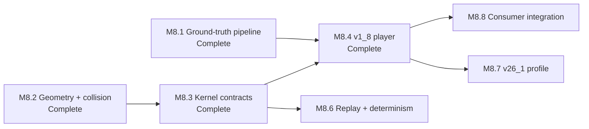

# Go Theft Craft master plan

Last reviewed: 2026-08-17

This file is the cross-repository source of truth for what remains. Detailed
designs and implementation plans remain in their owning repositories. Update
this file when a milestone starts, becomes blocked, or passes its release gate.

## Status legend

| Status | Meaning |
| --- | --- |
| Complete | Implemented and verified in the repository named by the milestone. |
| Client checks pending | Implemented, with every automated gate green, but a manual check its release gate requires has not been run. |
| Next | Approved and ready to implement. |
| Planned | Ordered, but its focused design or implementation plan is not yet approved. |
| Blocked | Cannot start until the named dependency is complete. |

## Current position

**M1: managed stream and compression** is implemented in `minecraft-protocol`
and passes its full release gate, including the new pinned Node
`minecraft-protocol` interoperability lane. The work is committed as
`8625ea7`.

**M2: encryption and login lifecycle** is complete in `minecraft-protocol` and
passes its full release gate, including two new encrypted Node
interoperability lanes.

**M2.5: schema-first code generation** is complete. Planning M4 against the real
protocol 775 schema found that the generator overrides schema types by bare
name, and that `position` and `entityMetadata` exist in both schemas with
different layouts — 47 packs x, y, z and 775 packs x, z, y; 47 terminates
metadata at 127 and 775 at 255. Generating 775 under the current rule would
have produced wrong bytes that every per-protocol round-trip test would have
accepted. The fix is to compile any type the schema defines and reserve
hand-written codecs for names the schema declares native, which also changes
protocol 47's generated API. It landed before M3 migrates `server`, so the
consumer migrates once.

**M3 is complete.** All twelve tasks are done and every step of its plan is
checked. `server` runs every connection on the managed stream, serves
handshake and status from generated packets, accepts logins through
`login.Acceptor`, negotiates compression, answers legacy pings, disconnects
gracefully, and owns no wire code at all: `pkg/protocol` and `pkg/gamedata` are
deleted apart from the play packet structs M6 replaces. `minecraft-protocol` is
released as `v0.1.0` and consumed as a released module with no `replace`
directive.

Every byte-parity fixture captured from the unmigrated server still matches,
and a pinned Node `minecraft-protocol` client reaches play against the migrated
server with compression off and on.

Both client checks passed on 2026-08-15 against a real 1.8.9 client, offline
and online, with **zero decode errors**: no generated codec rejected a packet
the vanilla client sent. The online login proved the server hash and
verify-token handling against the real Mojang session server, which no
automated test can do — every test stubs that call, and a hash wrong in the
same way on both sides of a loopback test still passes. Compression was
verified at `-1`, `256`, and `1`. The record is
[here](../server/docs/verification/2026-08-15-m3-client-checks.md).

Running the server found three defects the test suite never touched: two
disconnect-logging faults, both fixed, and a survival block duplication that is
**not** caused by the migrated drop data. Those and two missing features are
recorded in
[the session findings](../server/docs/verification/2026-08-15-m3-session-findings.md)
and carried into M6, which owns the rest of the consumer migration. One of
them — 2x2 crafting matching only some recipes — asked whether M3's registry
swap changed behavior. It did not: the matcher and the migrated registry are
both correct, and the defect was a pre-existing shift-click handler that
crafted once instead of draining the grid. Settled and fixed ahead of M6.

**M4 is complete, including both client checks.** All four stages landed, the
live check has been run against a real server, and a real Java 26.1 client has
been driven against this code with no packet failing to decode.
`minecraft-protocol` describes both pinned data trees with manifest v2,
generates `generated/java/v26_1` — 256 framed packets across five states, typed
game data for all 25 datasets, every dataset kept as the bytes upstream
published behind `v26_1.Raw()`, and a checked-in `coverage.json` — and aliases
it as `generated/java/current`. The login negotiator names no version: it
drives protocol 47, whose login ends at success, and protocol 775, whose login
passes through configuration, from the roles and the login exchange each
version declares. A 42-fixture differential suite compares the 775 codecs
against pinned Node ProtoDef in both directions.

The live check has now been run, against Paper 26.1.2 build 74, and it earned
its keep on the first run: the negotiator never answered `select_known_packs`,
and a 26.1 server sends no registry data and never finishes configuration
until it is answered. The connection stalled in configuration looking perfectly
healthy, and every scripted test passed throughout, because no script sent the
packet. Fixed, and the scripted server now withholds the finish handshake
until the answer arrives.

With that fixed the check reaches play, and the default limits — 2 MiB per
frame, 8 MiB decompressed — stand on traffic through login: the largest raw
frame a real server sent was 12,564 bytes and the largest decoded body 32,316
bytes, both `configuration/tags`.

The vanilla-client half was then closed too, on 2026-08-16, by a route the
plan had written off: a client cannot be pointed at a 775 server here, because
`login.Acceptor` is still protocol 47 only — but it can be served from a
recording of a real one. `mcproto serve` does that, and a real 26.1 client
spawned in the recorded world and played until it disconnected. **3,612
packets, none of which failed to decode.**

Getting there needed ten seconds of real play recorded first, and that is what
exposed the network NBT defect below. Play traffic is now measured as well:
6,145 frames across 49 distinct play packet types, every one decoding.

Protocol 47 is unchanged throughout, apart from one added file:
`generated/java/v1_8/login_exchange.go`. Its generated output is otherwise
byte-identical and its loopback interoperability suite still passes.

The eight things M4 found are recorded in its milestone section below. The two
worth carrying furthest: M4.2's report that the 775 codecs "parse as Go" was
true and not enough — they did not compile, for two reasons a test now covers —
and roles alone cannot drive a login, because two protocols agree about the
parts of one and about almost nothing else.

**M5 is complete.** Routing and middleware sit above framing without importing
the stream, the capture format is written straight from the observation path,
a bounded history ring is the one sink allowed to lose data, replay is
deterministic and reports its own divergences, and `mcproto` has the full
command set behind documented exit codes.

The amendment's headline defect was real and is fixed: a capture written with
the documented defaults would have held the login key exchange in the clear,
because the raw frame record is written before the frame is decoded and the
packet-level redaction check could not answer for it. The fix took a different
shape than the amendment specified, for a reason only the code showed — the
packet ID is not at the front of a frame payload once compression is on. That
and five other findings are in the M5 section below.

M5 also found things only a real connection could: replaying a genuine 26.1
login failed until the player learned that a capture holds both directions and
a session decodes one. Every synthetic fixture held a single direction, so
nothing before the live capture could have shown it.

**M6.1: server play-state migration is complete.** Every automated gate is
green and the vanilla-client play session ran on 2026-08-17 with **zero decode
errors**. The server's play state is off its own protocol 47 packet structs and onto
`minecraft-protocol`'s generated types: the local packet package and its code
generation are deleted, and the server now owns no wire code at all. Every
packet is a generated `minecraft-protocol` type, consumed from the released and
vendored `v0.1.0` module with no `replace` directive.

All six byte-parity fixtures captured from the unmigrated server are
byte-identical to what they were before the migration, and all five parity
tests still compare produced bytes against them. `task lint`, `task test`, the
new `task test:race`, `task test:interop`, and `task build` all pass. The play
read path no longer decodes packets twice; 13 hand-written `java.Unmarshal`
calls and 8 hand-rolled parsers are gone.

The last gate was the vanilla-client play session, and it passed. All fourteen
scenarios were played — join, move, break, place, chest, 2x2 and 3x3 crafting,
shift-clicking the output, damage, death, respawn, chat, a command with tab
completion, and disconnect — and the generated codec rejected nothing. That
covers the half M3 left on local structs, so protocol 47's serverbound surface
is now proven against a real client end to end rather than against the pinned
Node interop lane alone. The record is
[here](../server/docs/verification/2026-08-15-m6-1-client-check.md).

What the session found instead was gameplay, and one finding generalizes past
chests: **a block state this server invents that the client cannot resolve is
not a wrong block, it is no block at all.** A 1.8 client looks each chunk
section value up in its registry of valid states and falls back to air, so
storing a chest with metadata 0 — not one of the four horizontal facings —
drew air, and only the client's own placement prediction ever made one visible.
Anything M11 does with block state has to respect that the valid states are a
sparse set, not `id<<4 | anything`. Chests, containers, contact damage, and the
vanilla placement and facing rules were built during the session; the
[record](../server/docs/verification/2026-08-15-m6-1-client-check.md) lists the
rest of what it turned up.

Worth carrying separately: the vanilla behaviour was settled by reading the
deobfuscated 1.8.9 client that `minecraft-reference` already keeps, and doing
that first rather than reasoning from memory would have saved most of the hunt.
The reference jars are the cheapest source of truth this project has for
client-visible behaviour.

**M6.2: the proxy has nothing to migrate, and is now independent.** The
sub-project existed because M6 assumed the legacy proxy shared wire code with
this work. It does not: it imports nothing from `minecraft-protocol` and owns no
Java-wire code, because it speaks a different protocol family. Its only tie was
a vendored copy of the package M3 deleted from `server`, and dropping the
`require`, the `replace`, and the vendored tree left build, test, and lint
matching the baseline captured before the change.

**M6 is closed. M6.4 is postponed, deliberately.** Microsoft device-code
authentication is written and ready to start, and it is not being started:
nothing in the plan waits on it. It is independent of M4, M5, and M7, no later
milestone depends on it, and the `auth.Provider` seam it plugs into is already in
place, so picking it up later costs nothing that starting it now would save. What
postponing it costs is access to online-mode servers — every check from here runs
against offline mode, including M8's and M9's vanilla lanes. Take it up when a
real online-mode server is the thing being tested, not before. That moment now
has a name: M10's online-mode lane, listed in its checklist, is what finally
picks M6.4 up.

**M6.3: the headless connection is complete.** All fourteen tasks landed and
every automated gate is green: `task lint`, `task test` under `-race`, the new
`task test:e2e`, and `task build`. The client dials, authenticates offline,
logs in through the shared negotiator, reaches play, publishes session events
through bounded subscriptions, and closes exactly once. Protocol 47 and
protocol 775 both have adapters, a readiness rule, and a profile;
`version/java` assembles both.

The M7 design's two prerequisites were folded in where they belong. `Event`
carries the revision, through an embedded `Stamp` that only the collector can
write, so no handler or subscriber can set or forge one. The second — the
client owning the configuration phase — landed too: the client stops the
negotiator at the adapter's terminal state and drives configuration into play
itself. See the M6.3 section below.

Executing it changed three contracts the plan did not anticipate.
`version.Adapter` gained `Handshake`, because a version-neutral client cannot
build a handshake packet. `version.WireProfile` gained `Collector`, because the
adapter and the loop were holding different ones and every event a handler
produced was being dropped — a test caught it, not review. And appending to a
collector is the package function `event.Emit` rather than a method, because a
value inside an interface cannot be stamped after the fact.

**M8.1: physics ground-truth pipeline is complete.** It subdivided M8 and
depended only on the released `minecraft-reference` tool and the completed M0
game-data contracts, not on M1 through M7. The rest of M8 stays blocked on M4
and M7.

`mcreference dump` compiles and runs a reflective Java program against a
prepared 1.8.9 server jar and writes a canonical `physics.json`: 198 block
slipperiness values, the 65,536-entry trigonometry table, and the Mojang jar
digest. Twelve entity motion constants are literals inside method bodies that
no reflective dumper can reach, so they were transcribed and confirmed twice,
once from decompiled source and once from `javap` disassembly. The file is
committed, digest-pinned, and rendered into `generated/java/v1_8/physics.go`,
reachable as `v1_8.Data().Physics()`. `generate:check` passes with neither
`java` nor `javac` on `PATH`.

Three findings are worth carrying into M8.2 and later:

- Eleven of the twelve motion constants are `float` literals that Java widens
  to `double` where they are applied, so the real values are
  `0.9800000190734863` and its siblings rather than the round decimals.
  `physics.json` stores the widened forms.
- On the ground the horizontal drag is `slipperiness * 0.91F` for players and
  `slipperiness * 0.98F` for items, and Java computes that product in `float32`
  before widening. A kernel doing it in `float64` will not match bit for bit.
- Extracted data is optional in both the manifest schema and the render plan,
  so the 26.1 tree still generates. M8.7 adds a second dumper for 26.1.2;
  `Dump` already rejects every version but 1.8.9 with an explicit error.

**M8.2: geometry and collision are complete, and checked against the game.**
`geom`, `world`, and `collision` deliver swept axis-aligned movement over a
block view that distinguishes known air from an unknown region. All nine tasks
landed, `task verify` is green, and the three exit properties hold: swept motion
never tunnels, a step-up never exceeds its bound, and zero motion is a fixed
point.

The milestone also gained an oracle the plan did not ask for. `internal/oracle`
compiles a harness against the locally prepared, deobfuscated 1.8.9 server jar
and runs the game's own `AxisAlignedBB` methods and its own `Entity.moveEntity`,
its broad phase and both step-up attempts included, then requires a
bit-identical box and matching collision flags. 17,000 primitive cases and 2,872
whole moves agree exactly. No game source or jar is committed, and the tests skip
without a prepared workspace or a JDK, the same way `generate:check` skips
without a JDK.

Building it was worth it, because reading the plan had missed two things:

- A step-up records the **settle** as its Y motion, not the climb plus the
  settle. Vanilla resets the value to the negated rise before the settle clamp
  and keeps only that, so the vertical collision flag after a step describes the
  descent onto the surface. `onGround` follows from that flag and the tick's
  original downward motion, which means stepping does not by itself put an
  entity on the ground — a walking entity reads as grounded only because gravity
  makes its Y motion negative.
- `stepHeight` is a `float` widened where it is applied, so a player steps with
  `float64(float32(0.6))`, not `0.6`. This is the same widening M8.1 recorded for
  the motion constants, and it is now known to reach further than that list.
  M8.4 should assume any 1.8.9 quantity may be a widened `float` until checked.

The lesson generalizes: the fixture-only gates M8.4 and M8.7 rely on are weaker
than this, and the harness is reusable. Point it at `movement` when M8.4 lands
rather than waiting for M8.8's live server.

**Every remaining M8 stage now has an implementation plan.** M8.3, M8.4, M8.6,
M8.7, and M8.8 are written and linked in the tracker. Writing them settled three
things the sequencing design had left as risks, and each answer changes what the
stage costs.

**M8.6's runner risk is resolved, and the obstacle was not the runners.**
GitHub-hosted runners cover all six targets the gate names. What does not work is
`devbox` on Windows, because it provisions through Nix, and every check in every
one of these repositories currently assumes it. The plan therefore splits the
determinism job away from verification: one Ubuntu job keeps running
`task verify`, and a separate six-target job uses `actions/setup-go` with the Go
version pinned to the one `devbox.json` names, plus a test that fails if the two
ever disagree. The matrix also turns out to test M8.4's `float32` arithmetic far
more than it tests the encoder, which means recordings that do not exercise the
numerics would make the gate decoration; the plan requires specific ones.

**M8.7 cannot start with code.** `mcreference dump` rejects every version but
1.8.9 by explicit check, and its Java dumper names 1.8.9 identifiers throughout,
so a second version is a second dumper. More importantly, the reference workspace
holds no deobfuscated 26.1.2 server jar — only the original and executable jars
and decompiled sources — so whether that version can have a jar-backed oracle at
all is unknown. The plan's first task answers that and states both branches: with
an oracle it follows M8.4, and without one its gate is explicitly weaker than
M8.4's and M8.8's live check becomes the first real verification of its
constants.

**M8.8 has two prerequisites nobody had written down.** The headless client's
send path is unexported, because M7's scope was observation, so there is no way
to tell a server where the player went; an outbound version-neutral action seam
is that plan's first task and a real API addition. **Since met:** `Client.Do`
landed in `headless-minecraft` with move, look, move-look, ground, and respawn
intents, serialized against the read loop and refused before the server places
the player. M8.8's first task is done ahead of it, and its plan was reconciled
against the landed API on 2026-08-17: Task 1 is recorded complete with the
five particulars that differ from its sketch, and Task 4 absorbs the one
responsibility the landed API deliberately declined — choosing which movement
packet a tick warrants, per the measured cadence rule `version/action.go`
documents. The second prerequisite stands: with M6.4 postponed, the
gate runs in offline mode only — fine for a local vanilla server, but the result
says nothing about online mode and the plan requires it to say so. The plan also
defines a correction before counting one, since a vanilla server sends every
player a position-and-look during login, and counts the server's "moved wrongly"
log lines alongside teleports, because a server can tolerate our drift for a
while before it acts.

**M8.4 inverts the verification order the sequencing design assumed.** That
design gates M8.4 on recorded fixtures and moves the live check to M8.8, noting
that if M8.4 passes fixtures but M8.8 draws corrections, "the fault is likelier
in the fixtures than in the kernel." M8.2 turned that into a measurement: two of
its eight careful prose statements about vanilla were wrong, and no fixture
written from the same prose would have caught either. So M8.4's fixtures are
generated from the game through `internal/oracle`, and its gate is a differential
test against the game's own movement tick. Fixtures still ship, because M8.7 and
CI need a suite that runs without a JDK — they just record the game's answer
rather than ours.

**M8.3 and M8.4 are complete, and the movement tick is checked against the
game.** `sim`, `entity`, `runtime`, and the in-memory store deliver the tick
contract, the canonical digest, and a revision check that refuses a change set
computed against older state. `movement` and `profile/java/v1_8` deliver the
1.8.9 land tick: friction and acceleration, the heading through the game's own
sine table, the jump and its counter, the collision step, gravity, both drags,
and a motion threshold nobody had written down.

M8.4 was gated on the game rather than on fixtures, which is the inversion this
file argued for when M8.2 showed prose gates to be weak. The oracle now drives
`EntityLivingBase.onLivingUpdate` on a minimal living entity — so the game's own
bytecode runs the counter, the threshold, the decay, the friction lookup, the
heading, the move, gravity, and the drags — over six scenarios in eight randomly
obstructed rooms each, a hundred ticks apiece, compared bit for bit every tick.
4,800 ticks agree. The `EntityPlayerMP` fallback the plan budgeted for was not
needed.

The inversion paid for itself four times over. Every one of these had passed the
tests written from a careful reading:

- A player's box is not 0.6 by 1.8. The game halves a `float` width and adds a
  `float` height to a `double` position, so the body reaches
  `0.30000001192092896` from its centre and stands `1.7999999523162842` tall.
  Caught on the tick the body was created, before a rule had run.
- Both drags are `double` products. The constants are `float` and the motion is
  a `double`, so Java widens the constant to meet it. This is the *opposite* of
  the M8.1 finding it looks like: a product whose operands are all `float` is
  formed at single width, and one that mixes widths is not. The rule is which
  operands the game has, not which constants.
- The heading converts degrees in two `float` steps, while the jump impulse
  three rules away uses a single pre-divided constant. Both forms are in the
  game, they disagree, and at some yaws they read neighbouring entries of the
  sine table.
- The tick discards any component of motion below `0.005`, before the jump. No
  plan described this rule; without it a body walking at any angle other than
  square on diverges within four ticks.

Two divergences are recorded rather than fixed, and each now has an owner.
The vertical clamp is not a rule of the tick at all: the game calls the landing
behaviour of the block under the body's feet, whose default zeroes the vertical
motion and whose slime override negates it. There is no per-block landing hook
yet, so slime stays out of the differential worlds; the hook is assigned to
M9.3, whose movement scenarios are the first gate a slime block can fail — 1.8
has slime blocks, so both versions' lanes will see it. And the sneak edge-guard
that stops a crouching player walking off a ledge is gated on
`instanceof EntityPlayer`, so neither the harness's stub nor our collision
applies it — a real player at a real server will, which M8.8 will see.

Fixtures still ship, because M8.7 and CI need a suite that runs without a JDK,
and they record the game's answer rather than ours: `mctest` replays the same
six scenarios from committed data with no jar present, and the generator only
writes behind an explicit flag. What it does without the flag is check that the
committed fixtures still say what the jar says, so a fixture that drifts is
caught where the game is, not later on a machine that cannot ask it.

**M8.6 is complete, and the determinism matrix paid for itself immediately.**
`replay` records a run as its initial world, its per-tick input, and the digest
of every tick, and a workflow replays five committed recordings on six targets:
Linux, macOS, and Windows, each on amd64 and arm64. All six run and all six
agree.

The runner risk this file recorded is retired, and the resolution is the one the
plan proposed: verification keeps Devbox on one platform, determinism uses
`actions/setup-go` on six, and a test fails if `devbox.json`, the workflow, and
`go.mod` stop naming one Go version. One target needed replacing —  `macos-13`
sat queued for a quarter of an hour on three separate runs and was scheduled on
none of them, which is what a retired image looks like from outside, so the
Intel target is now `macos-15-intel` and it starts.

**The matrix found a wrong answer on arm64 on its first run with real
recordings.** All three arm64 targets disagreed with both amd64 targets, on
exactly three of the five recordings — the three where strafe and forward are
both non-zero. Go permits an implementation to contract a multiply and an add
into a single rounding unless an explicit conversion rounds the intermediate,
and the arm64 compiler takes that permission, so the two products in the heading
rule fused. The recordings driven with forward alone agreed, because their other
product is zero and fusing it changes nothing.

This is worth carrying past M8. Three points:

- **It was a correctness bug, not a tie.** Java never contracts unless
  `Math.fma` is called, so the game computes each product separately, and M8.4's
  oracle had already checked the unfused arithmetic against a real server. An
  arm64 build was producing positions vanilla does not produce. Anyone running
  this on Apple silicon or a Graviton server was getting them.
- **The fix left the recordings unchanged**, which is the evidence that the
  conversions force the answer amd64 already had rather than choosing a third
  one. No recording was regenerated to make the matrix green; the plan forbids
  it, and it was not needed.
- **M8.4's gate could not have found this.** The oracle runs where the jar runs,
  which is one platform at a time. Two gates were needed and both were: the
  oracle says which answer is right, and the matrix says everyone computes it.

The general lesson for M8.7 and M9: every `float32` product feeding an add is a
place arm64 may fuse, and the only reliable defence is an explicit conversion
rather than an intermediate variable. The recordings join the matrix
automatically as later profiles arrive, since it replays every file in the
directory and each recording pins its own profile identity and a digest of the
game data it ran against.

**M11: server framework is newly planned.** The eight items in
`server/docs/todo.md` fit no existing plan, because every server plan is
protocol migration, and this file had no milestone for `server` becoming
something people build with. M11 is that track, subdivided into M11.1 through
M11.7, depending on M6.1 alone and running parallel to M7 through M10.

Designing it settled two questions the todo list only implied. `server` is a
framework rather than an application, so every item is a seam with a default
implementation rather than a feature, and `cmd/server` becomes
`examples/vanilla`. And per-item identity, which the duplication requirement
forces, turns out to be affordable at 64 bits per item while per-block identity
is not: universal block IDs cost roughly 512 MB for a 500×500 area before a
single provenance record, so identity is sparse and covers placed blocks, with
the key space left able to hold the universal case behind a flag.

```mermaid
flowchart LR
    M0["M0 Protocol 47 foundation<br/>Complete"]
    M1["M1 Managed stream + compression<br/>Complete"]
    M2["M2 Encryption + login lifecycle<br/>Complete"]
    M25["M2.5 Schema-first codegen<br/>Complete"]
    M3["M3 Server status/login migration<br/>Complete"]
    M4["M4 Java 26.1 / protocol 775<br/>Complete"]
    M5["M5 Routing, capture/replay, mcproto<br/>Complete"]
    M6["M6 Complete consumer migrations<br/>Complete (M6.4 postponed)"]
    M7["M7 Observed client world state<br/>Complete"]
    M8["M8 Deterministic simulation slice<br/>M8.1–M8.4 complete"]
    M9["M9 Movement, attack, inventory, craft"]
    M10["M10 Conformance and stable v1"]
    M11["M11 Server framework<br/>M11.1–M11.7"]

    M0 --> M1 --> M2 --> M25 --> M3 --> M4 --> M5 --> M6 --> M7 --> M8 --> M9 --> M10
    M6 --> M11
```

M11 is a parallel track, not a step in the protocol pipeline. It depends on
M6.1 alone and nothing depends on it, so it runs beside M7 through M10 whenever
there is capacity. Its only hard obligation to the rest of the plan is that
`server` keeps working as the test harness M9 and M10 both need.

## Milestone tracker

| ID | Deliverable | Owner | Status | Depends on | Detailed documents |
| --- | --- | --- | --- | --- | --- |
| M0 | Shared contracts, bounded Java wire primitives, immutable game data, generated Java 1.8 data, and reflection-free protocol 47 codecs | `minecraft-protocol` | Complete | — | [Shared extraction](docs/superpowers/plans/2026-08-13-shared-protocol-extraction.md), [wire extraction](docs/superpowers/plans/2026-08-13-java-1-8-wire-extraction.md), [immutable data](docs/superpowers/plans/2026-08-13-immutable-game-data-contracts.md), [Java 1.8 data](docs/superpowers/plans/2026-08-14-java-1-8-generated-data.md), [protocol 47 codecs](../minecraft-protocol/docs/plans/2026-08-14-java-1-8-protocol-codecs.md) |
| M1 | Asynchronous managed stream, runtime state and compression changes, bounded pipelines, legacy `FE 01` pre-frame hook, disconnect-aware graceful shutdown, and observation points | `minecraft-protocol` | Complete | M0 | [Design](../minecraft-protocol/docs/superpowers/specs/2026-08-14-managed-stream-compression-design.md), [implementation plan](../minecraft-protocol/docs/superpowers/plans/2026-08-14-managed-stream-compression.md) |
| M2 | AES-CFB8 transport encryption and complete, developer-controllable login lifecycle | `minecraft-protocol` | Complete | M1 | [Protocol toolkit umbrella plan](docs/superpowers/plans/2026-08-13-current-protocol-stream-toolkit.md), [headless authentication plan](docs/superpowers/plans/2026-08-13-headless-client-authentication.md), [M2 design](../minecraft-protocol/docs/superpowers/specs/2026-08-15-encryption-login-lifecycle-design.md), [M2 implementation plan](../minecraft-protocol/docs/superpowers/plans/2026-08-15-encryption-login-lifecycle.md) |
| M2.5 | Compile every schema-defined type from its own schema, share named types, bound decode recursion, and delete the superseded hand-written value types | `minecraft-protocol` | Complete | M2 | [Design](../minecraft-protocol/docs/superpowers/specs/2026-08-15-schema-first-codegen-design.md), [implementation plan](../minecraft-protocol/docs/superpowers/plans/2026-08-15-schema-first-codegen.md) |
| M3 | Migrate one real connection path: server handshake, status, ping, login, disconnect, compression, and online/offline mode | `server`, `minecraft-protocol` | Complete | M2.5 | [Design](../server/docs/superpowers/specs/2026-08-15-shared-protocol-migration-design.md), [implementation plan](../server/docs/superpowers/plans/2026-08-15-shared-protocol-migration.md) |
| M4 | Generate Java 26.1 data and protocol 775 codecs, retaining unknown source datasets | `minecraft-protocol` | Complete | M3 | [Design](../minecraft-protocol/docs/superpowers/specs/2026-08-15-java-26-1-protocol-775-design.md), [implementation plan](../minecraft-protocol/docs/superpowers/plans/2026-08-15-java-26-1-protocol-775.md) |
| M5 | Packet routing and middleware, capture history, replay, status/login helpers, and non-interactive `mcproto` | `minecraft-protocol` | Complete | M4 | [Design](../minecraft-protocol/docs/superpowers/specs/2026-08-15-routing-capture-replay-cli-design.md) (amended 2026-08-15), [implementation plan](../minecraft-protocol/docs/superpowers/plans/2026-08-15-routing-capture-replay-cli.md) (amended 2026-08-15) |
| M6 | Finish shared-protocol migration for the server and proxy, then connect headless-minecraft to the current Java profile | `server`, `proxy`, `headless-minecraft` | Complete; M6.4 Microsoft device-code postponed, nothing depends on it | M5 | [Shared extraction](docs/superpowers/plans/2026-08-13-shared-protocol-extraction.md), [headless design](docs/superpowers/specs/2026-08-13-headless-minecraft-design.md), [headless lifecycle plan](docs/superpowers/plans/2026-08-13-headless-client-authentication.md) |
| M7 | Immutable observed player, entity, chunk, registry, container, and environment snapshots; reducers apply packets in wire order | `headless-minecraft` | Complete | M6 | [Headless design](docs/superpowers/specs/2026-08-13-headless-minecraft-design.md), [observed world state plan](docs/superpowers/plans/2026-08-15-observed-world-state.md), [world-state plan, Tasks 1–6](docs/superpowers/plans/2026-08-13-world-state-actions.md) |
| M8 | First deterministic, protocol-independent Java 1.8.9 and 26.1.2 player movement slice with canonical replay and server/client adapters; items and arrows moved to M9 | `minecraft-simulation` | M8.1–M8.4 and M8.6 complete | M4, M7 | [Sequencing design](../minecraft-simulation/docs/superpowers/specs/2026-08-15-m8-m9-sequencing-design.md), [simulation design](docs/superpowers/specs/2026-08-13-minecraft-simulation-design.md), [physics subproject design](../minecraft-simulation/docs/superpowers/specs/2026-08-14-simulation-physics-first-subproject-design.md), [reference research plan](docs/superpowers/plans/2026-08-13-minecraft-reference-extraction.md), [simulation implementation plan](docs/superpowers/plans/2026-08-13-minecraft-simulation-foundation.md) |
| M8.1 | Extract Java 1.8.9 physics constants from a verified Mojang server jar and publish them as a pinned, generated Go package | `minecraft-reference`, `minecraft-protocol` | Complete | — | [Physics subproject design](../minecraft-simulation/docs/superpowers/specs/2026-08-14-simulation-physics-first-subproject-design.md), [implementation plan](../minecraft-simulation/docs/superpowers/plans/2026-08-14-m8-1-ground-truth-pipeline.md) |
| M8.2 | `geom`, `world`, and `collision`: swept axis-aligned collision reproducing Java Edition 1.8.9 axis order and step-up, over a tri-state block view, verified against a real server jar | `minecraft-simulation` | Complete | — | [M8.2 implementation plan](../minecraft-simulation/docs/superpowers/plans/2026-08-15-m8-2-geometry-collision-core.md) |
| M8.3 | `sim`, `entity`, `runtime`, block handles in `world`, and an in-memory store: the tick contract, canonical result digest, and revision-checked change sets | `minecraft-simulation` | Complete | M8.2 | [M8.3 implementation plan](../minecraft-simulation/docs/superpowers/plans/2026-08-17-m8-3-kernel-contracts.md) |
| M8.4 | `movement` and `profile/java/v1_8` for the player, gated on a differential test against the game's own movement tick | `minecraft-simulation` | Complete; 4,800 ticks agree with the game, and six fixtures replay without a JDK | M8.3 | [M8.4 implementation plan](../minecraft-simulation/docs/superpowers/plans/2026-08-17-m8-4-v1-8-player-movement.md) |
| M8.6 | Canonical recording and replay, and a six-target determinism matrix | `minecraft-simulation` | Complete; all six targets agree, and the matrix found an arm64 fused-multiply-add bug | M8.3 for encoding, M8.4 for the matrix | [M8.6 implementation plan](../minecraft-simulation/docs/superpowers/plans/2026-08-17-m8-6-replay-and-determinism.md) |
| M8.7 | `profile/java/v26_1` for the player, plus a 26.1.2 physics dumper and dataset | `minecraft-reference`, `minecraft-protocol`, `minecraft-simulation` | Planned, plan written; starts with an oracle feasibility task | M8.4, M4 | [M8.7 implementation plan](../minecraft-simulation/docs/superpowers/plans/2026-08-17-m8-7-v26-1-player-movement.md) |
| M8.8 | One kernel driven by client prediction and server authority, gated on zero corrections from vanilla | `minecraft-simulation`, `headless-minecraft`, `server` | Planned, plan written | M8.4, M6, M7 | [M8.8 implementation plan](../minecraft-simulation/docs/superpowers/plans/2026-08-17-m8-8-consumer-integration.md) |
| M9 | Entity-trace capture, dropped items and arrows, then movement, digging, building, attack, container, inventory, and crafting scenarios, subdivided into M9.1–M9.8 by mechanic, each verified against both 1.8.9 and 26.1.2 | `minecraft-simulation`, `relay`, `headless-minecraft`, `server` | M9.1 client checks pending; M9.1b planned; M9.3–M9.8 plans drafted ahead of their prerequisites, each with a reconcile-first task; M9.2 unblocked by M8.4 and awaiting M8.8 | M9.1 on M5 and `relay` v0.2.0; M9.1b on M9.1 and M4; M9.2–M9.8 on M8.8, M9.1, and M9.1b | [Sequencing design](../minecraft-simulation/docs/superpowers/specs/2026-08-15-m8-m9-sequencing-design.md), [world-state and actions plan](docs/superpowers/plans/2026-08-13-world-state-actions.md), [M9 plan](docs/superpowers/plans/2026-08-16-m9-gameplay-mechanics.md) (M9.1 written; M9.2–M9.8 await their prerequisite), [M9.1b–M10 cross-version plan](docs/superpowers/plans/2026-08-17-m9-1b-m10-cross-version-conformance.md) |
| M10 | Cross-implementation conformance, compatibility contracts, migration notes, and stable `v1.0.0` releases | all runtime repositories | Planned | M9 | Existing repository roadmaps, [M10 plan](docs/superpowers/plans/2026-08-16-m10-conformance-releases.md) |
| M11 | Turn `server` into a framework: composable seams, a version-neutral world model, storage, world generation, provenance, observability, and commands, subdivided into M11.1–M11.7 | `server` | M11.1 through M11.4 complete; M11.5–M11.7 designed and planned, unimplemented | M6.1 | [Server framework design](../server/docs/superpowers/specs/2026-08-16-server-framework-design.md), six sub-milestone designs, and a plan for each, [M11 plan](docs/superpowers/plans/2026-08-16-m11-server-framework.md) |

## What is complete

- [x] `minecraft-protocol` repository foundation and finite wire limits.
- [x] Immutable game-data contracts and Java 1.8 generated data.
- [x] Protocol 47 descriptor and generated packet codecs (`162e95d`).
- [x] Initial `headless-minecraft` safety and version-profile foundation
  (`afab923`).
- [x] Managed stream, compression, protocol 47 transitions, graceful
  disconnect, observation points, and Node interoperability tests.
- [x] AES-CFB8 encryption, the Java key exchange, strict login identity types,
  observation redaction, and the opt-in login negotiator.
- [x] Schema-first code generation, shared named types, bounded decode
  recursion, and removal of the hand-written value types.
- [x] `minecraft-protocol` `v0.1.0`, its first tagged release, consumed by
  `server` as a released module.
- [x] Java 1.8.9 physics ground truth: `mcreference dump`, pinned
  `physics.json` with Mojang provenance, and generated `physics.go`
  (`b463b3e`, `961702d`).
- [x] Server connections on the managed stream, with generated handshake and
  status packets, the shared login acceptor, compression, legacy pings, and
  graceful disconnects.
- [x] Standalone `minecraft-reference` workflow and release (`v1.0.1`).
- [x] Observed world state: eight immutable domains at one revision per batch,
  wire-ordered reducers on both protocols, bounded preservation of everything
  the server sent that no version models, `examples/observe`, and the
  observed-world end-to-end lane.
- [x] Initial `minecraft-simulation` repository boundary (`854e7d9`).

Repository foundation does not mean the headless client or simulation runtime
is implemented. Those bodies of work begin at M6 and M8.

## What is left

### M1 — Managed stream and compression

Complete. Every item below is implemented and verified.

- [x] Replace the combined framed codec with session, packet, frame, and
  compression-envelope boundaries.
- [x] Implement asynchronous inbound reads and completed outbound writes over
  `io.Reader` and `io.Writer`.
- [x] Serialize developer-requested protocol-state and compression changes.
- [x] Enforce frame, decompressed-payload, queue, and shared buffered-byte
  limits before allocation.
- [x] Preserve inbound and outbound pipeline ordering.
- [x] Add the opt-in pre-frame hook for legacy `FE 01` ping.
- [x] Send the state-appropriate disconnect packet during graceful shutdown,
  drain accepted writes, and retain immediate abort for transport failure.
- [x] Publish lossless observation points that later capture/history code can
  subscribe to without becoming part of framing.
- [x] Test malformed frames, cancellation races, partial I/O, resource limits,
  localhost TCP behavior, and pinned Node `minecraft-protocol`
  interoperability.

Two decisions made while implementing, recorded because they affect later
milestones:

- The design reserves one frame-plus-decompression headroom. A single shared
  headroom slot deadlocks, because the read pump holds it while handing its
  frame to the coordinator. Each direction therefore gets its own reservation,
  so the buffered-byte ceiling stays honest. Encryption in M2 adds no new
  buffer to this accounting; it wraps the framed byte stream in place.
- A running stream owns its session exclusively, so `Stream.Snapshot` is the
  only safe way to observe state and pipeline settings. Consumers in M3 and M6
  must not read a session directly.

### M2 — Encryption and login lifecycle

Complete. Every item below is implemented and verified.

- [x] Approve a focused design and implementation plan.
- [x] Add AES-CFB8 at the transport boundary in the correct pipeline order.
- [x] Support offline and Microsoft-backed identities without coupling auth to
  the stream.
- [x] Keep automatic transitions optional: developers can inspect, accept,
  reject, delay, or replace state and compression decisions.
- [x] Test successful login, authentication rejection, timeout, cancellation,
  disconnect, and shutdown at every state.

The modern-login item moved to M4. Protocol 775 codecs do not exist until M4,
so hand-written configuration and play login packets would be discarded the
moment M4 generates them.

Three decisions made while implementing, recorded because they affect later
milestones:

- Encryption is applied, not proposed. No packet carries the plaintext session
  key, so M3 and M6 consumers call `Stream.Control` with a
  `java.EncryptionControl` after the key exchange rather than expecting a
  session transition to enable it.
- The `login` package is protocol 47 only. M4 either parameterizes it or adds a
  second constructor, and M6 depends on whichever it chooses. M2 tagged the
  generated packets with `protocol.LoginRole` so that choice is a change of
  dispatch rather than a second negotiator.
- The standard library's `cipher.NewCFBEncrypter` is cipher feedback with a
  block-wide segment; Java Edition uses an eight-bit one. Two Go peers using
  the standard library agree with each other and with no real implementation,
  so every loopback test passed while the cipher was wrong. The pinned Node
  lane is what caught it, which is the argument for keeping that gate required
  in M10.

### M2.5 — Schema-first code generation

Complete. Protocol 47's bytes did not change, which was the exit criterion.

- [x] Pin protocol 47's wire bytes with a round-trip test over every packet and
  hand-computed assertions for the position bit layout, written before anything
  changed.
- [x] Bound decode recursion against the existing `Limits.recursionDepth`.
- [x] Resolve hand-written codecs against the schema's own native set, and pass
  native invocation arguments through — `endVal` is no longer a Go constant.
- [x] Generate named types once when they are recursive or used by two or more
  packets, instead of inlining them per packet.
- [x] Delete `java.Position`, `java.Slot`, and `java.EntityMetadata`.
- [x] Prove the result with the existing byte fixtures and the pinned Node
  interoperability lane.

The `slot` question this milestone raised is answered: protocol 47's schema
expresses everything the hand-written `slot` codec did, and the fixtures passed
unchanged. There is no gap to carry into M4.

Four things found while implementing, recorded because they affect later
milestones:

- A name is native only when its definition is the native marker itself.
  `string` is defined as an invocation of the native `pstring`, so its stored
  node is a native node carrying a different name. Counting that as a native
  declaration reintroduces the same bug one name further along, and M4 will
  meet the pattern again in 775's alias-heavy type table.
- Four packets cannot be reached by any canonical byte stream, because entity
  metadata terminates at a byte the generator's test alphabet never produces
  and NBT needs a structurally valid tag. They are pinned by hand. M4 needs the
  same treatment for 775's equivalents.
- Two latent defects surfaced only once `position` stopped being a scalar: an
  option holding a struct rendered as `*(p).Field`, which Go parses as
  `*((p).Field)`, and a `pstring` with a non-VarInt count type was read with
  the VarInt-prefixed codec instead of being rejected. Both were unreachable
  while every schema-defined type was overridden by name.
- A parameterized type cannot be shared, because its shape depends on the
  argument each invocation supplies. Protocol 47 has one, `entityMetadataItem`.
  If 775 has a parameterized type that is also recursive, it cannot be compiled
  at all under the current rules, and M4 should check for that before planning
  its generation stage.

### M3 — First real consumer

Design and implementation plan approved. Twelve tasks across four stages, two
repositories. The server's connection runs on the managed stream from the first
byte; play keeps its local packet structs and moves to the shared reflect codec,
which reads the same `mc` tags.

- [x] Approve the server status/login migration plan.
- [x] Add `login.Acceptor` to `minecraft-protocol` as the server-side
  counterpart to M2's client negotiator, tested against it over `net.Pipe`.
- [x] Pin the server's current bytes with a connection harness written against
  the unmigrated code.
- [x] Source game data from `minecraft-protocol/data` repo-wide.
- [x] Replace the blocking read loop and the swapped `io.ReadWriter` with a
  `protocol.Stream`, keeping `writePacket`'s signature so its eighty call sites
  do not move.
- [x] Migrate handshake, status, ping, and login to generated packets.
- [x] Enable compression, threshold configurable, defaulting to 256.
- [x] Answer legacy `FE 01` pings and send disconnect packets before closing.
- [x] Delete `pkg/protocol`, the server's cipher files, and the hand-written
  server hash.
- [x] Prove it with byte-parity fixtures and the pinned Node client.
- [x] Prove it with a real 1.8.9 client through a full play session, and one
  online-mode login.

Six things found while implementing M3, recorded because they affect later
milestones:

- A session proposes a transition only for a packet it can inspect. A
  connection that writes a raw payload gets no transition, so the migration
  drove state explicitly until handshake, status, and login moved to generated
  values. M6 finishes this for play, and until it does the connection still
  mirrors the session's state into a local enum.
- `minecraft-protocol` requires Go 1.26.6, so `server` moved to the same
  `openserbia/go-flake` pins. `devbox.json` must set `GOROOT` explicitly:
  without it, a shell entered from a sibling repository leaks its GOROOT and
  every build fails on a toolchain mismatch. M6 will hit this in `proxy` and
  `headless-minecraft` too.
- The shared data names Java 1.8 `"1.8.9"`; the server advertises `"1.8.8"`.
  Both are protocol 47. The status response keeps `"1.8.8"` because M3 changes
  no byte on the wire, and reconciling the two names is a decision of its own.
- `cmd/dmd` survives. It downloads the `protocol.json` that the retained packet
  codegen reads, so it cannot go until M6 deletes the packet structs.
- `task lint` and `task build` were both failing in `server` before this
  milestone — six pre-existing findings, and a build that pointed at a
  directory holding no Go files. M3 could not report a green gate without
  fixing them, so it did.
- The offline UUID derivation moved into `minecraft-protocol` as
  `login.OfflineUUID`. It is byte-identical to the server's own, which is what
  keeps saved player files reachable: the server looks them up by UUID.

Three constraints found while planning M3:

- The server has **no compression today** — it never sends `set_compression` and
  cannot read a compressed frame. That item is new behavior, not a migration.
- Every play packet will now be decoded twice, and the generated decode is
  strict where the old loop was not. A serverbound packet whose generated model
  is wrong becomes a disconnect. The real-client session is what finds those,
  and each one is a codec bug to fix in `minecraft-protocol`.
- M2 defines `login.Verifier` but implements only the client half. The
  server-side acceptor is new work, and it belongs in `minecraft-protocol` so
  both halves of the encryption handshake can be tested against each other in
  one repository.

### M4 — Java 26.1 and protocol 775

**Complete against a real server.** All four stages landed, and the live check
has been run against Paper 26.1.2 build 74 on 2026-08-16. It found a defect no
scripted test could: the negotiator never answered `select_known_packs`, and a
26.1 server sends no registry data and never finishes configuration until it
is answered, so a live login stalled in configuration while looking healthy.
Fixed, with a scripted server that now withholds the finish handshake until
the answer arrives. The remaining gap is the vanilla client, below.

The measurement the limits were waiting for, through handshake, login,
configuration, and the first play packet:

| Measurement | Value | Limit | Headroom |
| --- | --- | --- | --- |
| Largest raw frame | 12,564 bytes (a compressed `configuration/tags` frame) | 2 MiB | 167x |
| Largest decoded body | 32,316 bytes (`configuration/tags`) | 8 MiB | 259x |

Both defaults hold with room to spare, so no limit moves. This measures login
only. Play is where chunk data is the largest thing a server sends, and
nothing here has measured it — M7 is where that check belongs.

| Stage | Exit criterion |
| --- | --- |
| M4.1 | `task data:fetch` twice produces no diff; `data:validate` passes for both versions; protocol 47 output is byte-identical after the manifest migration |
| M4.2 | The 775 schema compiles with zero unsupported constructs, and `position` compiles from the 775 schema rather than inheriting 1.8's bit order |
| M4.3 | Every 26.1 dataset decodes strictly with no unknown field, and every dataset name appears in `Raw` |
| M4.4 | `v26_1.Protocol()` reports 775; the ProtoDef differential suite passes; the live check reaches play against Paper 26.1 and reports its largest frame; a vanilla 26.1 client's traffic decodes — **met** |

- [x] Pin the PrismarineJS source manifest and aliases.
- [x] Implement configuration and play transitions for modern Java login,
  moved here from M2 because the packets it needs do not exist until this
  milestone generates them.
- [x] Import all exposed datasets and preserve unknown formats as raw data.
- [x] Generate deterministic protocol 775 packets and codecs.
- [x] Add byte fixtures and protocol 47 regression coverage.
- [x] Verify status and login against a compatible Paper server. Done against
  Paper 26.1.2 build 74; `livecheck/README.md` records the numbers.
- [x] Verify against a vanilla Java 26.1 client. Done on 2026-08-16:
  **3,612 packets from a real client, none of which failed to decode.** The
  record is in
  [the client check](../minecraft-protocol/docs/verification/2026-08-16-vanilla-client-check.md).

  It was reachable after all, by a route the earlier note missed. There is no
  775 server here to point a client at, so the client was served from a
  recording of a real one: `mcproto serve` decodes each recorded clientbound
  frame, writes it to the live client through this repository's own encoder,
  and waits wherever the recording shows the client speaking. Eight packets
  were decoded that nothing here had ever decoded, `block_place` among them,
  which carries a `Slot`.

  What it still does not cover is the acceptor, which remains protocol 47 only.
  That is M6 work and the note below stands.

What M4 produced: `generated/java/v26_1` with 256 framed packets across five
states, the typed game data for all 25 datasets, every dataset kept as the
bytes upstream published behind `v26_1.Raw()`, a checked-in `coverage.json`,
`generated/java/current` as an alias, a login negotiator that names no version,
and a 42-fixture differential suite against pinned Node ProtoDef. Protocol 47's
generated output is unchanged apart from one added file, `login_exchange.go`,
and its loopback interoperability suite still passes.

Eight things M4 found that the plan did not predict, each recorded in full in the
[implementation plan](../minecraft-protocol/docs/superpowers/plans/2026-08-15-java-26-1-protocol-775.md):

- **"Parses as Go" was a weaker claim than it sounded.** M4.2 reported the 775
  codecs parsed; they did not compile. A recursive type has to be held through
  a pointer, and a shared mapper compiles to a named string type while its
  lookup tables hold plain strings. Both are now covered by tests, and both
  would have gone unnoticed until the first consumer.
- **Roles alone cannot drive a login.** A role says which part a packet plays;
  driving the sequence also means building and reading packets whose names,
  IDs, field types, and states differ between versions. Each version now
  generates a login exchange, which is what let the negotiator lose its
  version dependency.
- **Login success is not a transition in protocol 775.** The client
  acknowledges it, and every state change in the modern sequence is proposed by
  the serverbound half of a handshake, because moving on the clientbound half
  leaves a client answering from a state it has left.
- **Disconnect reasons after login are NBT components, not JSON**, in
  configuration and play but not in login.
- **Two dataset shapes read wrong at first glance**: a loot drop's stack size
  range has an open end written as a null bound, and one tint category keys by
  number where every other keys by biome name.
- **Network NBT required a compound root, and real servers do not send one.**
  The plain-text form of a text component is a bare `TAG_String`; Paper sends
  its MOTD in `server_data` that way. The reader rejected it, and would have
  rejected every chat message, kick reason, title, and playerlist header whose
  component was plain text — a client built on this would have dropped its
  connection the first time anybody spoke. Neither the test suite nor the live
  check could see it: the live check read one play packet and stopped. It
  surfaced the moment something tried to record ten seconds of play, which
  stalled at eleven packets. This is the strongest argument in the plan for
  measuring against real traffic rather than against a specification.
- **A driver cannot pass through what a server is waiting for.** The
  negotiator treated `select_known_packs` as configuration content and skipped
  it, which is correct for everything else a server sends in configuration and
  wrong for this one packet: the server sends no registry data and never
  finishes configuration without the answer. Only the live check could find it,
  because a scripted server sends what the script says and this script had
  nothing to say about a packet nobody had thought about.
- **The version-string reconciliation was mostly unnecessary.** Of the seven
  documents naming `26.1.2`, all but two were naming a game build — a Mojang
  artifact or a server under test — which is the correct use. Only the
  authentication and toolkit plans read as claims about the dataset, and those
  two were reworded.

Five constraints found while planning M4, recorded because they affect later
milestones:

- `position` and `entityMetadata` exist in both schemas with different wire
  layouts. M2.5 fixes the generator rule that would have given 775 the 1.8
  codec; M4's differential fixtures include a position-carrying packet so a
  regression surfaces as a byte mismatch rather than a server disconnect.

- The pinned Node `minecraft-protocol` 1.66.2 supports up to 1.21.11, so there
  is no session-level 775 interoperability lane. M4 verifies codecs
  differentially against the `protodef` library and verifies the session only
  against a real server, by hand. M10's conformance matrix inherits this gap
  until upstream ships 26.1 support.
- Three 26.1 schema types are mutually recursive (`Slot`, `SlotComponent`, and
  the item-predicate family), so the generator must share named types and count
  decode depth. That work moved to M2.5, where protocol 47's byte fixtures can
  prove it.
- Six of the 24 resolved 26.1 datasets are aliases of older versions:
  `windows` is 1.16.1, `commands` is 1.20.3, `mapIcons` is 1.20.2, and
  `blockLoot` and `entityLoot` are 1.20. Anything in M7 or M9 that reads window
  slot layouts is reading nine-year-old data, and must say so.
- 26.1 dataset shapes differ from 1.8's, so typed models become version-owned
  rather than shared. M6 is the first milestone holding two versions at once and
  owns whatever cross-version accessor its consumers actually need.
- The default limits — 2 MiB per frame, 8 MiB decompressed — have never been
  checked against a modern login. M4's live check measures the largest frame and
  decompressed payload a real 26.1 login produces and records both, and the
  defaults change only if that measurement demands it.
- The pinned dataset is `26.1`, protocol 775. There is no `26.1.2` dataset
  upstream, though seven planning documents name one. M4's documentation task
  reconciled them: `26.1` for data and generated code, a patch version only when
  naming a game build or a server under test. Most mentions were already the
  latter and stayed.
- The default limits — 2 MiB per frame, 8 MiB decompressed — have been measured
  through login against Paper 26.1.2 build 74 and hold with 167x and 259x
  headroom. `livecheck/README.md` records the numbers and how the server was
  prepared. Play is not covered: chunk data is the largest thing a server
  sends, and no check has measured it, so no milestone may claim these limits
  fit play until one does.

### M5 — Routing, capture/history, replay, and CLI

**Complete.** Every task landed, and the command set was verified end to end
against the same Paper 26.1.2 server M4 measured: capture a login, inspect it,
replay it, and compare the digest against the one the capture recorded.

- [x] Approve the capture record format and redaction policy.
- [x] Amend both documents for what M2 and M4 changed under them.
- [x] Redact sensitive raw frames and observe rejected writes.
- [x] Add packet routing and ordered middleware outside framing.
- [x] Record raw frame, decoded packet, secret, state, compression, timing,
  direction, and lifecycle observations without blocking the stream.
- [x] Provide bounded in-memory history plus durable capture sinks.
- [x] Replay deterministically from a capture with explicit timing modes.
- [x] Add non-interactive `mcproto status`, `login`, `capture`, `inspect`, and
  `replay` commands with predictable exit codes and machine-readable output.

What M5 found or decided differently from its approved plan:

- **The redaction defect was real, and the fix has a shape the amendment did
  not.** The amendment specified `SensitiveFrame(State, int32)`, answered from
  a packet ID peeked before decode. A frame payload is the compression
  envelope, not the packet body, so the ID is not at the front of it and the
  stream cannot find it without decompressing. The session can, and it is the
  only thing that knows how, so the interface is
  `SensitiveFrame(Direction, framePayload []byte)` and the generated sessions
  answer false immediately outside the login state — which is what keeps a
  per-frame check off the cost of play traffic.
- **`OriginalLen` cannot be reported for a redacted secret record**, and that
  is correct rather than an omission: the material is never read at all unless
  disclosure was asked for, so measuring it would mean materializing the key.
- **A capture holds both directions and a session decodes one.** Offline replay
  of a real login failed on the client's own outbound frame until it learned to
  skip the direction it cannot decode. It still has to follow those packets'
  transitions, because a client's login acknowledgement is what moves the
  connection to configuration — and the state to follow comes from the packet
  record, not the raw one, because a raw record is stamped before the
  transition commits. Only a real capture exposed this; every synthetic fixture
  held one direction.
- **`Dispatch` is exported after all.** M6.3's plan assumed it would not be,
  and wrote an interface seam to work without it. `Run` owns a loop over a
  `Receiver`, and a consumer that groups packets before applying them — which
  protocol 775's bundle delimiter requires — needs the single-packet form `Run`
  already used internally. Exporting it is one method over existing behaviour.
  M6.3 may use the router directly or keep its own table; the seam still works
  either way.
- **Record kinds are numbered in stage order**, 1 through 4, rather than the
  "kind 5" the amendment sketched for the secret record. The amendment's point
  was that the secret stage needs a record kind at all, which it now has;
  leaving a hole at 3 to reach 5 would be a number without a reason.
- **Code generation did not move into `mcproto generate`.** The plan's last
  task asked for it with `cmd/mcdata-gen` left as an alias. It is a refactor of
  the one path every other gate depends on, and it buys a command name rather
  than a capability, so it was left alone and recorded rather than done
  quietly. Maintenance is not duplicated in YAML either way.

The four constraints found while amending M5, each of which invalidated
something the approved documents asserted:

- **A capture written with M5's documented defaults would have leaked the login
  encryption exchange.** Redaction is applied to `ObservationPacket` records
  only, and the raw record for the same frame carries the same bytes unflagged
  — while raw frames are the default and only stage replay needs. The header
  would have read `"redaction": "enforced"` over a file holding the shared
  secret in the clear, and `ErrUndisclosedSecret` would never have fired,
  because the record it guards is not the one carrying the bytes. The fix is a
  frame-level `SensitiveFrame(State, int32)` on the session, answered from the
  packet ID peeked before decode, so the inbound raw record can stay emitted
  before decoding as M1 intended. It is a defect in released code and it is
  M5's first task.
- **Nothing resolves a protocol ID to a protocol.** The capture header names
  `"java/26.1"` and offline replay was to build a session "through the
  registry"; no registry exists and M4 adds none. Replay takes an injected
  resolver, and a thin `protocols` package imported only by `cmd/mcproto` knows
  the two versions. An `init`-registered global was rejected: it would link a
  megabyte of 26.1 generated code into consumers that only speak 1.8.9.
- **M2's `ObservationSecret` stage had no record kind**, so a capture could not
  show when encryption began — the property that stage exists to provide. Kind 5
  carries the label, and the payload only under disclosure. Worth noting for M7
  and M10: raw frames are captured above the conduit, after decryption, so a
  disclosed key is never needed to replay a capture. It decrypts a separate
  trace taken below the conduit, and nothing else.
- **`Observation` gains three fields, not one.** The approved design claimed
  `Elapsed` would be M5's only change to M1 or M2 code. `OriginalLen` is needed
  because `observe` drops the payload before the record is built, so a redacted
  record cannot report the size it withheld; `ObservationRejected` is needed
  because `observeOutbound` runs only after a successful write, so a write
  rejected by backpressure emits nothing at all and a consumer chasing a
  vanished packet has no record to find. The rejected stage is the one stage
  describing the consumer rather than the session: replay skips it and the
  digest excludes it by construction.

### M6–M7 — Consumers and observed state

- [x] Settle whether the 2x2 crafting matcher regressed on M3's registry swap,
  and cover `matchRecipe2x2` against the real registry, which no test does.
  Settled: **no regression.** The shared registry keeps wildcard ingredients as
  `Metadata: -1`, and the matcher is correct across every case tried. The real
  defect was pre-existing: shift-clicking the output crafted once instead of
  draining the grid. Fixed, along with a duplication bug in `tryAddToSection`
  found on the fix path. The matcher and the crafting click paths now have
  tests against the real registry, and the `conn` test harness supplies real
  game data rather than leaving it nil.
- [x] Complete server play-state migration to `minecraft-protocol` (M6.1):
  replace the local packet structs in `pkg/gamedata/versions/pc_1_8` with
  generated types and delete the server's remaining codegen. M3 left play on
  those structs deliberately, decoding them with the shared reflect codec.
  **Done.** The package and its codegen are deleted, the server owns no wire
  code, the parity fixtures are unchanged, lint, test, race, interop, and build
  are green, and the vanilla-client play session ran on 2026-08-17 across all
  fourteen scenarios with zero decode errors. See the
  [record](../server/docs/verification/2026-08-15-m6-1-client-check.md).
- [x] Settle the legacy proxy's share of the migration (M6.2). There was none:
  the proxy has no wire imports to migrate. Its only tie to this line of work
  was a dead vendored dependency on the package M3 deleted from `server`, and
  that is now dropped. **Do not expect a proxy migration; there is nothing to
  migrate.** See the M6.2 section below.
- [x] Finish headless lifecycle, authentication, event subscriptions, and
  bounded stream ownership (M6.3). Offline authentication only; Microsoft
  device-code is M6.4.
- [x] Connect the headless client to the current Java profile (M6.3). Both
  profiles are assembled and validated, and the 775 adapter translates the
  session domain in configuration and play. The end-to-end lane covers
  protocol 47 only: serving 775 needs a server-side login, and the shared
  `login.Acceptor` is written against the v1_8 generated types.
- [x] Build immutable observed-world snapshots and wire-ordered reducers.
  **M7 is complete.** All eleven tasks are done: the reducer spine with one
  revision per batch, the client wiring, and eight domains — player, entities,
  chunks, environment, containers, registries, raw payloads, and chat — each on
  both protocols, plus `examples/observe` and the end-to-end lane. The chat
  domain was the declared cut line and shipped rather than being deferred.
  M7's design review put two prerequisites back on M6.3. `Event` has to carry
  the snapshot revision, which M6.3's design promised and its plan dropped, and
  the client has to own the configuration phase rather than letting
  `login.Negotiate` consume it. Without the second one, registry data, feature
  flags, and the inbound resource-pack offer never reach a handler on the first
  pass, which breaks M7's registry domain and two of M6.3's own session events.
  Both landed before M7's domains.
- [x] Preserve unknown metadata, namespaced values, and custom payloads.

#### M7 — What observed world state found

- **M7 was closed against a stub, and two of its packets were never on the
  wire.** Recorded 2026-08-17, after running a consumer against a real vanilla
  1.8.9 server. The milestone's own tests pass and its design holds; what they
  could not show is which packets a real server actually sends. The spawn
  position was never reduced at all, and `map_chunk_bulk` — the packet that
  carries the entire join-time world on 47 — is still not, so a session against
  vanilla observed no terrain whatsoever and said nothing about it. Both are
  listed as open items below. The lesson is not that the milestone was wrong but
  that "every test passes" and "a real server was understood" are different
  claims, and only the second one matters to a consumer.
- **The world holds state and events; the adapter holds decoding.** The design
  left this open and it governs every domain: `world.Player` and
  `world.Entities` expose mutators, and `internal/adapter/*/reduce.go`
  type-switches its own generated packets and calls them. Two protocols then
  share one snapshot shape and one event set, and each keeps its own quirks
  where they belong — 47's fixed-point positions and flag byte, 775's doubles
  and boolean struct, both becoming blocks and `world.Relative`.
- **`version` cannot name that seam.** `world` imports `version` for `Batch`,
  so a `Reducers` method on `version.Adapter` would make the two packages
  import each other. The client asserts the adapter to its own interface
  instead, and registers what it returns in `New`, after every option.
- **Every taxonomy constant gained a `Name` prefix.** `event.PlayerSpawned` is
  a struct and `event.NamePlayerSpawned` is its name. The session domain got
  away with unprefixed constants as the only domain; `PlayerSpawned` and
  `EntitySpawned` both want to be structs.
- **Protocol 775 chunk sections are stored but not decoded, deliberately.**
  775 sends each section as a paletted container whose encoding has changed
  across recent versions. The shared protocol module treats `chunkData` as an
  opaque byte array, nothing generates or validates the section format, and no
  captured 26.1 chunk exists here to test against. A decoder written from
  memory would return wrong blocks silently, and M8's collision and M9's
  digging would be built on them. The bytes are kept and reachable, chunk load,
  unload, block changes, block entities, and light all work, and block lookups
  in a 775 section report `ErrSectionNotDecodable`. **What unblocks it is one
  captured 26.1 chunk as a fixture**, which `mcproto capture` can record — the
  same route M4 used to close its vanilla-client check.
  **Closed 2026-08-17, and the fixture was not the only thing missing.** Two
  more were, and each would have produced wrong blocks rather than an error:
  - **The layout is not the one memory supplies.** A 26.1 section carries two
    counts, not one — `nonEmptyBlockCount` and a `fluidCount` that did not
    exist before — and its long array has no length prefix, because vanilla
    writes it with `writeFixedSizeLongArray`. Four format hypotheses were tried
    against the capture and all four desynced. What settled it was the 26.1.2
    server's own `LevelChunkSection.write`, decompiled locally by `mcreference`.
    **A capture says what the bytes are; only the source says what they mean.**
  - **A column does not say where it starts.** The blob is a run of sections
    with no origin, and the lowest one is the dimension's `min_y` over sixteen
    — -4 in the overworld, 0 in the nether. That number is in the dimension
    type registry's NBT, and `java.NetworkNBT` was opaque, so the value existed
    on the wire and nowhere a consumer could reach. Closed by `NetworkNBT.Int`
    in `minecraft-protocol`, per the same call that gave that repository block
    solidity. Until the floor is known the column is kept whole and undecoded,
    which is what this adapter always did.

  The decode is checked against the server's own arithmetic rather than against
  itself: every section declares how many of its blocks are not air, nothing in
  the decode path reads that number, and all 24 sections of the captured column
  agree — 98,304 blocks, block for block. The runtime guard is that a column's
  sections must consume the blob exactly, because every misread layout leaves
  the cursor short or past.
- **Each protocol attributes the half the other does not.** Protocol 775 sends a
  damage event naming the entity responsible and the entity that dealt it, and
  its death event carries only a player and a message — the killer field is
  gone. Protocol 47 has no damage packet at all, and its combat event carries
  the killer. Neither is the superset, which is what justifies a normalized
  attribution shape rather than exposing whichever protocol is richer. Where a
  protocol is silent the event says so, because entity 0 is a legal entity and
  there is no sentinel that means "not sent".
- **A death arrives twice on both protocols**, as an entity status and as a
  combat event, so `Died` is idempotent until the next respawn. The first
  announcement wins, and on protocol 47 the first one is the unattributed one —
  which is why `PlayerDied` reports whether it was attributed rather than
  reporting a killer of zero.
- **The chunk benchmarks say copy-on-read is still right.** A block lookup on
  a decoded section is 39.5 ns, and a snapshot over 400 columns of two sections
  each is 33.6 µs — a pointer copy per section, as design decision 4 intended.
  The raw store agrees: 64 channels of 256 bytes snapshot in 6.7 µs and 22 KB.
  Decision 9's escape route stays unused, and no domain needs a persistent map.

- **Nothing in the client ever fed a world, and every test passed.** The client
  asserts its adapter for a `Reducers(*world.World) []world.Reducer` method and
  registers what it returns. Neither adapter had that method: `Reducers` existed
  as a package-level function, which is what every adapter test calls directly.
  So `WithWorld` installed a world that counted batches, advanced its revision,
  and observed nothing — and eleven tasks of reducers, all green, never ran in a
  real connection. **The end-to-end lane found it in the first minute it
  existed.** This is the whole argument for the repository convention that an
  end-to-end lane drives an example rather than a harness living inside a
  `_test.go` file, and it is worth carrying into M9: a seam asserted by
  interface satisfaction fails silently, so something has to exercise it.

- **Protocol 47's chunk unload never released the column**, and the test named
  for it never checked. 47 has no unload packet: a ground-up column with an
  empty section bitmask is the unload, and the reducer read it as a load of
  nothing, leaving the column in the store for the rest of the session.
  `TestUnloadingIsDrivenByTheServer` asserted only that the earlier load had
  worked. Found by the same lane, in the same run.

- **The two protocols number the weather reasons oppositely.** On protocol 47,
  game-state reason 1 ends rain and 2 begins it; 775's generated mapper names 1
  `start_raining` and 2 `stop_raining`. Only the 775 side has a mapper to check
  against, so the 47 constants are hand-written and the reversal is the kind of
  thing that reads as correct in both files.

- **Protocol 47 calls the border's diameter a radius**, and sends the length of
  a side. Carrying the schema's name through would have halved the border for
  anybody who believed it.

- **Two facts ride events the taxonomy already declares**, because it declares
  no name for either: game rules ride `world.simulation_settings_changed`, which
  names the rules that changed, and a menu property rides
  `container.slots_changed`, which names the property indices. Both are honest
  groupings rather than new names, and both are worth revisiting if M9 wants to
  select on them separately.

- **No reducer ever wanted to return an error for server data.** Decision 3's
  narrowed contract held across all eight domains: every unrecognized value is
  preserved or dropped with a counter, and the only errors a reducer can return
  are broken invariants in this package, of which none occurred.

- **The raw-store bounds, all per owner:** 64 metadata indices and unbounded
  attributes per entity, 256 plugin channels, 256 game rules, 16 clocks, 512
  registries, 512 tag types, 10,000 listed players, 64 menus, 1,024 slots and
  64 properties per menu, 8,192 recipes, 256 chat messages, 64 boss bars, 64
  objectives with 1,024 scores each, and 256 teams. They are guesses, stated so
  they can be argued with, and every one reports what it refused.

- **The end-to-end lane covers protocol 47 only**, for M6.3's reason: serving
  775 needs a server-side login and the shared `login.Acceptor` is written
  against the v1_8 generated types. So "no generated codec rejected a packet" is
  a statement about the fixture, not about a real 26.1 server. The 775 reducers
  are covered by packet scripts against real generated values, and the first
  real 775 traffic is still ahead.

#### M6.2 — What the proxy check found

- **There was no migration to do.** M6 was written expecting the legacy proxy to
  move its wire imports to `minecraft-protocol` while keeping its own protocol
  private. It imports nothing from `minecraft-protocol`, and it holds no VarInt
  or Java-wire code at all — it speaks a different protocol family, so it shares
  nothing with the shared module by construction. The whole sub-project was one
  removal: drop the `require`, the `replace`, and the vendored tree.
- **No Go file imported the dead package, but the build graph still reached
  it.** `grep` over the proxy's own sources found nothing, and `go list -deps`
  printed `server/pkg/protocol` anyway. The path ran through the *vendored* copy
  of the private research module, which still carried the re-exports it used to
  take from `server`. The current research module reimplements those primitives
  itself, so re-vendoring dropped the node — no source change needed. A stale
  vendor tree can keep a deleted dependency alive after the importer has already
  stopped importing it, and `-deps` reports the vendor tree, not the upstream.
- **The toolchain gap had to close first.** It was recorded as a separate,
  deferrable gap on the grounds that nothing in the proxy needed it. Re-vendoring
  needed it: the research module declares `go 1.26.6`, `go mod vendor` refuses on
  anything older, and `GOSUMDB=off` blocks the toolchain download that would
  otherwise paper over the mismatch. The proxy is now on the same
  `openserbia/go-flake` pin as every other repository.
- **The proxy does not commit its vendor tree**, unlike the assumption the M6.2
  plan was written on. `vendor/` is gitignored there, so the change is `go.mod`
  and the toolchain pin alone, and a fresh clone re-vendors from the `replace`
  targets.
- Build, test, and lint were captured before the change and matched after.

#### M6.3 — What the headless connection found

- **The client owns the configuration phase.** This was M7's second
  prerequisite and it is now done. The adapter names the state the client
  takes over at — `LoginTerminalState`, configuration for 775 and nothing for
  47 — `Connect` passes it to `login.WithTerminalState`, and the loop drives
  configuration into play. Registry data, feature flags, resource-pack offers,
  cookies, and custom payloads now reach handlers instead of being consumed
  inside the login sequence. A scripted 775 configuration run in `client`
  covers it end to end short of a real server. **M7 Task 7 is unblocked**: its
  registry reducer receives `registry_data` in configuration, in wire order,
  in its own batch.
- **The client never answered keepalives, and now does.** Found while wiring
  the configuration phase, not by review. The taxonomy names the event
  `KeepAlivePonged` and the adapters published it without sending anything, so
  a real server would have dropped the session after about twenty seconds —
  and in configuration, before play was ever reached. No test caught it: the
  fixture server never sends a keepalive, and the client's own tests asserted
  the event, which existed. **Nothing in M6.3's design or plan assigned the
  answer to anyone.**
- **Answering needed a seam, and it is `version.Outbox`.** The readiness rule
  was the only outbound path and it stops observing the moment the player is
  placed, so it cannot own an answer that recurs for the whole session.
  Handlers now queue answers in a batch-scoped outbox that the loop drains and
  writes, before the readiness reply and in the order queued, reporting each
  as a `PacketSent`. It is the same shape as the collector, for the same
  reason: the read goroutine owns both ends of one batch. M9's actions are the
  next thing that will want it.
- **The bundle limit was never approached.** The default is 4096 packets per
  bundle. Nothing in this milestone exercises a real bundle: the fixture
  server speaks protocol 47, which has no delimiter, so every batch held one
  packet. The limit is covered by the batcher's and the loop's own tests at a
  limit of 2 and 3. M7, which will run against a real 775 server, is the first
  chance to measure a real bundle's size.
- **No frame measurements came from here.** This milestone never completed a
  775 login: `login.Acceptor` is written against the v1_8 generated types, so
  a 775 server cannot be stood up in this repository. M4.4's measurements —
  12,564 bytes largest raw frame, 32,316 bytes largest decoded body, both
  `configuration/tags` — remain the only real numbers, and both sit far under
  the 2 MiB and 8 MiB defaults.
- **Two contracts moved onto the adapter**, which is worth carrying into M7
  and M9 because it sets where version-specific wire knowledge lives: the
  handshake packet and the readiness rule are both adapter-owned. Anything
  else that differs per version and is not a packet handler belongs there too,
  rather than in the client behind a version switch.
- **A profile now carries its collector**, and `Validate` requires it. The
  first wiring gave the adapter one collector and the loop another, so every
  event a handler produced was silently dropped. Nothing failed: the
  connection worked, `Ready` arrived, and only the kick test noticed the
  missing event. M7 adds reducers on the same boundary and would have hit the
  identical fault.
- **775 disconnect reasons are structured components and are reported without
  text.** Both `kick_disconnect` and the configuration `disconnect` carry
  `java.NetworkNBT`. Rendering a chat component is a presentation decision the
  library does not make for a consumer, which matches what the shared login
  exchange already does. A consumer that wants the text renders it from the
  raw packet.
- [x] Carry damage attribution and death on the taxonomy. Found while designing
  [`examples/orbit`](docs/superpowers/specs/2026-08-16-orbit-example-design.md):
  the taxonomy had `PlayerHealthChanged` and `EntityDamaged` and neither named
  who dealt the damage, so no consumer could pick a target to retaliate
  against, and death was an inference a consumer drew from health reaching
  zero. Closed by design Decision 11 and plan Task 4.5. Three names added —
  `player.damaged`, `player.died`, `entity.died` — and `EntityDamaged` now
  carries the shared `event.Damage` instead of a bare source type. Orbit's
  required-surface items 4 and 5 are satisfied; item 6, respawn as a sendable
  action, stays open against M9.
- [x] Reduce `map_chunk_bulk` on protocol 47. Found on 2026-08-17 by running
  [`examples/orbit`](docs/superpowers/specs/2026-08-16-orbit-example-design.md)
  against a real vanilla 1.8.9 server: the adapter reduces `map_chunk` and
  nothing else, and a 1.8.9 server sends the whole join-time world as
  `map_chunk_bulk`. A capture of the session holds two bulk packets and not one
  single-column one, so no chunk ever reached the world, every block lookup
  answered "not loaded", and the bot reported itself sealed in while standing on
  open flat ground. Nothing failed: the connection worked, terrain events simply
  never fired, and `examples/observe` looked healthy because it prints the events
  that did. The unpacking is not the single-column one — bulk concatenates every
  column's blocks and light into one blob, so `SkyLightSent` decides the stride
  and getting it wrong misaligns every column after the first. Closed by
  `reduceChunkBulk47` in the v1_8 adapter: one column extent per metadata entry,
  sliced through the same `splitColumn47` the single-column packet already uses,
  so both packets reach the world as the same sections. Every bulk column is
  ground-up, so the biomes are always there and only the skylight is
  conditional. A blob shorter than its metadata claims stops the loop rather
  than storing guesses, because every following column starts where this one
  ends. The stride is covered by a test that reads a block out of the *second*
  column, which is the only assertion a wrong stride fails.
- [x] Guard the class of failure this belongs to. Three defects in one day were
  silent successes: a client with no world installed, a bot reading its own
  position back from server-sent state, and this. Each reported nothing, and each
  was found by a person watching a bot stand still. A session that reaches play
  and loads no chunk is not a working session, and something should say so.
  Closed 2026-08-17 by design Decision 12, in two halves that split on what is
  knowable when. **A world with no reducers is now refused by `New`**, because
  that is a static fact about the configuration and needs no session to see;
  the comment that used to call it legal is gone. **A placed session that has
  loaded no chunk after a grace period publishes `session.observation_missing`
  and logs a warning**, because whether a server sends terrain is only knowable
  by waiting. The second reports rather than fails: no protocol obliges a
  server to send terrain, and a library that hangs up on its own heuristic is
  worse than one that says what it sees. The check rides on inbound batches
  rather than a timer, since the loop is one goroutine and keepalives keep
  batches arriving. `session.observation_missing` is the only name in the
  taxonomy that no packet carries — it reports a packet's absence, which is the
  one thing no packet can say.
- [x] Observe the spawn position. Found on 2026-08-17 while binding
  [`examples/orbit`](docs/superpowers/specs/2026-08-16-orbit-example-design.md)
  to the world M7 delivered: no reducer touched the spawn-position packet, so the
  value the orbit is centred on existed nowhere in the library even though both
  protocols send it and `minecraft-protocol` decoded both. Closed by
  `Environment.SpawnChanged`, `event.WorldSpawnChanged`, and a case in each
  adapter, with reducer tests on both. The example's design had the fact
  backwards too, and now says so: this packet is the compass target, a vanilla
  server re-sends it when the player's respawn point moves, and there is no
  separate immovable world landmark on the wire. Second time an orbit
  required-surface row marked "Designed" turned out to be a hole.
- [x] Decide who owns a map from a block state to whether it is solid. No
  milestone did. `world` stores state IDs as sent and refuses block semantics by
  design, which is right, but nothing downstream supplies them either, so
  [`examples/orbit`](docs/superpowers/specs/2026-08-16-orbit-example-design.md)
  can see the whole world and still cannot tell a wall from air: every position
  reads unknown, so the bot will trap as soon as movement lands. It is
  the only thing left between that example and a complete revolution, and it is
  the only gap in its table with no milestone behind it. Isolated behind a
  `Solidity` port there so the fix lands in one type, wherever it ends up
  living. **Decided 2026-08-17: `minecraft-protocol` owns it.** That is where a
  state ID already means something — the same generated per-version data that
  names packets can name blocks — and it keeps `world`'s refusal to interpret
  intact, keeps one table serving both protocols, and keeps every consumer from
  writing its own. `headless-minecraft` keeps the `Solidity` port and satisfies
  it from there rather than defining the mapping itself. The decision is now
  implemented where it was decided: `minecraft-protocol` publishes
  `data.BlockMovementRegistry`, measured from the 1.8.9 server jar by
  `mcreference blocks`, pinned by digest in the manifest's `extracted` block
  beside the physics constants, and generated into `generated/java/v1_8` — 198
  blocks, 149 of them solid. The generated registry decodes the state encoding,
  which is where that knowledge belongs: 1.8.9 packs a state two ways and a
  table keyed the wrong way answers every lookup about the wrong block. Absence
  is modelled rather than flattened, so protocol 775 publishes nil until someone
  measures that jar, and `examples/orbit` reports at startup that it will see
  the world and refuse to move. What is left here is `MeasuredSolidity`, a port
  implemented against the registry, which is the whole of what splitting the
  port out was supposed to cost.

### M8–M9 — Simulation and gameplay

M8 subdivides into stages ordered by risk retired rather than by layer, and M9
subdivides by mechanic. The
[sequencing design](../minecraft-simulation/docs/superpowers/specs/2026-08-15-m8-m9-sequencing-design.md)
holds each stage's real dependency, its exit criterion, and the interfaces it
may not change. The
[physics subproject design](../minecraft-simulation/docs/superpowers/specs/2026-08-14-simulation-physics-first-subproject-design.md)
holds the original rationale; where the two disagree, the sequencing design is
newer and wins.

M8.1 and M8.2 have no dependency on each other. M8.1 needs no simulation code,
and M8.2 needs no extracted constants.

Three changes to the original plan, all recorded in the sequencing design:

- **M8.5 is retired.** Dropped items, arrows, and entity-trace capture move to
  M9.1 and M9.2, so M8 delivers one deterministic player movement slice. The
  identifier is not reused: an `M8.x` number means the same thing in every
  document.
- **M8.4 is gated on fixtures.** The zero-corrections test against a live
  vanilla server needs M6 and M7, which the movement code itself does not. That
  gate moves to M8.8, where the client adapter exists anyway.
- **Capture is proxy-shaped, and `relay` is the proxy.** The existing legacy
  proxy speaks a different protocol family and cannot be extended into a
  protocol 47 capture tool. M9.1 was therefore scoped as a new repository until
  `relay` v0.2.0 landed with the transport, the session registry, and a `Sink`
  carrying raw chunks. Revised 2026-08-17: M9.1 is a consumer in
  `relay/examples/minecraft`, and the only genuinely new work is terminating the
  login on both sides, which `relay` deliberately declines to do.
- **Recording belongs to the proxy, not to an endpoint.** `server` keeps its
  operational `slog` output and grows no packet log. Run the proxy in front of
  it when a packet log is wanted; the same binary that captures vanilla
  behaviour captures ours, in one format, replayable one way.

| Stage | Depends on | Exit criterion |
| --- | --- | --- |
| M8.1 | — | `v1_8.Physics()` returns slipperiness, the trigonometry table, and motion constants; `generate:check` passes with no JDK |
| M8.2 | — | Complete. Property tests prove no tunneling, bounded step-up, and that zero motion is a fixed point, and a differential harness proves the whole movement path bit-identical to a real 1.8.9 server |
| M8.3 | M8.2 | Complete. An empty tick produces a stable digest and a change set that a stale store rejects |
| M8.4 | M8.3 | Complete. Walk, sprint, jump, sneak, fall, and collide agree with the game's own movement tick bit for bit every tick, and the same six replay from game-generated fixtures with no JDK |
| M8.6 | M8.3 for encoding; M8.4 for the matrix | Complete. Identical digest on Linux, macOS, and Windows, on amd64 and arm64, over five recordings chosen to reach the float32 paths |
| M8.7 | M8.4, M4 | The M8.4 fixture suite passes on 26.1.2 |
| M8.8 | M8.4, M6, M7 | Both adapters run one kernel; scripted input draws zero corrections from vanilla 1.8.9 |

M9 follows M8.8 and subdivides by mechanic, because the packages and the
conformance fixtures are already organized that way and each mechanic is
independently verifiable against a vanilla server.

| Stage | Deliverable | Exit criterion |
| --- | --- | --- |
| M9.1 | Entity-trace capture in a new protocol 47 proxy repository | A captured trace replays deterministically from its recording |
| M9.1b | The same capture oracle on protocol 775, against a pinned 26.1.2 server | A 775 trace replays deterministically, and the replay tolerance is derived from 775's position encoding rather than 1.8's |
| M9.2 | Dropped item and arrow rules, both profiles | Captured traces replay within tolerance on 1.8.9 and 26.1.2 |
| M9.3 | Movement scenarios | Correction, teleport, and disconnect mid-action behave as vanilla on 1.8.9 and 26.1.2 |
| M9.4 | Digging and block breaking | Break times match vanilla for tool, block, and effect combinations on 1.8.9 and 26.1.2 |
| M9.5 | Building and placement | Placement legality and resulting block state match vanilla on 1.8.9 and 26.1.2 |
| M9.6 | Attack, damage, knockback | Reach validation, cooldown timing, damage, and death match vanilla on 1.8.9 and 26.1.2 |
| M9.7 | Containers and inventory | Window open and close, slot synchronization, and rejected moves match vanilla on 1.8.9 and 26.1.2 |
| M9.8 | Crafting | Recipe matching and result stacks match vanilla on 1.8.9 and 26.1.2, including the 2x2 grid |

Three constraints discovered while running M8.1, recorded here because they
affect later stages:

- Entity gravity and drag are numeric literals inside method bodies, not
  fields. No reflective dumper reaches them. They are transcribed from research
  notes and range-checked by tests. Every other constant is extracted.
- Eleven of the twelve motion constants are `float` literals that Java widens
  to `double` where they are applied, and the ground drag is computed as
  `slipperiness * 0.91F` in `float32` before widening. A kernel that computes
  that product in `float64` will not match vanilla bit for bit.
- Captured traces verify trajectories to roughly one thirty-second of a block,
  not exactly, because Java Edition 1.8 transmits positions as fixed point.
  This catches wrong constants and wrong axis order, not last-place drift.
  That number is a 1.8 artifact, not a project-wide tolerance: protocol 775
  sends positions as doubles, so the 26.1.2 lane needs its own figure derived
  from its own encoding. Reusing one thirty-second there would pass a kernel
  that is wrong by three orders of magnitude more than the wire can hide.

Two further constraints belong to the cross-version gates above:

- **The capture oracle is protocol 47 only.** M9.1 builds a proxy that speaks
  47, in front of a pinned 1.8.9 server, and every stage from M9.2 on is judged
  against traces it produces. Nothing verifies 26.1.2 behavior until a 775
  capture lane exists. M9.1b is that lane, and it gates M9.2 onward just as
  M9.1 does.
- **Some mechanics have no 1.8.9 counterpart, and that is a finding, not a
  failure.** The attack cooldown M9.6 names is a 1.9 addition; 1.8.9 has none.
  A per-version gate must be allowed to say "this behavior does not exist in
  this version" and record why, rather than forcing a shared expectation onto
  two games that disagree.

Drafting the M9.3–M9.8 stage plans surfaced three more, worth carrying here
because each one changes what a stage costs:

- **The 26.1 window dataset is an alias of Java 1.16.1.**
  `generated/java/v26_1/windows.go` says so in its own doc comment: upstream
  publishes no windows dataset for Java 26.1, so the pinned tree resolves the
  alias, and "a window here may name slots and properties the running server no
  longer has." M9.7 may therefore be building on slot layouts a decade out of
  date. Its plan opens with an audit whose failure is the deliverable, and
  M9.7 must be re-estimated after it.
- **The two versions classify blocks by incompatible material vocabularies.**
  1.8.9's stone is material `"rock"` and 26.1.2's is `"mineable/pickaxe"`, and
  26.1.2 encodes tool correctness as a family of `incorrect_for_<tier>_tool`
  materials that 1.8.9 has no counterpart for. A shared break-time lookup keyed
  by material name would miss on every 26.1 block, so M9.4's classification is
  version-owned out of necessity rather than symmetry.
- **M9.6 no longer owns damage attribution.** It landed:
  `event/damage.go` carries the damage type, the responsible entity, the entity
  that dealt it, and a position, and documents that protocol 47 sends none of
  them. The respawn primitive has since landed too, as `ActionRespawn` on the
  outbound action path, so what M9.6 still owns is the respawn scenario — the
  gate that proves the primitive against vanilla — not the primitive itself.

- [x] Complete M8.1: `mcreference dump`, pinned `physics.json` with Mojang
  provenance, and generated `physics.go`.
- [ ] Update `minecraft-simulation` to consume the released
  `minecraft-reference` tool instead of `main`. Lingering since M8.1 with no
  owner; folded into M8.6 as its first housekeeping task, since that is the
  next milestone to touch the repository.
- Retired: reviewed vanilla behavior catalogs for Java 1.8.9 and 26.1.2. M8.4
  measured what a careful catalog is worth — two of M8.2's eight prose
  statements about vanilla were wrong, and no fixture written from the same
  prose would have caught either — and replaced the approach with fixtures the
  game generates through `internal/oracle`. The oracle and the capture lanes
  are the catalog now; prose stays where a mechanic needs explaining, never as
  a gate. Retired the way M8.5 was, explicitly and with the reason, rather than
  left pending.
- [x] Complete M8.2: `geom`, `world`, and `collision`, with the three exit
  properties and a differential harness that agrees with a real 1.8.9 server
  bit for bit across 2,872 whole moves.
- [x] Write implementation plans for every remaining M8 stage: M8.3, M8.4,
  M8.6, M8.7, and M8.8.
- [ ] Implement the deterministic kernel, strict unknown-state handling,
  movement, canonical result digest, and replay (M8.3, M8.4, M8.6).
- [ ] Prove the same simulation through server and headless adapters, gated on
  zero corrections from a live vanilla 1.8.9 server (M8.8).
- [x] Build the protocol 47 capture consumer on `relay`: recording sink, trace
  extraction, replay gate, and `mcrelay trace` / `mcrelay verify` (M9.1). Every
  automated gate is green against a stub upstream.
- [ ] Run M9.1's live check: one real 1.8.9 client through the proxy to a pinned
  offline vanilla server, verified and traced. Procedure in
  `../relay/docs/verification/2026-08-17-capture-oracle.md`. Until it runs, the
  oracle is only known to agree with our own encoder.
- [ ] Extend the capture oracle to protocol 775 against a pinned vanilla 26.1.2
  server, derive that version's replay tolerance from its own position
  encoding, and build the two-version gate harness M9.2–M9.8 share (M9.1b).
  Plan in
  `docs/superpowers/plans/2026-08-17-m9-1b-m10-cross-version-conformance.md`.
  Until it lands, "match vanilla" in the M9 stages means 1.8.9 alone.
  M9.1b also inherits three measurements nobody owned, because its pinned
  26.1.2 server is the first real 775 peer any of this code meets: the largest
  play-state frame and decompressed body a real server sends — M4 measured
  login only, and recorded that no milestone may claim the 2 MiB and 8 MiB
  defaults fit play until play is measured; the captured chunk column in
  `internal/adapter/v26_1/testdata` gives a first number today — the size of a
  real protocol 775 bundle, which the 4096-packet default has never met; and
  the first real 775 traffic through the headless client's reducers, which M7
  covered only with scripted packets against generated values.
- [ ] Verify dropped items and arrows against captured traces on both versions
  (M9.2).
- [ ] Add movement scenarios: walk, sprint, sneak, jump, fall, collide,
  correction, teleport, and disconnect mid-action.
- [ ] Add attack scenarios: target selection, reach validation, cooldown or
  version-specific timing, damage, knockback, death, respawn, and rejected
  attacks.
- [x] Add respawn to the interaction primitives. Task 6 of the world-state plan
  lists chat, command, movement, look, stance, use, place, attack, interact,
  dig, slot, click, drop, and close, and no way to answer a death. Landed ahead
  of M8.8: `Client.Do` is the version-neutral outbound action path — move,
  look, move-look, and ground — and `ActionRespawn` followed it, because a
  client that dies and cannot respawn is stuck. M9.6's respawn scenario and
  [`examples/orbit`](docs/superpowers/specs/2026-08-16-orbit-example-design.md)
  are both unblocked. The remaining Task 6 primitives — use, place, attack,
  interact, dig, slot, click, drop, and close — stay with M9, mechanic by
  mechanic.
- [ ] Export `movement.Strategy` so an application can implement one. Task 7
  designs controller-owned strategy switching and ships bunnyhop; nothing yet
  proves a strategy defined outside the library works, which `examples/orbit`
  is the first caller to need.
- [ ] Add inventory and crafting scenarios: window open/close, slot sync,
  transaction rejection, recipe selection, missing ingredients, shift-click,
  crafted output, and reconnect recovery.
- [ ] Add digging and building scenarios with partial progress and server
  correction.

### M10 — Conformance and releases

- [ ] Convert suitable community-server cases into independently maintained
  black-box scenarios or fixtures after checking their licenses and behavior.
- [ ] Run compatibility matrices against pinned Node `minecraft-protocol`,
  Paper, the owned Go server, and supported vanilla clients.
- [ ] Teach `login.Acceptor` protocol 775. It is written against the v1_8
  generated types, which is why nothing here can serve a 775 login: the
  headless end-to-end lane covers 47 only, the matrix row for the owned Go
  server cannot exist on 775 without it, and M11.7's brigadier rendering
  silently assumes it. The code lives in `minecraft-protocol`; this row owns
  scheduling it, and it may move earlier if M11.7 starts first. Until now the
  gap was recorded in four places and owned in none.
- [ ] Run at least one online-mode lane, which is what finally picks up the
  postponed M6.4. Every headless check since M3 has run offline, and M8.8
  records that its result says nothing about online mode. A stable `v1.0.0`
  that ships Microsoft authentication must have exercised it against a real
  online-mode server at least once.
- [ ] Settle the advertised version string. The shared data names Java 1.8
  `"1.8.9"` and the server advertises `"1.8.8"`; both are protocol 47. M3
  deliberately changed no byte and called the reconciliation "a decision of
  its own", which nobody then owned. The compatibility contract is where it
  gets decided and recorded.
- [ ] Run prebuilt headless vanilla-client scenarios for status, login,
  movement, attack, inventory, crafting, malformed disconnects, and graceful
  shutdown.
- [ ] Keep Java reference artifacts and decompiled sources local; publish only
  provenance, independent behavior descriptions, fixtures, and expectations.
- [ ] Add public API compatibility tests and migration notes.
- [ ] Publish stable releases only after all release gates pass.

### M11 — Server framework

`server` is a framework first and an application never. `cmd/server` becomes
`examples/vanilla`, and the eight items in `server/docs/todo.md` become seams
rather than features. The
[design](../server/docs/superpowers/specs/2026-08-16-server-framework-design.md)
subdivides the track and settles ten decisions; each sub-milestone gets its own
focused design and plan when it becomes next.

The three worth carrying furthest:

- **Immutable sections with a swap on write** answer overlapping writers,
  saving without freezing the tick, and chunk ownership as one decision rather
  than three. `headless-minecraft` M7 reached the same model independently, so
  both repositories describe chunks the same way.
- **A live ID-to-location index is the duplication detector**, not a forensic
  log. Any write placing an existing item ID in a second location without
  removing it from the first is caught where it happens. The same index answers
  "where is this item now" and, persisted, is the item sidecar. It is also the
  instrument that would settle the unexplained survival block duplication in
  the M3 session findings.
- **Non-vanilla data lives beside the vanilla file, never inside it.** Custom
  NBT tags would work and would be dropped silently by any external reader.
  Keeping them separate costs a consistency problem, answered by writing both
  stores from one snapshot with a shared generation stamp and reconciling at
  load, which turns an external edit into a recorded event instead of silent
  corruption.

- [x] M11.1 Framework shape: `server.New` and options, `cmd/server` moves to
  `examples/`, seams declared, plain resource counters. Done on 2026-08-17.
  - The observation sink cost nothing measurable on the interoperability lane:
    three runs with a sink installed averaged 0.93s against 0.91s without, on a
    lane whose runtime is dominated by starting Node. So Task 4's "install a
    sink only when an observer exists" guard is a precaution rather than a
    load-bearing optimization, and a future milestone may drop it without
    having to re-measure first.
  - Both narrowings held. `Store` covers the world only and nothing needed
    player persistence in it sooner: the two per-player calls sit behind an
    unexported interface that the connection and the save loop share, and the
    connection took that interface in place of the concrete store. One thing
    the plan did not anticipate: chest persistence landed after it was written,
    and its two methods went on `Store` rather than the concrete path, because
    an external store that silently dropped chests would be the worse
    narrowing.
  - The external-import check passed on the first try, with one wrinkle worth
    recording for anyone repeating it: a check module needs its own `require`
    and `go.sum` entry for `minecraft-protocol`, because a `replace`d parent
    contributes its dependencies but not its sums. `go mod tidy` in the check
    module resolves it from the shared module cache.
  - One deviation from the plan's tests. It asked both that delivery to an
    observer never block the caller and that a sample be visible the moment
    `Observe` returns, which no single call can satisfy. Delivery is
    asynchronous through a bounded queue that drops when full, and the
    visibility test waits for the sample instead of assuming it.
  - `TestDisconnectSendsAPlayDisconnectPacket` in `internal/server/conn` is
    flaky, roughly 2 runs in 10, and it was already flaky before this milestone
    started (verified against the pre-M11.1 tree). It is unrelated to the
    framework work and still open; M11.2 owns it, as the next milestone in that
    repository.
- [x] M11.2 World model and chunk ownership: interned block states, per-version
  adapters, immutable sections. Done on 2026-08-17.
  [Design](../server/docs/superpowers/specs/2026-08-17-m11-2-world-model-design.md) and [plan](../server/docs/superpowers/plans/2026-08-17-m11-2-world-model.md), 2026-08-17.
  - **The encode cache does what it exists for.** Encoding the 625 chunks a
    player joining at view distance 12 is sent takes 15.4 ms cold and 5.8 ms
    warm on a Ryzen 9 9950X: the second player to join the same world pays a
    little over a third of what the first one did. Those 625 chunks hold 3,034
    non-empty sections, comfortably inside the 4,096-entry bound, so a join at
    the largest view distance the server offers never evicts its own work.
    `BenchmarkEncodeJoinCold` and `BenchmarkEncodeJoinWarm` in `pkg/world/v47`
    are the measurement.
  - **Memory went up, and the design's expectation that the override map's
    removal would offset it does not hold.** 625 resident chunks cost 49 MB,
    which is 16,262 bytes per section — 4 bytes per block, against the 2 bytes
    the old `uint16` sections used. The override map only offsets that on a
    world players have edited heavily, and a freshly generated world has no
    overrides to remove. `State` is a `uint32`, and Java 26.1 mints about
    30,000 states, so a `uint16` handle would still fit both versions and would
    give the 2 bytes back; that is a decision for whichever milestone owns
    resident memory, not a change to make while the model is new.
    `TestResidentWorldSize` reports the number.
  - **Three tasks could not be split.** The plan sequenced the atomic chunk map
    (Task 3), the generator conversion (Task 4), and the override map's removal
    (Task 7) as separate commits, with Task 7 last on purpose. They landed
    together, because the moment a generator writes handles the world must hold
    chunks, and the moment the world holds chunks the override map has no
    reader. Both safety nets still applied: the generator golden table, written
    before anything moved, has not changed, and the protocol 47 byte fixtures
    prove the wire has not either. What the plan got right is that the
    ordering *within* that commit is what matters — the golden table and the
    fixtures were both captured before a line of generator or encoder code
    changed.
  - **The two shims are as temporary as they claim, and one is worse than
    advertised.** `foldOverrides` is fifteen lines. `extractOverrides` diffs
    every resident chunk against a freshly generated one, so a save now
    generates the whole resident world a second time — the plan costed it at
    O(resident chunks × 65,536) reads but did not say it also pays for
    regeneration. M11.3 should delete it early rather than late.
  - **The 26.1 round-trip is worth what it cost.** It is the only check that
    the model is neutral before a second server exists, and it caught nothing
    on the first run, which is the point: the property-decomposition rules it
    exercises (last property varies fastest, booleans order true before false)
    were guesses until it passed over all 29,872 states. The vendor cost the
    plan worried about turned out to be zero — `vendor/` is not tracked in this
    repository.
  - `TestDisconnectSendsAPlayDisconnectPacket` is **fixed**. It was not the
    world model: `Disconnect` writes the kick reason through a stream whose
    runtime was started with the connection's context, and the read loop's
    teardown cancels that context. When the teardown won, it aborted the write
    carrying the reason and the client saw a bare socket close. Both sides now
    take one mutex. 100 consecutive runs pass, and 20 more under the race
    detector.
- [x] M11.3 Storage: `WorldStore` and `SideStore`, native format research,
  vanilla Anvil adapter, snapshot saving. Done on 2026-08-17.
  [Design](../server/docs/superpowers/specs/2026-08-17-m11-3-storage-design.md) and [plan](../server/docs/superpowers/plans/2026-08-17-m11-3-storage.md), 2026-08-17.
  Measurements: [M11.3 storage measurements](../server/docs/verification/2026-08-17-m11-3-storage-measurements.md).
  - **No threshold was crossed, and the native-format question stays closed.**
    An incremental save of 100 dirty chunks takes 45.5 ms against a 250 ms
    threshold, a cold load of a 25-chunk view takes 20 ms against 500 ms, and a
    chunk costs 4,148 bytes on disk against block data that is about 39,000
    bytes on the wire — 0.11×, where 3× would have reopened the question.
  - **The first run of the save measurement failed at 300 ms, and the fault was
    not the format.** A region is the unit of write, so the cost is per region
    rather than per chunk — that much is vanilla's too. What was ours is that
    rewriting a region decompressed all 1,024 columns and re-compressed them in
    order to change one. Carrying the untouched columns through still
    compressed took it from 300 ms to 45.5 ms. The measurement earned its place
    for this alone: a number that had simply passed would have hidden it.
  - **The new NBT reader found the writer malformed on its first run.** A list
    element carries only its payload, and the Anvil writer opened each
    `Sections` entry with `BeginCompound("")`, putting a three-byte tag header
    in front of it. Every region file this server had ever written was
    malformed NBT — invisible because nothing read one back. It is fixed, and
    every chunk payload is now also run through `minecraft-protocol`'s own NBT
    validator in the tests, which is a second opinion with no stake in this
    writer.
  - **The vanilla fixture is the one thing this milestone could not do.**
    Task 2 needs a region file written by a vanilla 1.8.9 server, which needs a
    Mojang server jar and a running world; this repository cannot produce one.
    `TestAVanillaRegionReads` and `TestAVanillaChestReads` are checked in and
    skipped, each naming what it needs and what stands in for it. Anyone with a
    1.8.9 world can drop `r.0.0.mca` into `pkg/world/anvil/testdata` and both
    start running. Until then, "this reader handles files it did not write" is
    argued rather than proved.
  - **One plan instruction was wrong and is corrected in the code.** The plan
    says a tile entity's item `id` is numeric on 1.8 and a name in later
    versions. It is a string from 1.8 onward. The writer resolves the name
    through the version's item registry, as the plan also said to, and only the
    missing vanilla fixture can settle it for certain.
  - **Two departures from the plan's file list, both forced by the same
    thing.** The stores hand back public value types, and an internal package
    cannot name them, so `WorldStore`, `SideStore`, and `PlayerStore` and their
    file-backed implementations live in `server/` rather than
    `internal/server/storage`. And `player.Player` gained no `Snapshot`/
    `Restore`, because those would name `server.PlayerData` from below it; the
    conversion lives in `server/playerstore.go`, the one package that sees both
    sides.
  - **A store learns the world's shape through `StoreBinder` at `New`.** An
    application builds a store before `server.New` exists, and a block state
    handle from another registry means nothing, so binding is the same
    arrangement a generator already had.
  - **`WithStore` is gone.** The M11.1 seam named a format — `SaveWorldAnvil`
    was a method on it — and could not express player persistence at all. It
    was one milestone old, consumed by nothing outside this repository, and the
    framework design's risk section priced the removal.
- [x] M11.4 World generation: parameters, named world types, version-neutral
  output. Done on 2026-08-17. No separate repository.
  [Design](../server/docs/superpowers/specs/2026-08-17-m11-4-world-generation-design.md) and [plan](../server/docs/superpowers/plans/2026-08-17-m11-4-world-generation.md), 2026-08-17.
  - **The defaults really were byte-identical, first try.** Every one of the
    four inherited chunk hashes survived the promotion of about forty constants
    into structs, and `TestTheGoldenTableStillCoversTheOriginalHashes` carries
    them forward literally so the claim stays checkable. That is a real
    result *and* a smaller endorsement of the safety net than it looks: the net
    never fired, so what it proved is that the transcription was right, not
    that the net catches a wrong one. The measurement of whether it was worth
    building is still outstanding.
  - **The parameter surface is about forty knobs**, grouped as seven at the top
    level plus `surface` (10), `caves` (8), `ores` (5 fields × 6 entries),
    `trees` (3), and `biomes` (4 plus 12 biome shapes). Four of them turned out
    to be entangled rather than independent, and each is a place where changing
    one value alone gives something nobody wants:
    - `surface.depth` is both how thick the surface layers are *and* where the
      stone fill stops, so raising it thins the stone rather than deepening the
      dirt.
    - `surface.desert_depth` only moves the stone top. The sand thickness comes
      from `surface.depth`, which means the two desert numbers do different
      things despite reading like a pair. That is what the constants did, and
      transcribing it faithfully is what kept the hashes still.
    - `bedrock_depth` is also the floor every surface loop guards against, so
      it is a bedrock setting and a "do not carve below here" setting at once.
    - `biomes.ocean_below` decides where ocean *is*, and the ocean biome's own
      `base_offset` of -22 decides how deep it is. Moving one without the other
      gives ocean above sea level.
  - **The name-mismatch rule cannot be judged yet**, which the plan predicted.
    It is written the way the design argued for — the world's generator and
    parameters win, a version mismatch warns and keeps going — and the tests
    pin all three branches. Whether it is *right* is only knowable the first
    time somebody switches `-generator` on a world they care about; what is
    certain is that today's behaviour, silently generating the new style beside
    the old, is worse.
  - **An unknown generator name is now a construction error listing the known
    ones.** Before this a `switch` fell through to the noise generator, so
    `-generator flta` gave you default terrain and no indication.
  - The `HeightAt`/`Generate` disagreement at a cave mouth is still there. It
    is documented on the method now rather than only in the design, and it
    belongs to whoever owns where a dropped item lands.
- [ ] M11.5 Provenance: item and block identity, the ID index, the audit log and
  its queries, reconciliation on load. [Design](../server/docs/superpowers/specs/2026-08-17-m11-5-provenance-design.md) and [plan](../server/docs/superpowers/plans/2026-08-17-m11-5-provenance.md), 2026-08-17.
- [ ] M11.6 Observability: one `Observer` interface, per-player, per-feature,
  and per-chunk attribution. [Design](../server/docs/superpowers/specs/2026-08-17-m11-6-observability-design.md) and [plan](../server/docs/superpowers/plans/2026-08-17-m11-6-observability.md), 2026-08-17.
- [ ] M11.7 Commands: `Command`, `Set`, `vanilla.Stubs()`, brigadier rendering
  on protocol 775 and tab-complete on 47. [Design](../server/docs/superpowers/specs/2026-08-17-m11-7-commands-design.md) and [plan](../server/docs/superpowers/plans/2026-08-17-m11-7-commands.md), 2026-08-17.

## Document index

### Approved specifications

- [Headless client and shared protocol design](docs/superpowers/specs/2026-08-13-headless-minecraft-design.md)
- [Minecraft simulation design](docs/superpowers/specs/2026-08-13-minecraft-simulation-design.md)
- [Simulation physics first subproject design](../minecraft-simulation/docs/superpowers/specs/2026-08-14-simulation-physics-first-subproject-design.md) — subdivides M8 into M8.1–M8.8
- [M8 and M9 sequencing design](../minecraft-simulation/docs/superpowers/specs/2026-08-15-m8-m9-sequencing-design.md) — real per-stage dependencies, the retirement of M8.5, M9.1–M9.8, and the frozen interfaces
- [Managed stream and compression design](../minecraft-protocol/docs/superpowers/specs/2026-08-14-managed-stream-compression-design.md)
- [Encryption and login lifecycle design](../minecraft-protocol/docs/superpowers/specs/2026-08-15-encryption-login-lifecycle-design.md)
- [Schema-first code generation design](../minecraft-protocol/docs/superpowers/specs/2026-08-15-schema-first-codegen-design.md) — adds M2.5
- [Shared protocol migration design](../server/docs/superpowers/specs/2026-08-15-shared-protocol-migration-design.md) — M3
- [Java 26.1 and protocol 775 design](../minecraft-protocol/docs/superpowers/specs/2026-08-15-java-26-1-protocol-775-design.md) — subdivides M4 into M4.1–M4.4
- [Routing, capture, replay, and CLI design](../minecraft-protocol/docs/superpowers/specs/2026-08-15-routing-capture-replay-cli-design.md) — amended 2026-08-15
- [Headless connection design](docs/superpowers/specs/2026-08-15-headless-connection-design.md) — subdivides M6 into M6.1–M6.4 and fixes the 73-name event taxonomy
- [Observed world state design](docs/superpowers/specs/2026-08-16-observed-world-state-design.md) — M7; complete. Put two prerequisites back on M6.3: the revision on `Event`, and a client loop that owns the configuration phase
- [Server framework design](../server/docs/superpowers/specs/2026-08-16-server-framework-design.md) — adds M11 and subdivides it into M11.1–M11.7
- [M11.2 world model and chunk ownership design](../server/docs/superpowers/specs/2026-08-17-m11-2-world-model-design.md) — interned states, immutable sections, the override map retired
- [M11.3 storage design](../server/docs/superpowers/specs/2026-08-17-m11-3-storage-design.md) — bidirectional Anvil, incremental snapshot saving, the native-format question answered "not yet"
- [M11.4 world generation design](../server/docs/superpowers/specs/2026-08-17-m11-4-world-generation-design.md) — typed parameters, a named-type registry, a determinism contract
- [M11.5 provenance design](../server/docs/superpowers/specs/2026-08-17-m11-5-provenance-design.md) — 24/40 item IDs, the index as the write path, a stated query budget
- [M11.6 observability design](../server/docs/superpowers/specs/2026-08-17-m11-6-observability-design.md) — closed label set, per-feature spans, per-region attribution
- [M11.7 commands design](../server/docs/superpowers/specs/2026-08-17-m11-7-commands-design.md) — one signature driving execution, completion, and brigadier

### Focused implementation plans

- [Java 1.8 wire extraction](docs/superpowers/plans/2026-08-13-java-1-8-wire-extraction.md) — complete
- [Immutable game-data contracts](docs/superpowers/plans/2026-08-13-immutable-game-data-contracts.md) — complete
- [Java 1.8 generated data](docs/superpowers/plans/2026-08-14-java-1-8-generated-data.md) — complete
- [Java 1.8 protocol codecs](../minecraft-protocol/docs/plans/2026-08-14-java-1-8-protocol-codecs.md) — complete
- [Managed stream and compression](../minecraft-protocol/docs/superpowers/plans/2026-08-14-managed-stream-compression.md) — complete
- [Encryption and login lifecycle](../minecraft-protocol/docs/superpowers/plans/2026-08-15-encryption-login-lifecycle.md) — complete; amended 2026-08-15 with descriptor login roles
- [Schema-first code generation](../minecraft-protocol/docs/superpowers/plans/2026-08-15-schema-first-codegen.md) — complete
- [Shared protocol migration](../server/docs/superpowers/plans/2026-08-15-shared-protocol-migration.md) — complete
- [M8.1 physics ground-truth pipeline](../minecraft-simulation/docs/superpowers/plans/2026-08-14-m8-1-ground-truth-pipeline.md) — complete
- [M8.2 geometry and collision core](../minecraft-simulation/docs/superpowers/plans/2026-08-15-m8-2-geometry-collision-core.md) — complete
- [M8.3 kernel contracts](../minecraft-simulation/docs/superpowers/plans/2026-08-17-m8-3-kernel-contracts.md) — complete
- [M8.4 v1_8 player movement](../minecraft-simulation/docs/superpowers/plans/2026-08-17-m8-4-v1-8-player-movement.md) — complete; 4,800 ticks agree with the game
- [M8.6 replay and determinism](../minecraft-simulation/docs/superpowers/plans/2026-08-17-m8-6-replay-and-determinism.md) — planned; the determinism matrix runs on `actions/setup-go`, not devbox
- [M8.7 v26_1 player movement](../minecraft-simulation/docs/superpowers/plans/2026-08-17-m8-7-v26-1-player-movement.md) — planned; opens with the oracle feasibility question
- [M8.8 consumer integration](../minecraft-simulation/docs/superpowers/plans/2026-08-17-m8-8-consumer-integration.md) — planned; reconciled 2026-08-17 against the landed `Client.Do`: Task 1 is complete, Task 4 owns the packet cadence, and execution starts at Task 2
- [Java 26.1 and protocol 775](../minecraft-protocol/docs/superpowers/plans/2026-08-15-java-26-1-protocol-775.md) — complete
- [Routing, capture, replay, and CLI](../minecraft-protocol/docs/superpowers/plans/2026-08-15-routing-capture-replay-cli.md) — complete; amended 2026-08-15
- [Headless connection](docs/superpowers/plans/2026-08-15-headless-connection.md) — M6.3; complete. Each task records what executing it changed
- [Microsoft authentication](docs/superpowers/plans/2026-08-15-microsoft-authentication.md) — M6.4; written and ready, **postponed**. Its prerequisites are met and nothing depends on it; start it when an online-mode server is what needs testing
- [Observed world state](docs/superpowers/plans/2026-08-15-observed-world-state.md) — M7; complete. All eleven tasks, both protocols, eight domains
- Drop the server dependency — M6.2; complete. The plan lives in the legacy proxy repository, which is private. Two tasks, and three of its premises about that repository's build needed correcting on execution
- [Headless client and authentication](docs/superpowers/plans/2026-08-13-headless-client-authentication.md) — foundation, lifecycle, and offline authentication complete; Microsoft device-code is M6.4
- [Constructed components, world state, and operations](docs/superpowers/plans/2026-08-13-world-state-actions.md) — observation portion complete through M7; the outbound action path landed move, look, ground, and respawn; the remaining interaction primitives and strategies are M9's
- [Minecraft reference extraction](docs/superpowers/plans/2026-08-13-minecraft-reference-extraction.md) — reference tool extracted and released; simulation research catalog pending
- [Minecraft simulation foundation](docs/superpowers/plans/2026-08-13-minecraft-simulation-foundation.md) — repository foundation complete; implementation pending
- [M9 gameplay mechanics](docs/superpowers/plans/2026-08-16-m9-gameplay-mechanics.md) — M9.1 written and built. Revised 2026-08-17: every gate from M9.2 on is a two-version gate, and M9.3–M9.8 now have drafted stage plans
- [M9.3 movement scenarios](docs/superpowers/plans/2026-08-17-m9-3-movement-scenarios.md) — drafted ahead of its prerequisites; Task 0 reconciles the M8.3/M8.4/M8.8 symbols it names
- [M9.4 digging and block breaking](docs/superpowers/plans/2026-08-17-m9-4-digging-block-breaking.md) — drafted; found that the two versions' block-material vocabularies are incompatible
- [M9.5 building and placement](docs/superpowers/plans/2026-08-17-m9-5-building-and-placement.md) — drafted; the resulting-state rule is version-owned because 1.8.9 addresses states by metadata and 26.1.2 by a flat range
- [M9.6 attack, damage, and knockback](docs/superpowers/plans/2026-08-17-m9-6-attack-damage-knockback.md) — drafted; owns the respawn primitive, and demonstrates the harness's `Absent` outcome on the attack cooldown
- [M9.7 containers and inventory](docs/superpowers/plans/2026-08-17-m9-7-containers-and-inventory.md) — drafted; opens with an audit task because the 26.1 window dataset is an alias of Java 1.16.1
- [M9.8 crafting](docs/superpowers/plans/2026-08-17-m9-8-crafting.md) — drafted; closes M9, and requires every stage's lanes to be accounted for before it does
- [M9.1b and M10 cross-version conformance](docs/superpowers/plans/2026-08-17-m9-1b-m10-cross-version-conformance.md) — planned. The protocol 775 capture oracle, per-version replay tolerances, the two-version gate harness, and the M10 matrix rows that close the 1.8-only gap
- [M10 conformance and releases](docs/superpowers/plans/2026-08-16-m10-conformance-releases.md) — planned; its Tasks 1 and 2 are amended by the cross-version plan above
- [M11 server framework](docs/superpowers/plans/2026-08-16-m11-server-framework.md) — planned
- [M11.2 world model plan](../server/docs/superpowers/plans/2026-08-17-m11-2-world-model.md) — 9 tasks; the override map goes last, behind two shims
- [M11.3 storage plan](../server/docs/superpowers/plans/2026-08-17-m11-3-storage.md) — 8 tasks; NBT and Anvil readers first, migration last
- [M11.4 world generation plan](../server/docs/superpowers/plans/2026-08-17-m11-4-world-generation.md) — 6 tasks; defaults byte-identical before anything else moves
- [M11.5 provenance plan](../server/docs/superpowers/plans/2026-08-17-m11-5-provenance.md) — 9 tasks; every feature off by default until the last
- [M11.6 observability plan](../server/docs/superpowers/plans/2026-08-17-m11-6-observability.md) — 8 tasks; the off profile is a CI test, not a claim
- [M11.7 commands plan](../server/docs/superpowers/plans/2026-08-17-m11-7-commands.md) — 8 tasks; today's suggestions are pinned before the rewrite

### Umbrella plans

- [Shared protocol extraction](docs/superpowers/plans/2026-08-13-shared-protocol-extraction.md) — Tasks 1–5 complete. Task 6 is superseded by the M3 migration plan, which splits it: game data moves in M3, packet structs in M6. Tasks 7 and 8 are settled and closed: Task 7 was written against a legacy-protocol package inside the proxy that does not exist, and M6.2 replaced it with a removal; Task 8's deletions all happened in M3 and M6.1. Nothing in this plan is outstanding.
- [Current protocol and stream toolkit](docs/superpowers/plans/2026-08-13-current-protocol-stream-toolkit.md) — use only as an umbrella. M1 superseded its stream and compression portion, M2 its encryption and login portion, M4 its Tasks 1–5, and M5 its Tasks 8–10. Nothing in it is current guidance.

## Repository conventions

`server`, `headless-minecraft`, `minecraft-protocol`, and `minecraft-simulation`
are frameworks. Applications are not what they ship; composable pieces are.

Every one of them carries an `examples/` directory that binds its pieces
together into runnable programs, and `examples/` is its own Go module. The
library keeps the dependency list its plan declares, examples pull whatever they
need to be realistic, and the cost is a second CI step because `go test ./...`
from the root does not descend into a nested module.

**Examples are the integration test surface, not documentation.** End-to-end
lanes drive an example rather than a harness that exists only inside a `_test.go`
file: `server` points its byte-parity fixtures and its pinned Node client lane at
`examples/vanilla`. An example that only demonstrates rots quietly, and an
example CI runs cannot. In a repository where most plans are written well ahead
of the code, that is worth a CI step by itself.

`headless-minecraft` does not meet this convention yet, and until 2026-08-17
this file claimed it did. `examples/connect` was never built — no commit ever
held it — and the end-to-end lane is `client/world_e2e_test.go`, a harness
whose own comment says it mimics what `examples/observe` subscribes to rather
than driving it. `task examples` lints, tests, and builds the examples module,
which keeps them compiling and nothing more. That is exactly the shape M7's
headline finding warned against: the reducers-never-wired defect survived every
harness and fell to a lane in its first minute. Making the lane drive
`examples/observe` is assigned to M8.8, which rewires the headless client
against a live server anyway.

| Repository | Examples | Owning milestone |
| --- | --- | --- |
| `headless-minecraft` | `observe` | M7 |
| | `orbit` | M9.6 |
| | `microsoft` | M6.4 |
| `server` | `minimal`, `flat`, `vanilla` | M11.1 |

## Update rule

For every milestone:

1. Link its approved specification and implementation plan before source work.
2. Record the starting commit and exact acceptance tests in that plan.
3. Mark this file `Next` when dependencies are complete.
4. Mark it `Complete` only after format, lint, tests, race tests where relevant,
   build, security checks, interoperability tests, and clean-worktree review.
5. Add any newly discovered work to a later milestone instead of silently
   expanding the active milestone.
