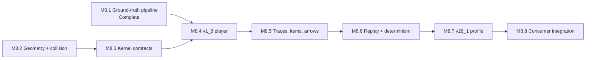

# Go Theft Craft master plan

Last reviewed: 2026-08-15

This file is the cross-repository source of truth for what remains. Detailed
designs and implementation plans remain in their owning repositories. Update
this file when a milestone starts, becomes blocked, or passes its release gate.

## Status legend

| Status | Meaning |
| --- | --- |
| Complete | Implemented and verified in the repository named by the milestone. |
| Client checks pending | Implemented, with every automated gate green, but a manual check its release gate requires has not been run. |
| Next | Approved and ready to implement. |
| Planned | Ordered, but its focused design or implementation plan is not yet approved. |
| Blocked | Cannot start until the named dependency is complete. |

## Current position

**M1: managed stream and compression** is implemented in `minecraft-protocol`
and passes its full release gate, including the new pinned Node
`minecraft-protocol` interoperability lane. The work is committed as
`8625ea7`.

**M2: encryption and login lifecycle** is complete in `minecraft-protocol` and
passes its full release gate, including two new encrypted Node
interoperability lanes.

**M2.5: schema-first code generation** is complete. Planning M4 against the real
protocol 775 schema found that the generator overrides schema types by bare
name, and that `position` and `entityMetadata` exist in both schemas with
different layouts — 47 packs x, y, z and 775 packs x, z, y; 47 terminates
metadata at 127 and 775 at 255. Generating 775 under the current rule would
have produced wrong bytes that every per-protocol round-trip test would have
accepted. The fix is to compile any type the schema defines and reserve
hand-written codecs for names the schema declares native, which also changes
protocol 47's generated API. It landed before M3 migrates `server`, so the
consumer migrates once.

**M3 is complete.** All twelve tasks are done and every step of its plan is
checked. `server` runs every connection on the managed stream, serves
handshake and status from generated packets, accepts logins through
`login.Acceptor`, negotiates compression, answers legacy pings, disconnects
gracefully, and owns no wire code at all: `pkg/protocol` and `pkg/gamedata` are
deleted apart from the play packet structs M6 replaces. `minecraft-protocol` is
released as `v0.1.0` and consumed as a released module with no `replace`
directive.

Every byte-parity fixture captured from the unmigrated server still matches,
and a pinned Node `minecraft-protocol` client reaches play against the migrated
server with compression off and on.

Both client checks passed on 2026-08-15 against a real 1.8.9 client, offline
and online, with **zero decode errors**: no generated codec rejected a packet
the vanilla client sent. The online login proved the server hash and
verify-token handling against the real Mojang session server, which no
automated test can do — every test stubs that call, and a hash wrong in the
same way on both sides of a loopback test still passes. Compression was
verified at `-1`, `256`, and `1`. The record is
[here](../server/docs/verification/2026-08-15-m3-client-checks.md).

Running the server found three defects the test suite never touched: two
disconnect-logging faults, both fixed, and a survival block duplication that is
**not** caused by the migrated drop data. Those and two missing features are
recorded in
[the session findings](../server/docs/verification/2026-08-15-m3-session-findings.md)
and carried into M6, which owns the rest of the consumer migration. One of
them — 2x2 crafting matching only some recipes — asked whether M3's registry
swap changed behavior. It did not: the matcher and the migrated registry are
both correct, and the defect was a pre-existing shift-click handler that
crafted once instead of draining the grid. Settled and fixed ahead of M6.

**M4 is in progress**, with **stage M4.1 complete**. `minecraft-protocol` now
describes a pinned data tree with manifest v2, and `mcproto data fetch` has
pulled the real PrismarineJS Java 26.1 tree at commit `8a80816c`: 25 datasets,
protocol 775 confirmed by the fetched `version` dataset itself. Fetching twice
produces byte-identical output, `data:validate` passes for both trees, and
protocol 47's generated code is unchanged.

The six aliased datasets the plan predicted are confirmed against the real
`dataPaths.json`, exactly as named: `blockLoot` and `entityLoot` at 1.20,
`commands` at 1.20.3, `mapIcons` at 1.20.2, `windows` at 1.16.1, and `proto` at
`latest`.

**M5** has an approved design and implementation plan as well, written against
the pinned upstream data rather than against expectations. It cannot start until
M4 completes, but its interfaces are settled and the constraints it surfaced are
recorded in its milestone section below.

**M8.1: physics ground-truth pipeline is complete.** It subdivided M8 and
depended only on the released `minecraft-reference` tool and the completed M0
game-data contracts, not on M1 through M7. The rest of M8 stays blocked on M4
and M7.

`mcreference dump` compiles and runs a reflective Java program against a
prepared 1.8.9 server jar and writes a canonical `physics.json`: 198 block
slipperiness values, the 65,536-entry trigonometry table, and the Mojang jar
digest. Twelve entity motion constants are literals inside method bodies that
no reflective dumper can reach, so they were transcribed and confirmed twice,
once from decompiled source and once from `javap` disassembly. The file is
committed, digest-pinned, and rendered into `generated/java/v1_8/physics.go`,
reachable as `v1_8.Data().Physics()`. `generate:check` passes with neither
`java` nor `javac` on `PATH`.

Three findings are worth carrying into M8.2 and later:

- Eleven of the twelve motion constants are `float` literals that Java widens
  to `double` where they are applied, so the real values are
  `0.9800000190734863` and its siblings rather than the round decimals.
  `physics.json` stores the widened forms.
- On the ground the horizontal drag is `slipperiness * 0.91F` for players and
  `slipperiness * 0.98F` for items, and Java computes that product in `float32`
  before widening. A kernel doing it in `float64` will not match bit for bit.
- Extracted data is optional in both the manifest schema and the render plan,
  so the 26.1 tree still generates. M8.7 adds a second dumper for 26.1.2;
  `Dump` already rejects every version but 1.8.9 with an explicit error.

```mermaid
flowchart LR
    M0["M0 Protocol 47 foundation<br/>Complete"]
    M1["M1 Managed stream + compression<br/>Complete"]
    M2["M2 Encryption + login lifecycle<br/>Complete"]
    M25["M2.5 Schema-first codegen<br/>Complete"]
    M3["M3 Server status/login migration<br/>Complete"]
    M4["M4 Java 26.1 / protocol 775<br/>In progress"]
    M5["M5 Routing, capture/replay, mcproto"]
    M6["M6 Complete consumer migrations"]
    M7["M7 Observed client world state"]
    M8["M8 Deterministic simulation slice"]
    M9["M9 Movement, attack, inventory, craft"]
    M10["M10 Conformance and stable v1"]

    M0 --> M1 --> M2 --> M25 --> M3 --> M4 --> M5 --> M6 --> M7 --> M8 --> M9 --> M10
```

## Milestone tracker

| ID | Deliverable | Owner | Status | Depends on | Detailed documents |
| --- | --- | --- | --- | --- | --- |
| M0 | Shared contracts, bounded Java wire primitives, immutable game data, generated Java 1.8 data, and reflection-free protocol 47 codecs | `minecraft-protocol` | Complete | — | [Shared extraction](docs/superpowers/plans/2026-08-13-shared-protocol-extraction.md), [wire extraction](docs/superpowers/plans/2026-08-13-java-1-8-wire-extraction.md), [immutable data](docs/superpowers/plans/2026-08-13-immutable-game-data-contracts.md), [Java 1.8 data](docs/superpowers/plans/2026-08-14-java-1-8-generated-data.md), [protocol 47 codecs](../minecraft-protocol/docs/plans/2026-08-14-java-1-8-protocol-codecs.md) |
| M1 | Asynchronous managed stream, runtime state and compression changes, bounded pipelines, legacy `FE 01` pre-frame hook, disconnect-aware graceful shutdown, and observation points | `minecraft-protocol` | Complete | M0 | [Design](../minecraft-protocol/docs/superpowers/specs/2026-08-14-managed-stream-compression-design.md), [implementation plan](../minecraft-protocol/docs/superpowers/plans/2026-08-14-managed-stream-compression.md) |
| M2 | AES-CFB8 transport encryption and complete, developer-controllable login lifecycle | `minecraft-protocol` | Complete | M1 | [Protocol toolkit umbrella plan](docs/superpowers/plans/2026-08-13-current-protocol-stream-toolkit.md), [headless authentication plan](docs/superpowers/plans/2026-08-13-headless-client-authentication.md), [M2 design](../minecraft-protocol/docs/superpowers/specs/2026-08-15-encryption-login-lifecycle-design.md), [M2 implementation plan](../minecraft-protocol/docs/superpowers/plans/2026-08-15-encryption-login-lifecycle.md) |
| M2.5 | Compile every schema-defined type from its own schema, share named types, bound decode recursion, and delete the superseded hand-written value types | `minecraft-protocol` | Complete | M2 | [Design](../minecraft-protocol/docs/superpowers/specs/2026-08-15-schema-first-codegen-design.md), [implementation plan](../minecraft-protocol/docs/superpowers/plans/2026-08-15-schema-first-codegen.md) |
| M3 | Migrate one real connection path: server handshake, status, ping, login, disconnect, compression, and online/offline mode | `server`, `minecraft-protocol` | Complete | M2.5 | [Design](../server/docs/superpowers/specs/2026-08-15-shared-protocol-migration-design.md), [implementation plan](../server/docs/superpowers/plans/2026-08-15-shared-protocol-migration.md) |
| M4 | Generate Java 26.1 data and protocol 775 codecs, retaining unknown source datasets | `minecraft-protocol` | **In progress** (M4.1 complete) | M3 | [Design](../minecraft-protocol/docs/superpowers/specs/2026-08-15-java-26-1-protocol-775-design.md), [implementation plan](../minecraft-protocol/docs/superpowers/plans/2026-08-15-java-26-1-protocol-775.md) |
| M5 | Packet routing and middleware, capture history, replay, status/login helpers, and non-interactive `mcproto` | `minecraft-protocol` | Planned | M4 | [Design](../minecraft-protocol/docs/superpowers/specs/2026-08-15-routing-capture-replay-cli-design.md), [implementation plan](../minecraft-protocol/docs/superpowers/plans/2026-08-15-routing-capture-replay-cli.md) |
| M6 | Finish shared-protocol migration for the server and proxy, then connect headless-minecraft to the current Java profile | `server`, `proxy`, `headless-minecraft` | Planned | M5 | [Shared extraction](docs/superpowers/plans/2026-08-13-shared-protocol-extraction.md), [headless design](docs/superpowers/specs/2026-08-13-headless-minecraft-design.md), [headless lifecycle plan](docs/superpowers/plans/2026-08-13-headless-client-authentication.md) |
| M7 | Immutable observed player, entity, chunk, registry, container, and environment snapshots; reducers apply packets in wire order | `headless-minecraft` | Planned | M6 | [Headless design](docs/superpowers/specs/2026-08-13-headless-minecraft-design.md), [world-state plan, Tasks 1–6](docs/superpowers/plans/2026-08-13-world-state-actions.md) |
| M8 | First deterministic, protocol-independent Java 1.8.9 and 26.1.2 movement slice with canonical replay and server/client adapters | `minecraft-simulation` | Planned | M4, M7 | [Simulation design](docs/superpowers/specs/2026-08-13-minecraft-simulation-design.md), [physics subproject design](../minecraft-simulation/docs/superpowers/specs/2026-08-14-simulation-physics-first-subproject-design.md), [reference research plan](docs/superpowers/plans/2026-08-13-minecraft-reference-extraction.md), [simulation implementation plan](docs/superpowers/plans/2026-08-13-minecraft-simulation-foundation.md) |
| M8.1 | Extract Java 1.8.9 physics constants from a verified Mojang server jar and publish them as a pinned, generated Go package | `minecraft-reference`, `minecraft-protocol` | Complete | — | [Physics subproject design](../minecraft-simulation/docs/superpowers/specs/2026-08-14-simulation-physics-first-subproject-design.md), [implementation plan](../minecraft-simulation/docs/superpowers/plans/2026-08-14-m8-1-ground-truth-pipeline.md) |
| M9 | Constructed components plus movement, digging, building, attack, containers, inventory, and crafting scenarios | `headless-minecraft`, `minecraft-simulation`, `server` | Planned | M8 | [World-state and actions plan](docs/superpowers/plans/2026-08-13-world-state-actions.md); focused combat and scenario-runner plans still required |
| M10 | Cross-implementation conformance, compatibility contracts, migration notes, and stable `v1.0.0` releases | all runtime repositories | Planned | M9 | Existing repository roadmaps; focused release plan still required |

## What is complete

- [x] `minecraft-protocol` repository foundation and finite wire limits.
- [x] Immutable game-data contracts and Java 1.8 generated data.
- [x] Protocol 47 descriptor and generated packet codecs (`162e95d`).
- [x] Initial `headless-minecraft` safety and version-profile foundation
  (`afab923`).
- [x] Managed stream, compression, protocol 47 transitions, graceful
  disconnect, observation points, and Node interoperability tests.
- [x] AES-CFB8 encryption, the Java key exchange, strict login identity types,
  observation redaction, and the opt-in login negotiator.
- [x] Schema-first code generation, shared named types, bounded decode
  recursion, and removal of the hand-written value types.
- [x] `minecraft-protocol` `v0.1.0`, its first tagged release, consumed by
  `server` as a released module.
- [x] Java 1.8.9 physics ground truth: `mcreference dump`, pinned
  `physics.json` with Mojang provenance, and generated `physics.go`
  (`b463b3e`, `961702d`).
- [x] Server connections on the managed stream, with generated handshake and
  status packets, the shared login acceptor, compression, legacy pings, and
  graceful disconnects.
- [x] Standalone `minecraft-reference` workflow and release (`v1.0.1`).
- [x] Initial `minecraft-simulation` repository boundary (`854e7d9`).

Repository foundation does not mean the headless client or simulation runtime
is implemented. Those bodies of work begin at M6 and M8.

## What is left

### M1 — Managed stream and compression

Complete. Every item below is implemented and verified.

- [x] Replace the combined framed codec with session, packet, frame, and
  compression-envelope boundaries.
- [x] Implement asynchronous inbound reads and completed outbound writes over
  `io.Reader` and `io.Writer`.
- [x] Serialize developer-requested protocol-state and compression changes.
- [x] Enforce frame, decompressed-payload, queue, and shared buffered-byte
  limits before allocation.
- [x] Preserve inbound and outbound pipeline ordering.
- [x] Add the opt-in pre-frame hook for legacy `FE 01` ping.
- [x] Send the state-appropriate disconnect packet during graceful shutdown,
  drain accepted writes, and retain immediate abort for transport failure.
- [x] Publish lossless observation points that later capture/history code can
  subscribe to without becoming part of framing.
- [x] Test malformed frames, cancellation races, partial I/O, resource limits,
  localhost TCP behavior, and pinned Node `minecraft-protocol`
  interoperability.

Two decisions made while implementing, recorded because they affect later
milestones:

- The design reserves one frame-plus-decompression headroom. A single shared
  headroom slot deadlocks, because the read pump holds it while handing its
  frame to the coordinator. Each direction therefore gets its own reservation,
  so the buffered-byte ceiling stays honest. Encryption in M2 adds no new
  buffer to this accounting; it wraps the framed byte stream in place.
- A running stream owns its session exclusively, so `Stream.Snapshot` is the
  only safe way to observe state and pipeline settings. Consumers in M3 and M6
  must not read a session directly.

### M2 — Encryption and login lifecycle

Complete. Every item below is implemented and verified.

- [x] Approve a focused design and implementation plan.
- [x] Add AES-CFB8 at the transport boundary in the correct pipeline order.
- [x] Support offline and Microsoft-backed identities without coupling auth to
  the stream.
- [x] Keep automatic transitions optional: developers can inspect, accept,
  reject, delay, or replace state and compression decisions.
- [x] Test successful login, authentication rejection, timeout, cancellation,
  disconnect, and shutdown at every state.

The modern-login item moved to M4. Protocol 775 codecs do not exist until M4,
so hand-written configuration and play login packets would be discarded the
moment M4 generates them.

Three decisions made while implementing, recorded because they affect later
milestones:

- Encryption is applied, not proposed. No packet carries the plaintext session
  key, so M3 and M6 consumers call `Stream.Control` with a
  `java.EncryptionControl` after the key exchange rather than expecting a
  session transition to enable it.
- The `login` package is protocol 47 only. M4 either parameterizes it or adds a
  second constructor, and M6 depends on whichever it chooses. M2 tagged the
  generated packets with `protocol.LoginRole` so that choice is a change of
  dispatch rather than a second negotiator.
- The standard library's `cipher.NewCFBEncrypter` is cipher feedback with a
  block-wide segment; Java Edition uses an eight-bit one. Two Go peers using
  the standard library agree with each other and with no real implementation,
  so every loopback test passed while the cipher was wrong. The pinned Node
  lane is what caught it, which is the argument for keeping that gate required
  in M10.

### M2.5 — Schema-first code generation

Complete. Protocol 47's bytes did not change, which was the exit criterion.

- [x] Pin protocol 47's wire bytes with a round-trip test over every packet and
  hand-computed assertions for the position bit layout, written before anything
  changed.
- [x] Bound decode recursion against the existing `Limits.recursionDepth`.
- [x] Resolve hand-written codecs against the schema's own native set, and pass
  native invocation arguments through — `endVal` is no longer a Go constant.
- [x] Generate named types once when they are recursive or used by two or more
  packets, instead of inlining them per packet.
- [x] Delete `java.Position`, `java.Slot`, and `java.EntityMetadata`.
- [x] Prove the result with the existing byte fixtures and the pinned Node
  interoperability lane.

The `slot` question this milestone raised is answered: protocol 47's schema
expresses everything the hand-written `slot` codec did, and the fixtures passed
unchanged. There is no gap to carry into M4.

Four things found while implementing, recorded because they affect later
milestones:

- A name is native only when its definition is the native marker itself.
  `string` is defined as an invocation of the native `pstring`, so its stored
  node is a native node carrying a different name. Counting that as a native
  declaration reintroduces the same bug one name further along, and M4 will
  meet the pattern again in 775's alias-heavy type table.
- Four packets cannot be reached by any canonical byte stream, because entity
  metadata terminates at a byte the generator's test alphabet never produces
  and NBT needs a structurally valid tag. They are pinned by hand. M4 needs the
  same treatment for 775's equivalents.
- Two latent defects surfaced only once `position` stopped being a scalar: an
  option holding a struct rendered as `*(p).Field`, which Go parses as
  `*((p).Field)`, and a `pstring` with a non-VarInt count type was read with
  the VarInt-prefixed codec instead of being rejected. Both were unreachable
  while every schema-defined type was overridden by name.
- A parameterized type cannot be shared, because its shape depends on the
  argument each invocation supplies. Protocol 47 has one, `entityMetadataItem`.
  If 775 has a parameterized type that is also recursive, it cannot be compiled
  at all under the current rules, and M4 should check for that before planning
  its generation stage.

### M3 — First real consumer

Design and implementation plan approved. Twelve tasks across four stages, two
repositories. The server's connection runs on the managed stream from the first
byte; play keeps its local packet structs and moves to the shared reflect codec,
which reads the same `mc` tags.

- [x] Approve the server status/login migration plan.
- [x] Add `login.Acceptor` to `minecraft-protocol` as the server-side
  counterpart to M2's client negotiator, tested against it over `net.Pipe`.
- [x] Pin the server's current bytes with a connection harness written against
  the unmigrated code.
- [x] Source game data from `minecraft-protocol/data` repo-wide.
- [x] Replace the blocking read loop and the swapped `io.ReadWriter` with a
  `protocol.Stream`, keeping `writePacket`'s signature so its eighty call sites
  do not move.
- [x] Migrate handshake, status, ping, and login to generated packets.
- [x] Enable compression, threshold configurable, defaulting to 256.
- [x] Answer legacy `FE 01` pings and send disconnect packets before closing.
- [x] Delete `pkg/protocol`, the server's cipher files, and the hand-written
  server hash.
- [x] Prove it with byte-parity fixtures and the pinned Node client.
- [x] Prove it with a real 1.8.9 client through a full play session, and one
  online-mode login.

Six things found while implementing M3, recorded because they affect later
milestones:

- A session proposes a transition only for a packet it can inspect. A
  connection that writes a raw payload gets no transition, so the migration
  drove state explicitly until handshake, status, and login moved to generated
  values. M6 finishes this for play, and until it does the connection still
  mirrors the session's state into a local enum.
- `minecraft-protocol` requires Go 1.26.6, so `server` moved to the same
  `openserbia/go-flake` pins. `devbox.json` must set `GOROOT` explicitly:
  without it, a shell entered from a sibling repository leaks its GOROOT and
  every build fails on a toolchain mismatch. M6 will hit this in `proxy` and
  `headless-minecraft` too.
- The shared data names Java 1.8 `"1.8.9"`; the server advertises `"1.8.8"`.
  Both are protocol 47. The status response keeps `"1.8.8"` because M3 changes
  no byte on the wire, and reconciling the two names is a decision of its own.
- `cmd/dmd` survives. It downloads the `protocol.json` that the retained packet
  codegen reads, so it cannot go until M6 deletes the packet structs.
- `task lint` and `task build` were both failing in `server` before this
  milestone — six pre-existing findings, and a build that pointed at a
  directory holding no Go files. M3 could not report a green gate without
  fixing them, so it did.
- The offline UUID derivation moved into `minecraft-protocol` as
  `login.OfflineUUID`. It is byte-identical to the server's own, which is what
  keeps saved player files reachable: the server looks them up by UUID.

Three constraints found while planning M3:

- The server has **no compression today** — it never sends `set_compression` and
  cannot read a compressed frame. That item is new behavior, not a migration.
- Every play packet will now be decoded twice, and the generated decode is
  strict where the old loop was not. A serverbound packet whose generated model
  is wrong becomes a disconnect. The real-client session is what finds those,
  and each one is a codec bug to fix in `minecraft-protocol`.
- M2 defines `login.Verifier` but implements only the client half. The
  server-side acceptor is new work, and it belongs in `minecraft-protocol` so
  both halves of the encryption handshake can be tested against each other in
  one repository.

### M4 — Java 26.1 and protocol 775

Design and implementation plan approved. M4 subdivides into four stages,
ordered by risk retired.

| Stage | Exit criterion |
| --- | --- |
| M4.1 | `task data:fetch` twice produces no diff; `data:validate` passes for both versions; protocol 47 output is byte-identical after the manifest migration |
| M4.2 | The 775 schema compiles with zero unsupported constructs, and `position` compiles from the 775 schema rather than inheriting 1.8's bit order |
| M4.3 | Every 26.1 dataset decodes strictly with no unknown field, and every dataset name appears in `Raw` |
| M4.4 | `v26_1.Protocol()` reports 775; the ProtoDef differential suite passes; the live check reaches play against Paper 26.1 and reports its largest frame |

- [x] Pin the PrismarineJS source manifest and aliases.
- [ ] Implement configuration and play transitions for modern Java login,
  moved here from M2 because the packets it needs do not exist until this
  milestone generates them.
- [ ] Import all exposed datasets and preserve unknown formats as raw data.
- [ ] Generate deterministic protocol 775 packets and codecs.
- [ ] Add byte fixtures and protocol 47 regression coverage.
- [ ] Verify status/login against a compatible Paper server and a vanilla Java
  26.1 client.

Five constraints found while planning M4, recorded because they affect later
milestones:

- `position` and `entityMetadata` exist in both schemas with different wire
  layouts. M2.5 fixes the generator rule that would have given 775 the 1.8
  codec; M4's differential fixtures include a position-carrying packet so a
  regression surfaces as a byte mismatch rather than a server disconnect.

- The pinned Node `minecraft-protocol` 1.66.2 supports up to 1.21.11, so there
  is no session-level 775 interoperability lane. M4 verifies codecs
  differentially against the `protodef` library and verifies the session only
  against a real server, by hand. M10's conformance matrix inherits this gap
  until upstream ships 26.1 support.
- Three 26.1 schema types are mutually recursive (`Slot`, `SlotComponent`, and
  the item-predicate family), so the generator must share named types and count
  decode depth. That work moved to M2.5, where protocol 47's byte fixtures can
  prove it.
- Six of the 24 resolved 26.1 datasets are aliases of older versions:
  `windows` is 1.16.1, `commands` is 1.20.3, `mapIcons` is 1.20.2, and
  `blockLoot` and `entityLoot` are 1.20. Anything in M7 or M9 that reads window
  slot layouts is reading nine-year-old data, and must say so.
- 26.1 dataset shapes differ from 1.8's, so typed models become version-owned
  rather than shared. M6 is the first milestone holding two versions at once and
  owns whatever cross-version accessor its consumers actually need.
- The default limits — 2 MiB per frame, 8 MiB decompressed — have never been
  checked against a modern login. M4's live check measures the largest frame and
  decompressed payload a real 26.1 login produces and records both, and the
  defaults change only if that measurement demands it.
- The pinned dataset is `26.1`, protocol 775. There is no `26.1.2` dataset
  upstream, though seven planning documents name one. M4's documentation task
  reconciles them: `26.1` for data and generated code, a patch version only when
  naming a server the live check ran against.

### M5 — Routing, capture/history, replay, and CLI

Design and implementation plan approved. The capture format is a JSON header
followed by CRC-checked, length-prefixed binary records; redaction is enforced
by the writer, and disclosure requires an explicitly constructed writer.

- [x] Approve the capture record format and redaction policy.
- [ ] Add packet routing and ordered middleware outside framing.
- [ ] Record raw frame, decoded packet, state, compression, timing, direction,
  and lifecycle observations without blocking the stream.
- [ ] Provide bounded in-memory history plus durable capture sinks.
- [ ] Replay deterministically from a capture with explicit timing modes.
- [ ] Add non-interactive `mcproto status`, `login`, `capture`, `inspect`, and
  `replay` commands with predictable exit codes and machine-readable output.

One constraint found while planning M5: `Observation` carries ordering but no
timing, and a sink-side clock measures the sink rather than the wire. M5 adds an
`Elapsed` field stamped at the observation point. It is the only change M5 makes
to M1 or M2 code.

### M6–M7 — Consumers and observed state

- [x] Settle whether the 2x2 crafting matcher regressed on M3's registry swap,
  and cover `matchRecipe2x2` against the real registry, which no test does.
  Settled: **no regression.** The shared registry keeps wildcard ingredients as
  `Metadata: -1`, and the matcher is correct across every case tried. The real
  defect was pre-existing: shift-clicking the output crafted once instead of
  draining the grid. Fixed, along with a duplication bug in `tryAddToSection`
  found on the fix path. The matcher and the crafting click paths now have
  tests against the real registry, and the `conn` test harness supplies real
  game data rather than leaving it nil.
- [ ] Complete server play-state migration to `minecraft-protocol`: replace the
  local packet structs in `pkg/gamedata/versions/pc_1_8` with generated types
  and delete the server's remaining codegen. M3 leaves play on those structs
  deliberately, decoding them with the shared reflect codec.
- [ ] Migrate proxy wire imports while keeping legacy private to `proxy`.
- [ ] Finish headless lifecycle, authentication, event subscriptions, and
  bounded stream ownership.
- [ ] Connect the headless client to the current Java profile.
- [ ] Build immutable observed-world snapshots and wire-ordered reducers.
- [ ] Preserve unknown metadata, namespaced values, and custom payloads.

### M8–M9 — Simulation and gameplay

M8 subdivides into eight stages, ordered by risk retired rather than by layer.
The [physics subproject design](../minecraft-simulation/docs/superpowers/specs/2026-08-14-simulation-physics-first-subproject-design.md)
holds the exit criterion and rationale for each.

M8.1 and M8.2 have no dependency on each other. M8.1 needs no simulation code,
and M8.2 needs no extracted constants.

| Stage | Exit criterion |
| --- | --- |
| M8.1 | `v1_8.Physics()` returns slipperiness, the trigonometry table, and motion constants; `generate:check` passes with no JDK |
| M8.2 | Property tests prove no tunneling, bounded step-up, and that zero motion is a fixed point |
| M8.3 | An empty tick produces a stable digest and a change set that a stale store rejects |
| M8.4 | Scripted walk, sprint, jump, and sneak against vanilla 1.8.9 draw zero correction packets |
| M8.5 | Captured item and arrow traces replay within one thirty-second of a block |
| M8.6 | Identical digest on Linux, macOS, and Windows, on amd64 and arm64 |
| M8.7 | The same conformance suite passes on 26.1.2 |
| M8.8 | Client prediction and server-authoritative validation both run the same kernel |

Two constraints discovered while planning M8.1, recorded here because they
affect later stages:

- Entity gravity and drag are numeric literals inside method bodies, not
  fields. No reflective dumper reaches them. They are transcribed from research
  notes and range-checked by tests. Every other constant is extracted.
- Captured traces verify trajectories to roughly one thirty-second of a block,
  not exactly, because Java Edition 1.8 transmits positions as fixed point.
  This catches wrong constants and wrong axis order, not last-place drift.

- [x] Complete M8.1: `mcreference dump`, pinned `physics.json` with Mojang
  provenance, and generated `physics.go`.
- [ ] Update `minecraft-simulation` to consume the released
  `minecraft-reference` tool instead of `main`.
- [ ] Complete reviewed vanilla behavior catalogs and independent fixtures for
  Java 1.8.9 and 26.1.2.
- [ ] Implement the deterministic kernel, strict unknown-state handling,
  collision, movement, canonical result digest, and replay.
- [ ] Prove the same simulation through server and headless adapters.
- [ ] Add movement scenarios: walk, sprint, sneak, jump, fall, collide,
  correction, teleport, and disconnect mid-action.
- [ ] Add attack scenarios: target selection, reach validation, cooldown or
  version-specific timing, damage, knockback, death, respawn, and rejected
  attacks.
- [ ] Add inventory and crafting scenarios: window open/close, slot sync,
  transaction rejection, recipe selection, missing ingredients, shift-click,
  crafted output, and reconnect recovery.
- [ ] Add digging and building scenarios with partial progress and server
  correction.

### M10 — Conformance and releases

- [ ] Convert suitable community-server cases into independently maintained
  black-box scenarios or fixtures after checking their licenses and behavior.
- [ ] Run compatibility matrices against pinned Node `minecraft-protocol`,
  Paper, the owned Go server, and supported vanilla clients.
- [ ] Run prebuilt headless vanilla-client scenarios for status, login,
  movement, attack, inventory, crafting, malformed disconnects, and graceful
  shutdown.
- [ ] Keep Java reference artifacts and decompiled sources local; publish only
  provenance, independent behavior descriptions, fixtures, and expectations.
- [ ] Add public API compatibility tests and migration notes.
- [ ] Publish stable releases only after all release gates pass.

## Document index

### Approved specifications

- [Headless client and shared protocol design](docs/superpowers/specs/2026-08-13-headless-minecraft-design.md)
- [Minecraft simulation design](docs/superpowers/specs/2026-08-13-minecraft-simulation-design.md)
- [Simulation physics first subproject design](../minecraft-simulation/docs/superpowers/specs/2026-08-14-simulation-physics-first-subproject-design.md) — subdivides M8 into M8.1–M8.8
- [Managed stream and compression design](../minecraft-protocol/docs/superpowers/specs/2026-08-14-managed-stream-compression-design.md)
- [Encryption and login lifecycle design](../minecraft-protocol/docs/superpowers/specs/2026-08-15-encryption-login-lifecycle-design.md)
- [Schema-first code generation design](../minecraft-protocol/docs/superpowers/specs/2026-08-15-schema-first-codegen-design.md) — adds M2.5
- [Shared protocol migration design](../server/docs/superpowers/specs/2026-08-15-shared-protocol-migration-design.md) — M3
- [Java 26.1 and protocol 775 design](../minecraft-protocol/docs/superpowers/specs/2026-08-15-java-26-1-protocol-775-design.md) — subdivides M4 into M4.1–M4.4
- [Routing, capture, replay, and CLI design](../minecraft-protocol/docs/superpowers/specs/2026-08-15-routing-capture-replay-cli-design.md)

### Focused implementation plans

- [Java 1.8 wire extraction](docs/superpowers/plans/2026-08-13-java-1-8-wire-extraction.md) — complete
- [Immutable game-data contracts](docs/superpowers/plans/2026-08-13-immutable-game-data-contracts.md) — complete
- [Java 1.8 generated data](docs/superpowers/plans/2026-08-14-java-1-8-generated-data.md) — complete
- [Java 1.8 protocol codecs](../minecraft-protocol/docs/plans/2026-08-14-java-1-8-protocol-codecs.md) — complete
- [Managed stream and compression](../minecraft-protocol/docs/superpowers/plans/2026-08-14-managed-stream-compression.md) — complete
- [Encryption and login lifecycle](../minecraft-protocol/docs/superpowers/plans/2026-08-15-encryption-login-lifecycle.md) — next; amended 2026-08-15 with descriptor login roles
- [Schema-first code generation](../minecraft-protocol/docs/superpowers/plans/2026-08-15-schema-first-codegen.md) — approved; starts after M2
- [Shared protocol migration](../server/docs/superpowers/plans/2026-08-15-shared-protocol-migration.md) — approved; starts after M2.5
- [M8.1 physics ground-truth pipeline](../minecraft-simulation/docs/superpowers/plans/2026-08-14-m8-1-ground-truth-pipeline.md) — complete
- [Java 26.1 and protocol 775](../minecraft-protocol/docs/superpowers/plans/2026-08-15-java-26-1-protocol-775.md) — approved; starts after M3
- [Routing, capture, replay, and CLI](../minecraft-protocol/docs/superpowers/plans/2026-08-15-routing-capture-replay-cli.md) — approved; starts after M4
- [Headless client and authentication](docs/superpowers/plans/2026-08-13-headless-client-authentication.md) — foundation complete; lifecycle and authentication pending
- [Constructed components, world state, and operations](docs/superpowers/plans/2026-08-13-world-state-actions.md) — pending
- [Minecraft reference extraction](docs/superpowers/plans/2026-08-13-minecraft-reference-extraction.md) — reference tool extracted and released; simulation research catalog pending
- [Minecraft simulation foundation](docs/superpowers/plans/2026-08-13-minecraft-simulation-foundation.md) — repository foundation complete; implementation pending

### Umbrella plans

- [Shared protocol extraction](docs/superpowers/plans/2026-08-13-shared-protocol-extraction.md) — Tasks 1–5 complete. Task 6 is superseded by the M3 migration plan, which splits it: game data moves in M3, packet structs in M6. Tasks 7 and 8 remain for M6.
- [Current protocol and stream toolkit](docs/superpowers/plans/2026-08-13-current-protocol-stream-toolkit.md) — use only as an umbrella. M1 superseded its stream and compression portion, M2 its encryption and login portion, M4 its Tasks 1–5, and M5 its Tasks 8–10. Nothing in it is current guidance.

## Update rule

For every milestone:

1. Link its approved specification and implementation plan before source work.
2. Record the starting commit and exact acceptance tests in that plan.
3. Mark this file `Next` when dependencies are complete.
4. Mark it `Complete` only after format, lint, tests, race tests where relevant,
   build, security checks, interoperability tests, and clean-worktree review.
5. Add any newly discovered work to a later milestone instead of silently
   expanding the active milestone.
