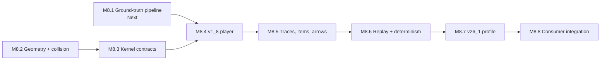

# Go Theft Craft master plan

Last reviewed: 2026-08-14

This file is the cross-repository source of truth for what remains. Detailed
designs and implementation plans remain in their owning repositories. Update
this file when a milestone starts, becomes blocked, or passes its release gate.

## Status legend

| Status | Meaning |
| --- | --- |
| Complete | Implemented and verified in the repository named by the milestone. |
| Next | Approved and ready to implement. |
| Planned | Ordered, but its focused design or implementation plan is not yet approved. |
| Blocked | Cannot start until the named dependency is complete. |

## Current position

**M1: managed stream and compression** is implemented in `minecraft-protocol`
and passes its full release gate, including the new pinned Node
`minecraft-protocol` interoperability lane. The work is uncommitted pending
review.

**M2: encryption and login lifecycle** is now unblocked, but it still needs a
focused design and implementation plan before source work starts.

**M8.1: physics ground-truth pipeline** remains ready. It subdivides M8, but it
depends only on the released `minecraft-reference` tool and the completed M0
game-data contracts, not on M1 through M7. Its design and 8-task implementation
plan are approved. It touches `minecraft-reference` and `minecraft-protocol`
only, so it does not contend with M2 for the same files. The rest of M8 stays
blocked on M4 and M7.

```mermaid
flowchart LR
    M0["M0 Protocol 47 foundation<br/>Complete"]
    M1["M1 Managed stream + compression<br/>Complete"]
    M2["M2 Encryption + login lifecycle<br/>Next"]
    M3["M3 Server status/login migration"]
    M4["M4 Java 26.1 / protocol 775"]
    M5["M5 Routing, capture/replay, mcproto"]
    M6["M6 Complete consumer migrations"]
    M7["M7 Observed client world state"]
    M8["M8 Deterministic simulation slice"]
    M9["M9 Movement, attack, inventory, craft"]
    M10["M10 Conformance and stable v1"]

    M0 --> M1 --> M2 --> M3 --> M4 --> M5 --> M6 --> M7 --> M8 --> M9 --> M10
```

## Milestone tracker

| ID | Deliverable | Owner | Status | Depends on | Detailed documents |
| --- | --- | --- | --- | --- | --- |
| M0 | Shared contracts, bounded Java wire primitives, immutable game data, generated Java 1.8 data, and reflection-free protocol 47 codecs | `minecraft-protocol` | Complete | — | [Shared extraction](docs/superpowers/plans/2026-08-13-shared-protocol-extraction.md), [wire extraction](docs/superpowers/plans/2026-08-13-java-1-8-wire-extraction.md), [immutable data](docs/superpowers/plans/2026-08-13-immutable-game-data-contracts.md), [Java 1.8 data](docs/superpowers/plans/2026-08-14-java-1-8-generated-data.md), [protocol 47 codecs](../minecraft-protocol/docs/plans/2026-08-14-java-1-8-protocol-codecs.md) |
| M1 | Asynchronous managed stream, runtime state and compression changes, bounded pipelines, legacy `FE 01` pre-frame hook, disconnect-aware graceful shutdown, and observation points | `minecraft-protocol` | Complete | M0 | [Design](../minecraft-protocol/docs/superpowers/specs/2026-08-14-managed-stream-compression-design.md), [implementation plan](../minecraft-protocol/docs/superpowers/plans/2026-08-14-managed-stream-compression.md) |
| M2 | AES-CFB8 transport encryption and complete, developer-controllable login lifecycle | `minecraft-protocol` | **Next** | M1 | [Protocol toolkit umbrella plan](docs/superpowers/plans/2026-08-13-current-protocol-stream-toolkit.md), [headless authentication plan](docs/superpowers/plans/2026-08-13-headless-client-authentication.md); focused M2 design and plan still required |
| M3 | Migrate one real connection path: server handshake, status, ping, login, disconnect, compression, and online/offline mode | `server`, `minecraft-protocol` | Planned | M2 | [Shared extraction, Tasks 6–8](docs/superpowers/plans/2026-08-13-shared-protocol-extraction.md); focused migration plan still required |
| M4 | Generate Java 26.1 data and protocol 775 codecs, retaining unknown source datasets | `minecraft-protocol` | Planned | M3 | [Protocol toolkit, Tasks 1–5](docs/superpowers/plans/2026-08-13-current-protocol-stream-toolkit.md); focused M4 plan still required |
| M5 | Packet routing and middleware, capture history, replay, status/login helpers, and non-interactive `mcproto` | `minecraft-protocol` | Planned | M4 | [Protocol toolkit, Tasks 8–10](docs/superpowers/plans/2026-08-13-current-protocol-stream-toolkit.md); focused capture/replay API design still required |
| M6 | Finish shared-protocol migration for the server and proxy, then connect headless-minecraft to the current Java profile | `server`, `proxy`, `headless-minecraft` | Planned | M5 | [Shared extraction](docs/superpowers/plans/2026-08-13-shared-protocol-extraction.md), [headless design](docs/superpowers/specs/2026-08-13-headless-minecraft-design.md), [headless lifecycle plan](docs/superpowers/plans/2026-08-13-headless-client-authentication.md) |
| M7 | Immutable observed player, entity, chunk, registry, container, and environment snapshots; reducers apply packets in wire order | `headless-minecraft` | Planned | M6 | [Headless design](docs/superpowers/specs/2026-08-13-headless-minecraft-design.md), [world-state plan, Tasks 1–6](docs/superpowers/plans/2026-08-13-world-state-actions.md) |
| M8 | First deterministic, protocol-independent Java 1.8.9 and 26.1.2 movement slice with canonical replay and server/client adapters | `minecraft-simulation` | Planned | M4, M7 | [Simulation design](docs/superpowers/specs/2026-08-13-minecraft-simulation-design.md), [physics subproject design](../minecraft-simulation/docs/superpowers/specs/2026-08-14-simulation-physics-first-subproject-design.md), [reference research plan](docs/superpowers/plans/2026-08-13-minecraft-reference-extraction.md), [simulation implementation plan](docs/superpowers/plans/2026-08-13-minecraft-simulation-foundation.md) |
| M8.1 | Extract Java 1.8.9 physics constants from a verified Mojang server jar and publish them as a pinned, generated Go package | `minecraft-reference`, `minecraft-protocol` | **Next** | — | [Physics subproject design](../minecraft-simulation/docs/superpowers/specs/2026-08-14-simulation-physics-first-subproject-design.md), [implementation plan](../minecraft-simulation/docs/superpowers/plans/2026-08-14-m8-1-ground-truth-pipeline.md) |
| M9 | Constructed components plus movement, digging, building, attack, containers, inventory, and crafting scenarios | `headless-minecraft`, `minecraft-simulation`, `server` | Planned | M8 | [World-state and actions plan](docs/superpowers/plans/2026-08-13-world-state-actions.md); focused combat and scenario-runner plans still required |
| M10 | Cross-implementation conformance, compatibility contracts, migration notes, and stable `v1.0.0` releases | all runtime repositories | Planned | M9 | Existing repository roadmaps; focused release plan still required |

## What is complete

- [x] `minecraft-protocol` repository foundation and finite wire limits.
- [x] Immutable game-data contracts and Java 1.8 generated data.
- [x] Protocol 47 descriptor and generated packet codecs (`162e95d`).
- [x] Initial `headless-minecraft` safety and version-profile foundation
  (`afab923`).
- [x] Managed stream, compression, protocol 47 transitions, graceful
  disconnect, observation points, and Node interoperability tests.
- [x] Standalone `minecraft-reference` workflow and release (`v1.0.1`).
- [x] Initial `minecraft-simulation` repository boundary (`854e7d9`).

Repository foundation does not mean the headless client or simulation runtime
is implemented. Those bodies of work begin at M6 and M8.

## What is left

### M1 — Managed stream and compression

Complete. Every item below is implemented and verified.

- [x] Replace the combined framed codec with session, packet, frame, and
  compression-envelope boundaries.
- [x] Implement asynchronous inbound reads and completed outbound writes over
  `io.Reader` and `io.Writer`.
- [x] Serialize developer-requested protocol-state and compression changes.
- [x] Enforce frame, decompressed-payload, queue, and shared buffered-byte
  limits before allocation.
- [x] Preserve inbound and outbound pipeline ordering.
- [x] Add the opt-in pre-frame hook for legacy `FE 01` ping.
- [x] Send the state-appropriate disconnect packet during graceful shutdown,
  drain accepted writes, and retain immediate abort for transport failure.
- [x] Publish lossless observation points that later capture/history code can
  subscribe to without becoming part of framing.
- [x] Test malformed frames, cancellation races, partial I/O, resource limits,
  localhost TCP behavior, and pinned Node `minecraft-protocol`
  interoperability.

Two decisions made while implementing, recorded because they affect later
milestones:

- The design reserves one frame-plus-decompression headroom. A single shared
  headroom slot deadlocks, because the read pump holds it while handing its
  frame to the coordinator. Each direction therefore gets its own reservation,
  so the buffered-byte ceiling stays honest. Encryption in M2 adds no new
  buffer to this accounting; it wraps the framed byte stream in place.
- A running stream owns its session exclusively, so `Stream.Snapshot` is the
  only safe way to observe state and pipeline settings. Consumers in M3 and M6
  must not read a session directly.

### M2 — Encryption and login lifecycle

- [ ] Approve a focused design and implementation plan.
- [ ] Add AES-CFB8 at the transport boundary in the correct pipeline order.
- [ ] Support offline and Microsoft-backed identities without coupling auth to
  the stream.
- [ ] Implement configuration and play transitions for modern Java login.
- [ ] Keep automatic transitions optional: developers can inspect, accept,
  reject, delay, or replace state and compression decisions.
- [ ] Test successful login, authentication rejection, timeout, cancellation,
  disconnect, and shutdown at every state.

### M3 — First real consumer

- [ ] Approve the server status/login migration plan.
- [ ] Migrate handshake, status request, ping/pong, and legacy ping first.
- [ ] Migrate offline and online login, compression, encryption, and
  disconnect handling.
- [ ] Remove duplicated server framing only after old/new fixture parity and
  real-client connection tests pass.
- [ ] Keep play-state migration out of this milestone unless required by a
  minimal post-login smoke test.

### M4 — Java 26.1 and protocol 775

- [ ] Pin the PrismarineJS source manifest and aliases.
- [ ] Import all exposed datasets and preserve unknown formats as raw data.
- [ ] Generate deterministic protocol 775 packets and codecs.
- [ ] Add byte fixtures and protocol 47 regression coverage.
- [ ] Verify status/login against a compatible Paper server and a vanilla Java
  26.1 client.

### M5 — Routing, capture/history, replay, and CLI

- [ ] Approve the capture record format and redaction policy.
- [ ] Add packet routing and ordered middleware outside framing.
- [ ] Record raw frame, decoded packet, state, compression, timing, direction,
  and lifecycle observations without blocking the stream.
- [ ] Provide bounded in-memory history plus durable capture sinks.
- [ ] Replay deterministically from a capture with explicit timing modes.
- [ ] Add non-interactive `mcproto status`, `login`, `capture`, `inspect`, and
  `replay` commands with predictable exit codes and machine-readable output.

### M6–M7 — Consumers and observed state

- [ ] Complete server play-state migration to `minecraft-protocol`.
- [ ] Migrate proxy wire imports while keeping legacy private to `proxy`.
- [ ] Finish headless lifecycle, authentication, event subscriptions, and
  bounded stream ownership.
- [ ] Connect the headless client to the current Java profile.
- [ ] Build immutable observed-world snapshots and wire-ordered reducers.
- [ ] Preserve unknown metadata, namespaced values, and custom payloads.

### M8–M9 — Simulation and gameplay

M8 subdivides into eight stages, ordered by risk retired rather than by layer.
The [physics subproject design](../minecraft-simulation/docs/superpowers/specs/2026-08-14-simulation-physics-first-subproject-design.md)
holds the exit criterion and rationale for each.

M8.1 and M8.2 have no dependency on each other. M8.1 needs no simulation code,
and M8.2 needs no extracted constants.

| Stage | Exit criterion |
| --- | --- |
| M8.1 | `v1_8.Physics()` returns slipperiness, the trigonometry table, and motion constants; `generate:check` passes with no JDK |
| M8.2 | Property tests prove no tunneling, bounded step-up, and that zero motion is a fixed point |
| M8.3 | An empty tick produces a stable digest and a change set that a stale store rejects |
| M8.4 | Scripted walk, sprint, jump, and sneak against vanilla 1.8.9 draw zero correction packets |
| M8.5 | Captured item and arrow traces replay within one thirty-second of a block |
| M8.6 | Identical digest on Linux, macOS, and Windows, on amd64 and arm64 |
| M8.7 | The same conformance suite passes on 26.1.2 |
| M8.8 | Client prediction and server-authoritative validation both run the same kernel |

Two constraints discovered while planning M8.1, recorded here because they
affect later stages:

- Entity gravity and drag are numeric literals inside method bodies, not
  fields. No reflective dumper reaches them. They are transcribed from research
  notes and range-checked by tests. Every other constant is extracted.
- Captured traces verify trajectories to roughly one thirty-second of a block,
  not exactly, because Java Edition 1.8 transmits positions as fixed point.
  This catches wrong constants and wrong axis order, not last-place drift.

- [ ] Complete M8.1: `mcreference dump`, pinned `physics.json` with Mojang
  provenance, and generated `physics.go`.
- [ ] Update `minecraft-simulation` to consume the released
  `minecraft-reference` tool instead of `main`.
- [ ] Complete reviewed vanilla behavior catalogs and independent fixtures for
  Java 1.8.9 and 26.1.2.
- [ ] Implement the deterministic kernel, strict unknown-state handling,
  collision, movement, canonical result digest, and replay.
- [ ] Prove the same simulation through server and headless adapters.
- [ ] Add movement scenarios: walk, sprint, sneak, jump, fall, collide,
  correction, teleport, and disconnect mid-action.
- [ ] Add attack scenarios: target selection, reach validation, cooldown or
  version-specific timing, damage, knockback, death, respawn, and rejected
  attacks.
- [ ] Add inventory and crafting scenarios: window open/close, slot sync,
  transaction rejection, recipe selection, missing ingredients, shift-click,
  crafted output, and reconnect recovery.
- [ ] Add digging and building scenarios with partial progress and server
  correction.

### M10 — Conformance and releases

- [ ] Convert suitable community-server cases into independently maintained
  black-box scenarios or fixtures after checking their licenses and behavior.
- [ ] Run compatibility matrices against pinned Node `minecraft-protocol`,
  Paper, the owned Go server, and supported vanilla clients.
- [ ] Run prebuilt headless vanilla-client scenarios for status, login,
  movement, attack, inventory, crafting, malformed disconnects, and graceful
  shutdown.
- [ ] Keep Java reference artifacts and decompiled sources local; publish only
  provenance, independent behavior descriptions, fixtures, and expectations.
- [ ] Add public API compatibility tests and migration notes.
- [ ] Publish stable releases only after all release gates pass.

## Document index

### Approved specifications

- [Headless client and shared protocol design](docs/superpowers/specs/2026-08-13-headless-minecraft-design.md)
- [Minecraft simulation design](docs/superpowers/specs/2026-08-13-minecraft-simulation-design.md)
- [Simulation physics first subproject design](../minecraft-simulation/docs/superpowers/specs/2026-08-14-simulation-physics-first-subproject-design.md) — subdivides M8 into M8.1–M8.8
- [Managed stream and compression design](../minecraft-protocol/docs/superpowers/specs/2026-08-14-managed-stream-compression-design.md)

### Focused implementation plans

- [Java 1.8 wire extraction](docs/superpowers/plans/2026-08-13-java-1-8-wire-extraction.md) — complete
- [Immutable game-data contracts](docs/superpowers/plans/2026-08-13-immutable-game-data-contracts.md) — complete
- [Java 1.8 generated data](docs/superpowers/plans/2026-08-14-java-1-8-generated-data.md) — complete
- [Java 1.8 protocol codecs](../minecraft-protocol/docs/plans/2026-08-14-java-1-8-protocol-codecs.md) — complete
- [Managed stream and compression](../minecraft-protocol/docs/superpowers/plans/2026-08-14-managed-stream-compression.md) — complete
- [M8.1 physics ground-truth pipeline](../minecraft-simulation/docs/superpowers/plans/2026-08-14-m8-1-ground-truth-pipeline.md) — next; ready in parallel with M2
- [Headless client and authentication](docs/superpowers/plans/2026-08-13-headless-client-authentication.md) — foundation complete; lifecycle and authentication pending
- [Constructed components, world state, and operations](docs/superpowers/plans/2026-08-13-world-state-actions.md) — pending
- [Minecraft reference extraction](docs/superpowers/plans/2026-08-13-minecraft-reference-extraction.md) — reference tool extracted and released; simulation research catalog pending
- [Minecraft simulation foundation](docs/superpowers/plans/2026-08-13-minecraft-simulation-foundation.md) — repository foundation complete; implementation pending

### Umbrella plans

- [Shared protocol extraction](docs/superpowers/plans/2026-08-13-shared-protocol-extraction.md) — Tasks 1–5 complete; consumer migration remains
- [Current protocol and stream toolkit](docs/superpowers/plans/2026-08-13-current-protocol-stream-toolkit.md) — use only as an umbrella; M1 has completed and superseded its stream/compression portion

## Update rule

For every milestone:

1. Link its approved specification and implementation plan before source work.
2. Record the starting commit and exact acceptance tests in that plan.
3. Mark this file `Next` when dependencies are complete.
4. Mark it `Complete` only after format, lint, tests, race tests where relevant,
   build, security checks, interoperability tests, and clean-worktree review.
5. Add any newly discovered work to a later milestone instead of silently
   expanding the active milestone.
