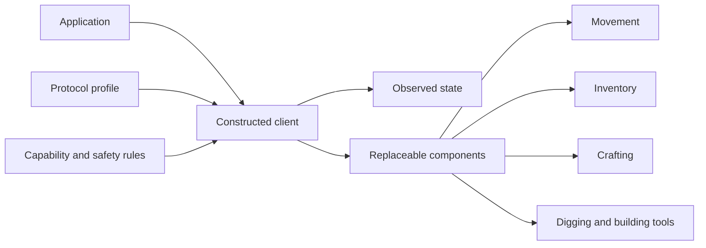

# Headless Minecraft client for Go

`headless-minecraft` is an embeddable, native Go client for automating Minecraft
servers. It speaks the Minecraft protocol directly; it does not launch or wrap
Mojang's Java client.

> [!IMPORTANT]
> This project is pre-alpha and cannot connect to a server yet. The current code
> contains construction-time authorization, strict safety defaults, and the
> first version-profile contracts. There is no published release.

## Design goals

- Replace protocol, authentication, state, movement, inventory, crafting,
  digging, building, and recovery components during client construction.
- Adapt behavior to the server's actual menu, slots, collision data, abilities,
  effects, equipment, and modded attributes.
- Keep observed server state immutable and server-authoritative.
- Provide conservative vanilla-compatible defaults without preventing explicit
  custom physics or protocol implementations.
- Compose tools and plans, including multi-block digging and rotated or mirrored
  building matrices, instead of hard-coding one-block actions.



Components are selected and validated before network work begins. Runtime state
can change the capabilities available to a component, but it does not silently
replace the component graph.

## Planned support

| Capability | Status |
| --- | --- |
| Endpoint-scoped authorization and strict recovery profile | In progress |
| Injectable wire-protocol profile | In progress |
| Java Edition login, configuration, and play lifecycle | Planned |
| Immutable world, entity, player, registry, and container snapshots | Planned |
| Generic slots plus semantic inventory and menu drivers | Planned |
| Replaceable movement, crafting, digging, and building components | Planned |
| Modded body, physics, abilities, effects, and dynamic inventory rules | Planned |
| Bedrock Edition client | Deferred until the shared protocol repository supports it |

See the [roadmap](ROADMAP.md) for dependency order. Roadmap entries are not
compatibility promises or release dates.

## Current API

The current foundation requires applications to declare an endpoint and the
automation scopes they intend to use:

```go
authorization, err := safety.Authorize(
	"localhost:25565",
	safety.ScopeObserve,
	safety.ScopeMove,
)
if err != nil {
	return err
}

if !authorization.Allows("localhost:25565", safety.ScopeMove) {
	return safety.ErrUnauthorized
}

profile := safety.Strict()
```

Authorization records application intent; it does not prove that a remote
server permits automation.

## Protocols and game data

The client consumes the sibling
[`minecraft-protocol`](https://github.com/go-theft-craft/minecraft-protocol)
module. That module will provide generated Java Edition protocols and pinned
[PrismarineJS minecraft-data](https://github.com/PrismarineJS/minecraft-data)
bundles. Applications may inject their own wire protocol, data, and conformance
rules for custom or modded servers.

Java Edition and Bedrock Edition do not share transport assumptions. Bedrock
support will require a dedicated implementation behind the shared protocol
contracts, not a Java-protocol compatibility layer.

## Safety defaults

- High-level automation requires an endpoint and explicit scopes.
- Ambiguous state-changing operations do not retry automatically.
- Server corrections replace client projections.
- Movement stops when collision data is unknown.
- Inventory recovery resynchronizes after rejected or mismatched actions.
- Custom profiles cannot disable process resource ceilings.

Server rules may prohibit bots even when the client sends valid packets. This
library does not provide anti-cheat evasion or guarantee that a server permits
automation.

## Development

Clone both repositories into the same parent directory:

```text
go-theft-craft/
├── headless-minecraft/
└── minecraft-protocol/
```

Install [Devbox](https://www.jetify.com/devbox), enter this directory, and run:

```bash
devbox run -- task verify
```

Devbox configures the tracked pre-commit hook for the clone. The hook checks
formatting, runs the Go linters, and scans staged content for secrets and private
keys. CI scans the complete committed tree. Run `devbox run -- task --list` to
see the individual tasks.

The public API is still changing. Before starting a substantial contribution,
[open an issue](https://github.com/go-theft-craft/headless-minecraft/issues) to
agree on the component boundary and conformance tests.

## Project information

- [Roadmap](ROADMAP.md)
- [Release and versioning rules](RELEASING.md)
- [Changelog](CHANGELOG.md)
- [Apache-2.0 license](LICENSE)
- [Protocol and game-data toolkit](https://github.com/go-theft-craft/minecraft-protocol)

This project is not an official Minecraft product. It is not approved by or
associated with Mojang or Microsoft.
