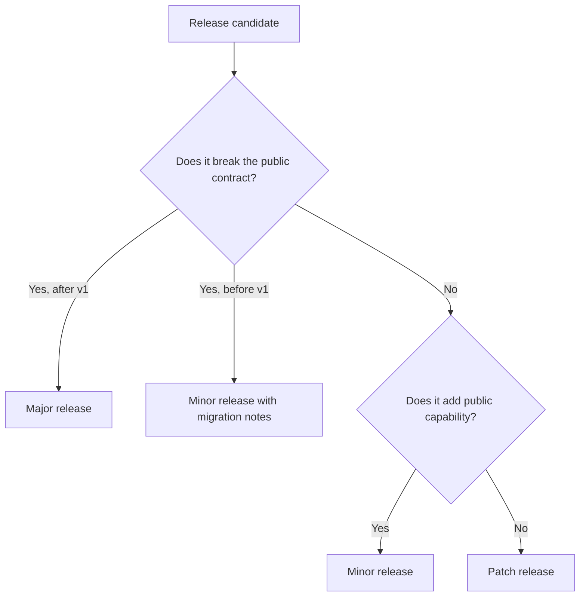
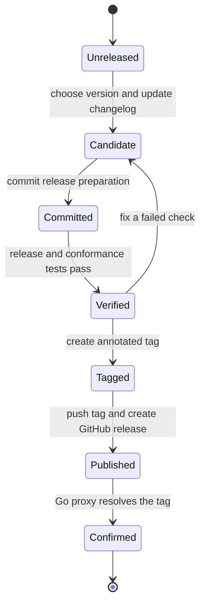

# Release and versioning rules

This repository uses [Semantic Versioning 2.0.0](https://semver.org/) and Go module tags in `vMAJOR.MINOR.PATCH` form. Minecraft versions and protocol numbers do not determine the module version.

## Version stability

Releases start in the `v0.x.y` series. A `v0` minor release may break an API while the component model settles. Every breaking `v0` change requires a changelog entry, a `**Breaking:**` marker, and migration instructions.

The `v1.0.0` release starts compatibility guarantees for the public API. Starting with `v2.0.0`, the module path must include the matching major suffix, such as `github.com/go-theft-craft/headless-minecraft/v2`.

## Public compatibility contract

The compatibility contract includes:

- exported Go names, signatures, interfaces, constants, and documented behavior;
- client lifecycle, event, state, component, capability, and action contracts;
- version-profile and custom-adapter contracts;
- strict safety defaults, recovery outcomes, and authorization scopes;
- default queue, timeout, and subscription behavior; and
- command names, flags, exit behavior, and documented structured output.

Internal packages and test fixtures do not form part of the public contract.

## Pick the version change

Use these project rules:

| Change | Version |
| --- | --- |
| Add a component, action, event, state lookup, or version profile | Minor |
| Add support for another Minecraft protocol version | Minor |
| Remove or rename an exported component method or state field | Major after `v1` |
| Change construction dependency rules in a way that rejects valid clients | Major after `v1` |
| Loosen a strict safety default | Major after `v1` |
| Tighten a safety default to fix a security or corruption risk | Patch with a `Security` entry and impact note |
| Correct protocol ordering, collision, physics, or inventory synchronization | Patch when valid callers remain compatible |
| Change documentation, tests, or internal adapters only | Patch |

## Pre-releases

Use `-alpha.N`, `-beta.N`, and `-rc.N` in that order. Do not use a pre-release tag as the latest stable release. Publish an `rc` before `v1.0.0` and before every later major release.

## Changelog rules

Maintain [CHANGELOG.md](CHANGELOG.md) during development. Put each user-visible change under `Unreleased` in one of these sections:

- `Added`
- `Changed`
- `Deprecated`
- `Removed`
- `Fixed`
- `Security`

Write entries for users, not for commit history. Mark a breaking entry with `**Breaking:**` within its category. Include a migration instruction or a link to one.

At release time, rename `Unreleased` to the version and UTC date in `YYYY-MM-DD` form. Add a fresh empty `Unreleased` section above it.

## Release flow

Release only from a clean `main` branch whose CI checks pass.

1. Release the required `minecraft-protocol` version first.
2. Remove every local `replace` directive from `go.mod`.
3. Review `CHANGELOG.md` and choose the version from the rules above.
4. Replace `Unreleased` with the version and current UTC date.
5. Add a new empty `Unreleased` section.
6. Commit the release preparation.
7. Run `devbox run -- task release:check VERSION=vMAJOR.MINOR.PATCH`.
8. Run owned-server protocol and safety conformance tests when gameplay behavior changed.
9. Create an annotated `vMAJOR.MINOR.PATCH` tag on the verified commit.
10. Push the commit and the tag.
11. Create a GitHub release from the matching changelog section.
12. Confirm that `go list -m github.com/go-theft-craft/headless-minecraft@vMAJOR.MINOR.PATCH` resolves the release.

`release:check` rejects a dirty tree, a local `replace` directive, and an invalid version. Do not move or reuse a published tag. Publish a new patch release for a correction.

## Release tooling

Library releases use annotated Git tags and GitHub releases directly. Do not add
GoReleaser merely to publish the module or generate its changelog; the reviewed
`CHANGELOG.md` remains the release-note source.

Adopt GoReleaser only if this repository later ships a command or another binary
artifact. Its scope would then be binaries, checksums, provenance, and GitHub
release assets. Go module tags remain the source of module versions.

## Dependency policy

`headless-minecraft` and `minecraft-protocol` have independent versions. A client release records its minimum shared-protocol version in `go.mod`. A published tag must use a released dependency and must not contain a local `replace` directive.

The [Go module version documentation](https://go.dev/doc/modules/version-numbers) defines Go's stability meaning. The [Go module reference](https://go.dev/ref/mod#major-version-suffixes) defines major-version suffixes.
