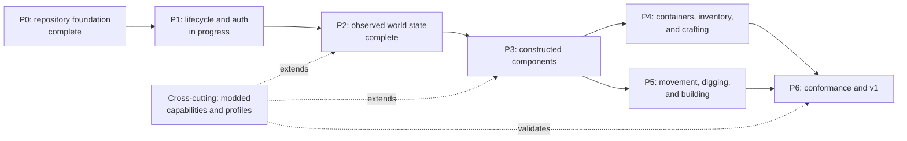

# Roadmap

The roadmap records dependency order, not release dates. Completed work remains in the chart so later decisions retain context.

## P0: repository foundation

- Pin the Go toolchain through `openserbia/go-flake`.
- Define endpoint-scoped authorization and strict safety defaults.
- Define the first wire-profile validation contract.
- Establish release, changelog, and roadmap rules.

## P1: lifecycle and authentication

- Add scoped client lifecycle and bounded stream ownership. **Done:** the
  client connects, reaches play, publishes session events, and closes once.
- Add offline and Microsoft authentication providers. Offline is done;
  Microsoft device-code is next.
- Complete Java login, encryption, compression, configuration, and play
  transitions.

## P2: observed world state

- Publish immutable player, entity, chunk, registry, container, and environment
  snapshots. **Done:** eight domains, one revision per batch, on both protocols.
- Preserve unknown namespaced attributes, metadata, item data, and custom
  payloads. **Done:** bounded per owner, and every bound reports what it
  refused.
- Apply packet reducers in wire order before publishing events. **Done.**

One limit carries forward: no chat component is rendered anywhere, which is
deliberate and permanent.

The other one is closed. Protocol 775 chunk sections decode through
`decodeSection775`, against a chunk column captured from a real 26.1.2 server
(`internal/adapter/v26_1/testdata/chunk-26.1-0-0.bin`). Sections in both
protocols are still *stored* undecoded and decode on demand, which is a design
choice rather than a gap: a server streams hundreds of chunks a consumer never
reads a block from.

## P3: constructed components

- Validate and construct the component graph before network work.
- Add dynamic capabilities, body, physics, collision, and interaction contracts.
- Keep component replacement at construction time.

## P4: containers and crafting

- Represent the menu that the server actually opens.
- Add generic raw slots and semantic menu drivers.
- Add version-aware inventory synchronization and composed crafting plans.

## P5: world operations

- Add manual movement and controller-owned movement strategies.
- Add explicit digging phases and tool-driven multi-block plans.
- Add rotated and mirrored building matrices with partial progress.

## P6: stable contracts

- Run fixture, owned-server, and anti-cheat conformance tests.
- Verify strict recovery for corrections, uncertainty, and disconnects.
- Publish `v1.0.0` after public component and state contracts have compatibility tests.

## Deferred work

Pathfinding, autonomous goal selection, combat strategy, and scheduling remain application concerns. A later Bedrock client requires a separate design after the shared protocol repository implements Bedrock transport and authentication.
