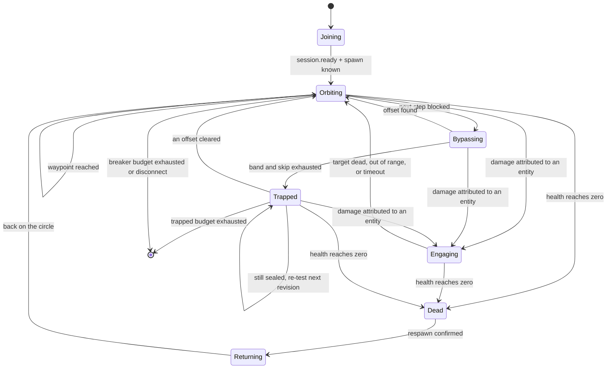

# Orbit example design

- Status: Decision core and observation implemented; actions blocked on M8.8 and
  M9, and the bypass search blocked on block solidity, which no milestone owns
- Date: 2026-08-16, observation bound 2026-08-17
- Repository: `headless-minecraft`
- Example: `examples/orbit`
- Earliest complete milestone: M9.6

## Implementation status

The decision core is written and tested. `Bot.Advance` is a pure function from
one `Tick` and a `World` to one `Action`, and it owns the geometry, the bypass
search, retaliation, respawn, the trapped state, and every bound in this
document. Its tests script a world rather than connecting to one, so the state
machine is provable today: 32-waypoint deviation, wall bypass inside the band,
sealed-band trapping, standing without sending, resuming when the wall opens,
the trapped budget, retaliation and all three ways a fight ends, one respawn per
death, and the breaker budget.

Running it against a live server found two things no unit test would have. Both
are fixed and both are covered now. A third arrived when observation was bound —
see below — which is three for three: every live run of this example so far has
found something its tests could not.

**A subscription opened after `Connect` has already missed `session.ready`.**
`Connect` publishes the event on its way through play and returns after it, so
the obvious order — connect, then subscribe, then loop — silently never sees the
bot join. The example subscribes first. Any consumer will hit this, so it is
worth a line in the client's own documentation rather than leaving each caller
to find it: the fix is trivial once seen and invisible until then.

**A bot that stands still has to say why.** The first live run connected and
printed nothing for twenty-five seconds, which reads exactly like a working
orbit. The shell now logs state and reason on change, and the wait for a spawn
position is bounded by `JoinTimeout`, after which the bot exits 3 saying what
did not arrive rather than standing in silence. The message named M7 while the
spawn was unobservable; now that it is observed, reaching that timeout means the
server really sent no spawn position, and it says so.

### Observation is bound — 2026-08-17

M7 landed, and `Observed` in `observed.go` implements `World` over one
`world.Snapshot`. The core did not change to accept it, which is the property
the split was chosen for. `Actuator` is still `Pending{}`, because the actions
it names are M8.8 and M9.6.

Binding it found four things.

**The world spawn was never observed at all.** Item 2 below said "Designed" and
it was not: no reducer in `world/` touched the spawn-position packet, so the
value the orbit is centred on did not exist anywhere in the library. Both
protocols send it — `PlayClientboundSpawnPosition`, `0x05` on 47 carrying bare
coordinates, `0x61` on 775 carrying a `GlobalPos` plus an angle — and
`minecraft-protocol` already decoded both. Closed by adding
`Environment.SpawnChanged`, `event.WorldSpawnChanged`, and a case in each
adapter. This is the second time a "Designed" row in this table turned out to be
a hole, after items 4 and 5, and both times writing the example is what found
it.

**This document had the spawn backwards.** It said the spawn "is not the respawn
point: the two differ once a bed is used". For the packet that actually carries
it, that is inverted: a vanilla server sends the level's shared spawn on join
and re-sends the same packet whenever the player's own respawn point moves, so
there is one value and the bed overwrites it. Nothing in the protocol reports a
separate immovable landmark. The bot never sleeps, so its circle never moves,
but a consumer that assumed otherwise would be wrong and the library cannot warn
it.

**Nothing maps a block state to whether it is solid**, and the bypass search is
the only thing in the example that needs it. `ChunksView.Block` returns the
state ID the server sent and the `world` package deliberately models no block
semantics, so the search reads `Unknown` at every position, accepts no offset,
and will report the bot trapped as soon as it can move at all. This is the one
gap with no milestone behind it — see *Decided* — and it is why the example
still cannot complete a revolution even though it can now see the world.

**A client with no world keeps no state, and says nothing about it.** Found by
running the bound example against a live server, which is the third time a live
run has caught something the tests could not. `client.WithWorld` was missing
from the example's construction, so every batch was published as events and
applied to nothing. `World()` kept answering — with an empty snapshot, forever —
and the bot waited out its full join timeout and then reported that the server
had sent no spawn position, while the server's own source plainly sent one and
`examples/observe` showed `world.spawn_changed` arriving on the same connection.
The failure accuses the wrong party, which is the worst kind: every message was
true about what the bot saw and wrong about why. The option is documented and
the omission is a consumer error rather than a library defect, but a snapshot
accessor that cannot distinguish "nothing has happened yet" from "you never
installed a world" will catch the next consumer the same way.

With that fixed, a run against a pinned offline 1.8.9 server connects, reads the
spawn, builds the circle, enters `Returning`, and exits 3 at the first step it
cannot take: `movement is M8.8 and M9.3`. That is the whole observation half
working end to end against a real server, stopping at the first thing a
milestone owes rather than at anything this example got wrong.

### Standing on open ground — 2026-08-17

The bot walked to its circle and then reported itself sealed in, on a flat world
with nothing on it. Two causes, found in that order, and only the second was the
one that mattered.

**Block solidity, now answered from the game, and now owned by the library.**
The fact is the material's `blocksMovement`, because that is the whole of what
the game asks: `isPassable` in 1.8.9 is `!blockMaterial.blocksMovement()`, and
the ground navigator that decides where a mob may walk calls that same
predicate. Neither consults a bounding box nor whether the block fills its cell,
so neither does this. The third-party block dataset the protocol repository
already ships cannot answer it — it carries a bounding box and a material
*name*, and its material registry is tool speeds — which is why an extraction
from the jar is the source rather than a convenience.

The table lived in this example for one day. It is now
`minecraft-protocol`'s `data.BlockMovementRegistry`, measured by `mcreference
blocks` into an extracted dataset beside the physics constants and generated
into the version package, where the state encoding is decoded by the version
that already knows it. What remains here is `MeasuredSolidity`: a port
implemented against that registry, and a startup warning for the version nobody
has measured.

**The world had no terrain in it at all.** Wiring solidity changed nothing,
because the lookup never got as far as asking. The protocol 47 adapter reduces
`map_chunk` and a vanilla server sends the join-time world as `map_chunk_bulk`,
which nothing reduces; a capture of the session holds two bulk packets and no
single-column one. So every block read "not loaded", every position read
`Unknown`, and the bypass search correctly refused open air.

That is the third silent success in one day, after a client with no world
installed and a bot reading its own position back from server-sent state. Each
one worked, reported nothing, and was caught by somebody watching a bot stand
still. The pattern is worth stating plainly: this example's value is not that it
exercises the API, it is that it is *run*, and every defect it found was
invisible to a test suite that passes.

Position, health, and entities come from the snapshot rather than from folded
events, and the subscription carries only what a snapshot cannot say: readiness,
attributed damage, death, respawn, and the server placing the player. Rebuilding
state from a stream of changes would keep a second copy of the world the library
already keeps.

## Context

The requested behaviour is one program: a bot that jumps its way around a circle
of radius 25 centred on spawn, steps around what blocks it, fights back when
something hits it, respawns and returns to the circle when it dies, and — when
it is walled in with no way out — stands still rather than grinding against the
wall.

None of it can be written today. M6.3 has just made the client connect;
`world.Snapshot` is M7, movement is M8.8, and attack, damage, death, and
respawn are M9.6. This
document specifies the example ahead of the code, on purpose, because the
example is the only artifact in the repository that exercises the library the
way an application will and it is cheaper to discover a missing accessor here
than in Task 11 of the world-state plan.

The library's own plan lists what this example must supply for itself:

> Do not add autonomous goal selection, pathfinding, combat strategy, or a
> scheduler.
> — `docs/superpowers/plans/2026-08-13-world-state-actions.md`, Global Constraints

Every one of those four appears in the requested behaviour. Orbiting is goal
selection, bypassing an obstacle is pathfinding, hitting back is combat
strategy, and the tick loop that drives all of it is a scheduler. That is the
point of the example rather than an objection to it: if all four can be built on the
public API by a program that imports nothing internal, the library's non-goals
are a boundary rather than a hole. If any of them cannot, the missing seam is a
library defect, and the table in *Required surface* is where it shows up.

## Goals

- One runnable program under `examples/orbit`, in the `examples` module, that
  drives a real server and is run by CI rather than read.
- Goal selection, obstacle bypass, retaliation, respawn, and the trapped state
  all owned by the example, using only exported API.
- Every loop bounded: bounded chase distance, bounded detour search, bounded
  time spent trapped, bounded breaker acknowledgements. Nothing that runs for a
  week accumulates.
- A named list of what the library must expose, each item traced to the
  milestone that owes it.

## Non-goals

- A pathfinder. The bypass search is one dimension wide and described below; it
  is not A\*, and it is not a foundation for one.
- Surviving an arbitrary server. The example targets a server the operator owns,
  declares `safety.ScopeObserve | ScopeMove | ScopeInteract` for that endpoint,
  and exits on anything it did not plan for.
- Evading anti-cheat. No jitter, no humanisation, no threshold tuning. If a
  server rejects the movement, the correction opens the breaker and the example
  stops, which is the honest outcome.
- Reconnecting. The library never reconnects and neither does the example. A
  disconnect exits non-zero.

## Behaviour

The states are one `switch` in one goroutine. Events arrive on a subscription
and are folded into the state machine; nothing else runs concurrently except a
20 Hz ticker that drives the movement update, which is the rate the server
expects and which the example owns because the library ships no scheduler.

### Orbiting

The circle is sampled into 32 waypoints. That number is chosen, not rounded: the
sagitta of a chord subtending 2π/32 on r=25 is `25 × (1 − cos(5.625°)) ≈ 0.12`
blocks, so the polygon the bot actually walks never leaves the circle by more
than an eighth of a block. Sixteen waypoints would deviate by half a block, and
sixty-four would double the turn count for a deviation nobody can observe.

Spawn is the world spawn position reported at join, not the respawn point; the
two differ once a bed is used, and the circle is defined against the first.

Jumping is continuous, which makes the orbit a movement strategy rather than a
sequence of one-shot calls. The example implements `movement.Strategy` itself
and installs it through `Controller.UseStrategy`. This is the seam Task 7 of the
world-state plan already designed — strategy ownership sits in the controller
and strategies are injectable — and the example is the proof that a strategy
defined outside the library works, which the built-in bunnyhop cannot
demonstrate.

### Bypassing

Strict mode refuses to move through unknown collision data, so the strategy
tests the next step against the current snapshot before committing to it. Three
outcomes:

1. **Steppable.** The obstruction is one block tall with air above it. The bot
   is already jumping; nothing changes.
2. **Radially avoidable.** Search a radial offset in `[−4, +4]` blocks around
   r=25, nearest offset first, and take the first that clears. The circle is the
   invariant and the radius is the free variable, which turns "go around it"
   into a bounded one-dimensional search over nine candidates instead of a graph
   traversal.
3. **Angularly avoidable.** If no offset clears, skip to the next waypoint and
   retry the search there. At most three consecutive skips, which is 33.75° of
   arc.

Exhausting all three is the only route into `Trapped`. The order matters:
cheapest test first, and every branch terminates.

### Engaging

Retaliation needs an attacker, not just a health drop, and this is the one place
the current designs do not obviously supply what the example needs — see
*Required surface*, item 4. Given an attributed source:

- Target the source entity. Do not target anything else, ever. A bot that picks
  its own fights is a bot that wanders off.
- Break off when the target dies, leaves reach, leaves `r + 8` from spawn, or
  the engagement passes 30 seconds. All four are bounds on the same failure:
  being led away from the circle.
- Resume at the nearest waypoint by angle, not the one the bot left.

Attack timing comes from the version profile's cooldown, not from a constant in
the example. The 1.8.9 and 26.1.2 rules differ and the example must not encode
either.

### Dead and Returning

Death is health reaching zero. The example sends the respawn request itself —
the library will not do it, because respawning is an action and actions are the
caller's. After respawn is confirmed, walk to the nearest waypoint on the
circle, which may be far away if the respawn point is not spawn, and re-enter
`Orbiting`. The walk back uses the same bypass search, so a wall between the bed
and the circle is handled by code that already exists.

### Trapped

Trapped is defined as a conjunction, because either half alone produces false
positives: no net angular progress for 15 seconds **and** the bypass search
exhausted its band and its skips. A bot stuck behind a slow mob satisfies the
first and not the second.

In `Trapped` the bot stops moving and stands. It sends no command and takes no
action to free itself; the only thing it keeps doing is looking.

Standing is not the same as giving up, because the state that trapped the bot is
not the bot's. A wall is blocks, blocks change, and the snapshot reports it when
they do. So `Trapped` re-runs the bypass search — the same ±4 band, the same
skip budget — once per snapshot revision that changes a block within the band,
and returns to `Orbiting` the moment an offset clears. Re-testing on a timer
instead would either burn ticks on a world that has not moved or miss the
opening for however long the timer runs; the revision is already the signal that
something changed.

Damage still routes to `Engaging` from here. A bot walled in with whatever
walled it in should defend itself, and killing the thing may be what clears the
band.

Two bounds keep this from being an idle process that lives forever. The bot
leaves `Trapped` for good after 10 minutes with no successful re-test, logging
the position and the reason and exiting non-zero — a bot that has been sealed in
for ten minutes is a fact for the operator, not a state to sit in. And a trapped
bot still answers keepalives, so it does not silently rot on the server's side
while it waits.

## Required surface

What the example needs, where it must come from, and whether the current designs
provide it. Items marked **gap** are the reason to write this document before
the code.

| # | Needs | Package | Milestone | Status |
| --- | --- | --- | --- | --- |
| 1 | `client.New`, `Connect`, `Subscribe`, `Close` | `client` | M6.3 | Present in the working tree as of 2026-08-16 |
| 2 | Player position, health, and world spawn on the snapshot | `world` | M7 | Present. Position and health were there; the spawn was not observed at all and was added 2026-08-17 as `Environment.SpawnChanged` and `event.WorldSpawnChanged` on both protocols |
| 3 | Block lookup at a position, and "is this chunk loaded" as a distinct answer from "this block is air" | `world` | M7 | Present. `ChunksView.Block` returns a state ID and reports loadedness separately — but see item 11, because a state ID alone does not answer the question the search asks |
| 4 | Damage attributed to a source entity | `world`, `event` | M7 | Present. Closed by design Decision 11 as `event.Damage` on `PlayerDamaged`. Protocol 47 still names nobody, so the bot keeps orbiting there rather than swinging at an inference |
| 5 | Death distinguishable from a health drop | `event` | M7 | Present. `PlayerDied` fires once per death, and `PlayerView.Dead` holds it until a respawn |
| 6 | Respawn as a sendable action | `interaction` | M9 | **Gap.** Task 6's primitive list — chat, command, movement, look, stance, use, place, attack, interact, dig, slot, click, drop, close — has no respawn. A client that cannot respawn cannot recover from its own death |
| 7 | `movement.Strategy` implementable outside the library | `movement` | M8.8 | Designed — Task 7. Needs the interface exported, not just consumed |
| 8 | Attack primitive with profile-supplied cooldown | `interaction` | M9.6 | Designed |
| 9 | Entity position and health for target tracking | `world` | M7 | Position present. Health is not: a server sends another entity's health as an attribute or a metadata field and the world stores both as sent without interpreting either. `EntityView.Dead` answers the only question the bot asks of it, so the example reads that instead |
| 10 | Breaker acknowledgement after a movement correction | `safety` | M9 | Designed — must be explicit in the example, with a budget |
| 11 | A map from a block state to whether it is solid | `minecraft-protocol` | none yet | Present for protocol 47. Assigned to `minecraft-protocol` on 2026-08-17 and implemented there the same day: `data.BlockMovementRegistry`, measured from the 1.8.9 server jar and generated into `generated/java/v1_8`. `world` still refuses block semantics, which is right, and `MeasuredSolidity` is the one type that changed here — which is what the port was split out for. Protocol 775 is unmeasured, so its registry is nil and its bot classifies nothing and says so |

Items 4, 5, 11, and the spawn half of item 2 are settled. Item 6 is still owed
by M9. Item 11 closed on 2026-08-17 for protocol 47, where the bot now walks
against the game's own answer; on protocol 775 it is the measurement, not the
design, that is missing.

Item 3 was present the whole time and still observed nothing against a real
server: a vanilla 1.8.9 server sends the join-time world as `map_chunk_bulk`,
which no reducer read, so every lookup answered "not loaded" and the bot
reported itself sealed in on open flat ground. Fixed 2026-08-17 in the v1_8
adapter.

## Bounds

Every number the example ships with, in one place, so a review can argue with
them:

| Bound | Value | Why |
| --- | --- | --- |
| Waypoints | 32 | 0.12-block deviation from the true circle |
| Radial band | ±4 blocks | Wide enough to clear a tree, narrow enough to stay an orbit |
| Consecutive angular skips | 3 | 33.75° of arc before declaring the region impassable |
| No-progress timeout | 15 s | Longer than any mob obstruction, shorter than patience |
| Chase radius | r + 8 | Combat never leaves the neighbourhood of the circle |
| Engagement timeout | 30 s | An unkillable target is a target to abandon |
| Trapped budget | 10 min | Ten minutes sealed in is a fact for the operator |
| Breaker acknowledgements | 5 | Repeated corrections mean the movement is wrong, not unlucky |
| Movement tick | 20 Hz | What the server expects |

## Verification

Examples are the integration test surface, so this one is run, not read. Against
a pinned offline server: join, complete one full revolution, place a two-block
wall across the path and assert the bypass clears it without leaving the ±4
band, box the bot in completely and assert it stops moving and sends nothing,
then break one wall block and assert it resumes on the revision that reports it,
kill the bot from outside and assert it respawns and rejoins the
circle, and hit it with a mob and assert it engages the source and returns to
the nearest waypoint.

The trapped case is the one worth a fixture rather than a live server, because
building a sealed box on a live server is slower than scripting the packets that
describe one.

## Decided

- **Block solidity waits for a library block registry rather than being
  approximated here.** Settled 2026-08-17. Two shortcuts were available and both
  were rejected. Treating every non-zero state as solid detours the bot around
  flowers and drowns it in water it read as a wall, so the orbit it walks is not
  the orbit the verification describes and every automated check still passes.
  Hand-writing a table of passable state IDs per protocol puts block semantics
  inside an example, which is exactly what the `world` package refuses to do, and
  it rots silently on the next version. The cost is that the example cannot
  complete a revolution until something owns the mapping: `Solidity` classifies
  nothing, every position reads `Unknown`, and the bot will trap as soon as it
  can move.
  Closed the same day it was written down: the mapping went to
  `minecraft-protocol`, and this example reads it. The waiting cost one day, and
  the port meant the fix was one type.
  That is a visible failure with a named cause, which is the outcome this example
  exists to produce. Isolating it behind its own port is what keeps the fix to
  one type.

- **`Trapped` exits non-zero after its budget.** Settled 2026-08-16. CI reads
  exit codes, and a bot that spent ten minutes sealed in did not do the job it
  was started for. It closes the client first, so the disconnect is clean and
  the non-zero status is the report, not the mechanism.

## Open questions

1. Does the radial band belong in the example or does a second example want it?
   Keeping it here until something else needs it.
2. Should the orbit strategy live in `movement` as a second built-in beside
   bunnyhop? Not until a second caller wants it. An example is the right place
   for the first version.
